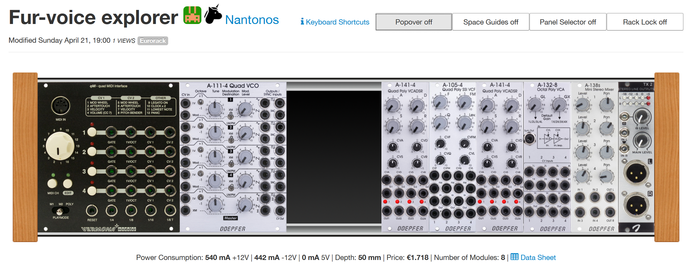

# Basic 4-voice for MPE demo

Exploration of the basic setup needed for a four-voice polyphonic Eurorack system, to be driven by an MPE MIDI-to-CV converter providing:

- 4 gates
- 4 pitch CV
- 4 attack velocity
- 4 release velocity, lol
- 4 Y-axis CV
- 4 pressure CV

(plus the usual global MIDI CVs).

## Consolidated controls

Quad modules should have a single set of controls for setting up the patch (turn one knob to set all four voices, rather than setting four knobs to identical settings)

## Expression inputs

Quad modules should also have per-voice CV control for expression.

## Sample system

[Example system](https://www.modulargrid.net/e/racks/view/901763) using a Vermona 4-voice as a placeholder for the MPE MIDI to CV.

### Doepfer [A-111-4](http://www.doepfer.de/A1114.htm) quad oscillator

Four CEM3340 chips with triangle, saw and pulse (plus 3 4-to-1 mixers for the three waveforms). 10 octave range (with undeclared precision).

This fails to consoldiate controls (four mod level and four tune pots, more useful for auto-chords than for MPE). Not clear how useful the master section is here, either (more for paraphonic systems). This is more four oscillarors on one module.

It does have four expression inputs (switchable FM or PWM) and four sync inputs. The four oscillator chips each have a separate regulated PSU to avoid oscillator drift and locking.

### Doepfer [A-105-4](http://www.doepfer.de/a1054.htm) Quad Poly VCF

Four SSI2144 24dB Lowpass filters. Frequency, FM, Q and level set by consolidated pots, plus consolidated (global) CV inputs with attenuators. Assumes 10V CV. Global frequency could e.g. be with an LFO. Global FM (knob and CV) drives 4 internal VCAs.

Per-voice FM.

Assume this is driven by an envelope, though the levels should be modulatable per-voice for expression.

### Doepfer [A-141-4](http://www.doepfer.de/a1414.htm) Quad Poly VCADSR

Would typically need two quad EG, one for driving the filters and one for velocity and expression volume control on a quad/octal VCA. An AD/AR EG might be preferable.

A-141-4 uses four CEM3310 EG chips. Output is 0 to 10V.

Consolidated A,D,S.R knobs plus CVs with polarising attenuators.

Four gate inputs (no retriggering?) and four envelope outputs with LED indication. [Internal jumpers](http://www.doepfer.de/a100_man/A141_4_connectors_and_jumpers.pdf) allow normalling to VCF or VCA.

### Doepfer [A-132-8](http://www.doepfer.de/a1328.htm) Octal Poly VCA

Four pairs of linear followed by (switchable) linear or exponential VCAs. Consolidated controls for default gain of the linear and expo VCAs.

Per-voice expression: four linear inputs and four expo inputs, e.g. envelope on linear and attack velocity on expo.

Four outputs plus a summed output, could be sufficient for a minimal system or if a mono-in, stereo-out effect (chorus, etc) is added. If not:

### Doepfer [A-138s](http://www.doepfer.de/A138s.htm) Mini Stereo Mixer

Simple (not voltage controlled) 4 mono inputs to one stereo output mixer. Per-voice level and pan.

### Joranalogue Audio Design [Transmit 2](https://joranalogue.com/collections/eurorack/products/transmit-2)

Stereo, electronically balanced output module with level/clip indicators.