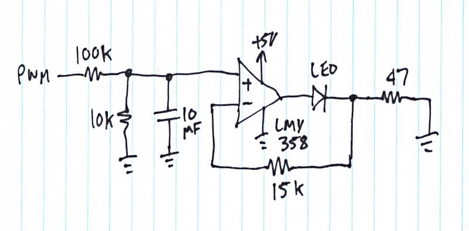
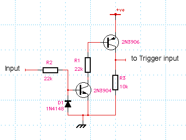
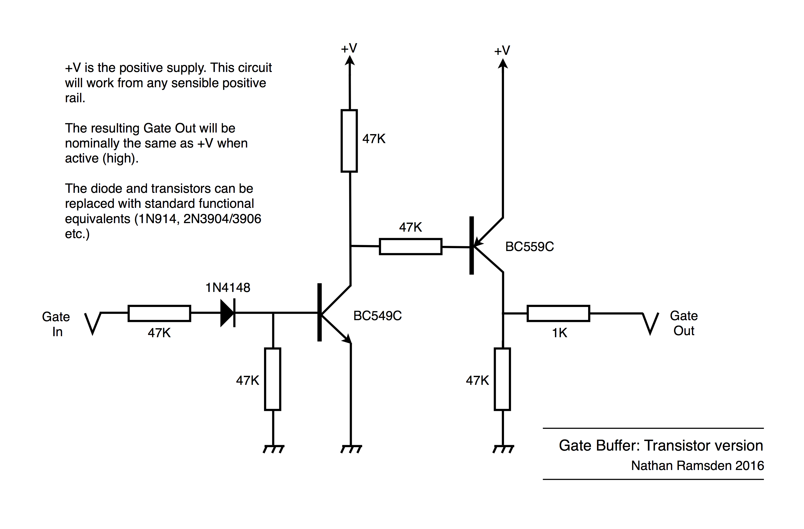

# Gate and LED

Provides gate, trigger outputs and LED indication of gate status.

RGB LEDs give feedback on what note is playing.

## LEDs

[Diffused 'Piranha' Super-flux RGB LED](https://www.adafruit.com/product/1451) (got 10). 5mm height (2.5mm shoulder plus 2.5mm dome; but panel is 2mm so at least gate jacks will need spacer washers), 7.6mm square, common anode.

Red: 1.8-2.2V Forward Voltage, at 20mA current, Green: 3.0-3.3V, Blue: 3.0-3.3V

### LED interfacing

Two RGB LEDs need 6 channels. If LED on rotary encoder, needs 1 or 3 more.

PWM: native on Teensy, or use a PWM LED driver chip like:

- [PCA9685](https://www.adafruit.com/product/815) (16 channels, I2C)
- [TLC59711](https://www.adafruit.com/product/1455) (12 channels, SPI, 15mA, 5 to 17V.)
- [NCP5623](https://www.mouser.com/ProductDetail/onsemi/NCP5623DTBR2G?qs=atIEnC%2F2K4UXlMf9SxIM5g%3D%3D) (3 channels, 5bit, I2C, fixed address)

Mouser out of stock bare TLC59711 but carries the Adafruit boards which are 22.75mm x 28.38mm so minimum 6HP (30mm) for that part.

Voltage translation: SN74AHCT125 (up to 5V5) or 74HCT595, or LED driver does that too.

Notice [this thread](https://forum.pjrc.com/threads/28460-teensy3-1-tlc59711-16-bit-led-driver-timing-issue-and-flicker?highlight=TLC59711) on using the Adafruit TLC59711 library. [Alternate library](https://github.com/ulrichstern/Tlc59711) with [wiki notes](https://github.com/ulrichstern/Tlc59711/wiki#electronics-notes) uses transactions, does not use old SPI clock multiplier.

Also [this thread](https://forum.pjrc.com/threads/24599-IntervalTimer-and-LED-fading?highlight=TLC59711) on why Teensy PWM is better than a PWM chip; uses an op-amp integrator to smooth the PWM signal and to provide the current drive rather than getting it from the Teensy. LMV358 SOIC-8 dual op-amp is [cheap](https://www.mouser.com/ProductDetail/Diodes-Incorporated/LMV358SG-13) at $0.414/10, need 3 for 2 RGB LEDs.

This is driven anode, but Pirhana RGB LEDs are common anode so this won't work.

[Constant current LED with op-amp](https://www.allaboutcircuits.com/technical-articles/the-basics-behind-constant-current-led-drive-circuitry/)

- [How to Hook up (common anode) RGB LEDs](https://forum.pjrc.com/threads/73390-How-to-Hook-up-RGB-LEDs-with-a-Proprietary-Switch-Circuit)

The [straightforward solution](https://www.pjrc.com/teensy/tutorial2.html) works fine with no visible flicker; just modified to common anode so the common pin goes to 3V3 not ground, and the PWM gives brightest light at zero not 255.

## Gate & Trigger

Avoid the  [two-transistor gate output from Graham Hinton](https://modwiggler.com/forum/viewtopic.php?p=2720659&sid=8184a7a1e66cf2090d4727f4a460bd16#p2720659) because the description sounds good but buiders report unreliable operation:

>> Both transistors are used as switches, not amplifiers. The first transistor turns on at any input voltage above about 1V, this then turns on the second transistor which pulls the output up to +ve (+14V taken from the Roland). It assumes that the input is a Gate and has a fairly fast rise/fall time and is not an analogue signal like a LFO triangle. If you want to use slow rise/fall signals you need a Schmitt trigger.

Fixing the known inaccuracy in that schematic:

> Try a resistor like 10k between its base and emitter so that it is driven by voltage rather than current.

See also [Synth DIY: Gate Buffer ](https://synthnerd.wordpress.com/2016/03/17/synth-diy-gate-buffer/) and [a known bad Gate in the original Arturia Beatstep](https://synthnerd.wordpress.com/arturia-beatstep/) which gives load-dependent 4V gates!

Gate is +10V. Test droop into low loads like 10k.

Trigger is +10V for 10ms.

## Boards

Panel board with 6 jacks on two rows (Gate & Trigger, Tune per voice), 2 LEDs above, one edge connector below.

- 4 for gate and trig
- 6 for two rgb
- 4 for gnd

Circuitry board with power connections (5V for level shifters, 10V for gate/trig),
digital outs (4) for gate and trig,
pwm outs (6) for two RGB LEDs,
gnd connection to teensy.

## Work Plan

- [ ] experiment with level shifter & Teensy PWM to drive bare RGB LED. Looking for range of colors, flicker, CPU usage
  - _It works fine with no level shifter, just 3v3 is okay. Tested with 270R, use higher value as this is too bright._
- [ ] breadboard two-transistor gate
- [ ] breadboard op-amp gate
- [ ] sketch to output 10ms pulse with a timer.
