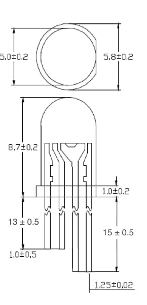

# Gate and LED

Provides gate, trigger outputs and LED indication of gate status.

RGB LEDs give feedback on what note is playing.

## LEDs

Two RGB LEDs, one per channel.

_(Older discussion on LED options moved to [old led page](./old-led.md))_

[NeoPixel Diffused 5mm Through-Hole LED - 5 Pack](https://www.adafruit.com/product/1938) easy 1-wire control, integrated pwm controller. Needs 5V so use logic level shifter such as 74LV1T34 (single) 74AHCT125 (quad) or 74HCT245 (octal). Library [includes HSV color model](https://learn.adafruit.com/adafruit-neopixel-uberguide?view=all#hsv-hue-saturation-value-colors-dot-dot-dot-3024464) as well as RGB, and includes [gamma encoding](https://learn.adafruit.com/adafruit-neopixel-uberguide?view=all#dot-dot-dot-and-gamma-correction-3024505) too.

Data connection is 3V3 from Teensy.

74LV1T34 provides 8mA output drive at 5V, so needs a +5V power.
74AHCT125 provides 20mA (max) 8mA (recommended) output drive at 5V. Has output enable, not needed here.

- [Use 100nF](https://learn.adafruit.com/adafruit-neopixel-uberguide?view=all#discrete-neopixel-products-2894456) between 5V and GND beside each LED.
- Connects to any random pin (custom bit-banged protocol). 
- Should have [300R to 500R in the data line, close to the LED](https://learn.adafruit.com/adafruit-neopixel-uberguide/best-practices).
- Current per LED is 12mA max

Sample code in RGB-NeoPixel-01.ino which works with direct 3V3 input, but a level shifter wold be more robust to small variations in 5V and 3V3 levels.

## Gate & Trigger

**Avoid** the  [two-transistor gate output from Graham Hinton](https://modwiggler.com/forum/viewtopic.php?p=2720659&sid=8184a7a1e66cf2090d4727f4a460bd16#p2720659) because the description sounds good but builders report unreliable operation:

>> Both transistors are used as switches, not amplifiers. The first transistor turns on at any input voltage above about 1V, this then turns on the second transistor which pulls the output up to +ve (+14V taken from the Roland). It assumes that the input is a Gate and has a fairly fast rise/fall time and is not an analogue signal like a LFO triangle. If you want to use slow rise/fall signals you need a Schmitt trigger.

Fixing the known inaccuracy in that schematic:

> Try a resistor like 10k between its base and emitter so that it is driven by voltage rather than current.

Instead, trying this one from [Synth DIY: Gate Buffer ](https://synthnerd.wordpress.com/2016/03/17/synth-diy-gate-buffer/):

See also [a known bad Gate in the original Arturia Beatstep](https://synthnerd.wordpress.com/arturia-beatstep/) which gives load-dependent 4V gates!

Gate is +10V. Test droop into low loads like 10k.

Trigger is around +10V for 10ms. Maybe 9V with a small 12V to 9V regulator? Thus, needs a +12V from the power board (but not -12V.).

## Boards

Panel board with 6 jacks on two rows (Gate & Trigger, Tune per voice), 2 LEDs above, one edge connector below.

- 4 for gate and trig
- 1 for NeopPixels
- 4 for gnd

Circuitry board with power connections (5V for level shifters, 12V to make gate/trig),
digital outs (4) for gate and trig,
gnd connection to teensy.

Maybe combine with [tune input](./calibration.md) on one board?

## Work Plan

- [x] experiment with level shifter & Teensy PWM to drive bare RGB LED. Looking for range of colors, flicker, CPU usage **abandones in favor of NeoPixels**
  - _It works fine with no level shifter, just 3v3 is okay. Tested with 270R, use higher value as this is too bright._
- [x] experiment with through-hole NeoPixels (**works**)
- [ ] breadboard two-transistor gate
- [ ] breadboard op-amp gate
- [ ] sketch to output 10ms pulse with a timer.
