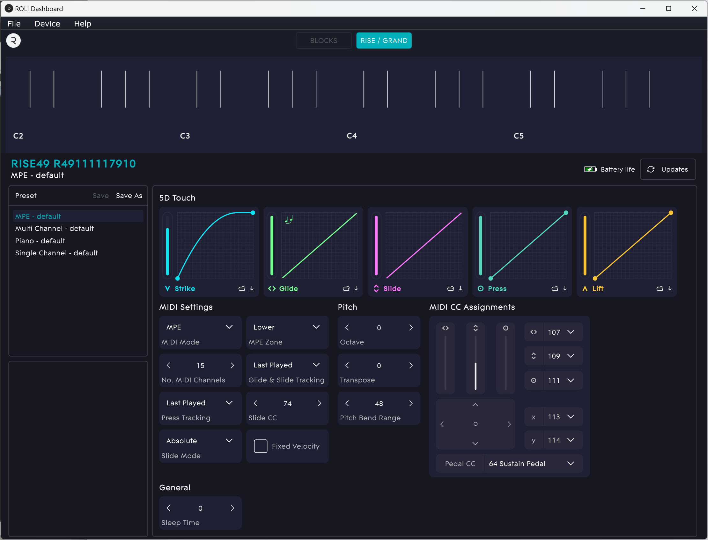

# MIDI implementation

## Libraries

Low level, collect data and dispatch to handlers

- Francois Best [MIDI Library](https://www.pjrc.com/teensy/td_libs_MIDI.html) (version 5 on [GitHub](https://github.com/FortySevenEffects/arduino_midi_library) but 4 may be simpler to use here)
- Paul Stoffregen USB MIDI Host using [USBHost_t36](https://github.com/PaulStoffregen/USBHost_t36)
- Teensyduino [USB MIDI](https://www.pjrc.com/teensy/td_midi.html)

Note that [Arduino USBMIDI](https://github.com/lathoub/Arduino-USBMIDI) claims to support Teensy 4.1 but does not support USB Host.

Note [bug in MIDI.hpp re system common messages](https://forum.pjrc.com/threads/73743-midi-tune-select-problem?p=333274&viewfull=1#post333274)

Detect devices connected to USB host:

> myusb.task() is what polls for a connected USB device.

High level, implement MIDI 1.0, HRV and and MPE specifications

- My own library.

Doesn't yet exist as a library but verious sketches implement parts.

Voice allocation is not in that library, module specific.

## Note range

Range of [musical frequencies for MIDI notes](https://www.inspiredacoustics.com/en/MIDI_note_numbers_and_center_frequencies) assuming :

- Equal temperament tuning
- MIDI 60 is C4, middle C (thus MIDI 69 is A4, concert A)
- A4 is 440Hz
- C4 is by default 0V, Doepfer Eurorack standard (thus tuning to 440Hz needs 0.75V)
- pitch CV range +5V to -5V
- DAC verification should avoid the note extremes to minimize linearity error
- With pitchbend, note numbers are non-integer


Voltage = 0.75 + (n - 69)/12

| MIDI 	| Name 	| Voltage  	| Frequency 	|
|------	|------	|----------	|-----------	|
| _127_  	| G9   	|          	| 12,543.85 	|
| _120_  	| C9   	| 5V       	| 8372.02   	|
| _119_  	| B8   	| 4 11/12V 	| 7902.13   	|
| _117_  	| **A8**   	| 4.75V    	| 7040.00   	|
| 108  	| C8   	| 4V       	| 4186.01   	|
| 105  	| **A7**   	| 3.75V    	| 3520.00   	|
| 93   	| **A6**   	| 2.75V    	| 1760.00   	|
| 81   	| **A5**   	| 1.75V    	| 880.00    	|
| 69   	| **A4**   	| 0.75V    	| 440.00    	|
| 60   	| C4   	| 0V       	| 261.63    	|
| 57   	| **A3**   	| -0.25V   	| 220.00    	|
| 45   	| **A2**   	| -1.25V   	| 110.00    	|
| 36   	| C2   	| -2V      	| 65.41     	|
| _33_   	| **A1**   	| -2.25V   	| 55.00     	|
| _24_   	| C1   	| -3V      	| 32.70     	|
| _21_   	| **A0**   	| -3.25V   	| 27.50     	|
| _16_   	| E0   	|          	| 20.60     	|
| _9_   	| **A-1**   | -4.25V    | 16.35     	|
| _0_       | C-2       |  -5V      | 8.18     |

Frequencies for the A notes are _exact_, others are rounded.
MIDI notes outside 88-key piano range are in italics.

Note that:

- A8 is a convenient 4.750 V corresponding to an exact integer frequency 7040 Hz
- C8 is a convenient 4v for testing, and also corresponds to the _highest_ note on an 88-key piano
- C2 is -2V and also the _lowest_ note on an 88-key piano
- A2 is a convenient -2.250 V corresponding to an exact integer frequency 55 Hz
- E0 is the lower limit of audibility
- A-1 is -4.25V and exact 16.350 Hz, useful for auto tuning
- MIDI notes 121 to 127 are unreachable with a ±5V DAC swing if the C4 = 0V Doepfer tuning is maintained. Also not musically useful notes.
- MIDI notes 0 to 15 inaudible, so not musically useful

## Duophony

- [Duophony on SoS](https://www.soundonsound.com/techniques/duophony)

## Note priority

Dispatching key events to the two channels: first one is lowest note priority, second channel is highest note priority. So can be used as one of two popular monosynth styles, as well as duophonic.

- [Priorities & Triggers](https://www.soundonsound.com/techniques/priorities-triggers)

## Smoothing and update rate

DIN MIDI is 31,250 baud with 10 bits (1 start, 8 data, 1 stop, no parity) per byte transferred = 3,125 bytes/sec. 3 bytes per MIDI CC means max update rate (for a single CC using all the bandwidth) is ~1000 CC per second.

Interesting quote [from Haken MPE+](https://www.hakenaudio.com/mpe):

> Data smoothing is not a bad thing for the synthesizer to do — in fact, the Sampling Theorem tells us that smoothing is always necessary to avoid aliasing!  Aliasing is not a problem unique to audio sample streams, but also X,Y,Z control streams encoded in Midi. The common sample rates for audio are 44.1, 48, or 96 kHz.  The effective sample rate for the most popular MPE controllers’  Z data is ~25 Hz, and ~500 Hz for the Continuum Fingerboard. MPE+ lets the controller specify the best amount of smoothing to avoid update noise (aka zipper noise or aliasing) but still retain the finger motion information in the data.  [Clarification: The Continuum internally has an effective sample rate of ~3 kHz for Z; this data is processed to create the optimized ~500 Hz effective sample rate control stream for Midi transmission.]

and, from the [Sound on Sound review of the Expressive-E Osmose](https://www.soundonsound.com/reviews/expressive-e-osmose):

> The Osmose’s internal control scheme is not based on MPE MIDI but an extension of it termed MPE+ that improves resolution in the domains of time (for very quick response) and magnitude (for very smooth). Interestingly, it does away with the concept of key velocity (or, in MPE terms, Strike Value) completely, and instead derives note onset information from ‘attack trajectory’, a much more precise assessment of key travel over time that can take into account key dip as well as rate and acceleration.

> However, the Osmose will function perfectly well as an MPE or basic MIDI controller. It does that by deriving velocity data (or MPE Strike Value) from the initial key touch, and various types of channel or polyphonic pressure from the aftertouch. An ‘Ext MIDI’ mode, with a dedicated button, toggles the Osmose’s interface entirely over to MIDI control functions. And then a handful of dedicated MIDI control profiles are provided, including a full MPE implementation, ‘classic keyboard’ (which turns off all expressive features except velocity and channel aftertouch), and ‘poly aftertouch’ (which gives good compatibility with synths like the Oberheim OB‑6 that offer this response, but not full MPE). The point in the key dip at which notes trigger varies between modes: higher/earlier for MPE, and lower/later for ‘classic keyboard’. That’s some real sophistication, and very nicely considered.

See also the section [**14-bit Controllers are Flawed**](https://www.hakenaudio.com/mpe) and [Control Voltage Converter (CVC) for Analog Synthesizers](https://www.hakenaudio.com/voltage-converter) which has W,X,Y,Z outputs on four channels (using I2C, oddly), and similar [Evaton Technologies µCVC](https://www.evatontechnologies.com/mcvc).

Useful discussion on [Osmose, CC87, CC74 for 14-bit output](https://community.vcvrack.com/t/osmose-expressive-e/19100/9)

[MIDI BigBuffer to avoid losing data with high throughput](https://forum.pjrc.com/threads/70227-USBhost_t36-MIDI-losing-midi-note-on-off-events-(Teensy-3-6)-during-modwheel-change?p=306436&viewfull=1#post306436)

[class MIDIDevice_BigBuffer ](https://github.com/PaulStoffregen/USBHost_t36/blob/b6f94f7605b3f6cb57a10e41cab51b25b47f7736/USBHost_t36.h#L1521C53-L1521C53) required for 480 speed.

## Tunings, and Microtuning

- [MICROTUNING VIRTUAL AND ELECTRONIC HARDWARE INSTRUMENTS: AN OVERVIEW OF FORMATS AND METHODS FOR USING ALTERNATIVE INTONATION SYSTEMS](https://midi.org/microtuning-and-alternative-intonation-systems)

> There are countless other such examples of historical and contemporary musical instrument intonation systems that would be able to easily illustrate the glaring shortcomings of being restricted to only 12 notes repeating at the 2/1. For musicians and composers to be able to encompass the full range of expression and compositional possibilities of using alternative intonation systems in their music – including, but not limited to, 12 Note Octave Repeating Microtunings – it is advised to support those visionary developers who have implemented full-keyboard microtuning in their instruments. With correctly implemented full-keyboard microtuning functionality, there is no compromise in the way that one may microtune their hardware or virtual instruments.

> Virtual instruments that can more easily achieve high-precision full-controller microtuning are those where developers have implemented the use of either the **TUN** or **MTS (MIDI Tuning Standard)** microtuning formats, which enable saving all of the microtuning mapping information into a single tuning data file that may be loaded directly into the instruments, or in the case of MTS, also be transmitted from the timeline of DAWs that allow transmitting SYSEX, such as for example REAPER and Bitwig.

- [How to create a .tun file in Scala](https://sevish.com/2014/how-to-create-a-tun-file-in-scala/) also describes mts
- [MIDI tuning frequency data format](https://en.wikipedia.org/wiki/MIDI_tuning_standard#Frequency_Data_Format)

TUN (.tun) is textual, one line for each of the 128 notes, while MTS (.mid) is binary, 3 bytes per note.

- [Mapping microtonal scales to a MIDI keyboard in Scala](https://sevish.com/2017/mapping-microtonal-scales-keyboard-scala/)
- [re-tuned - same melodies in different tunings](https://sevish.bandcamp.com/album/re-tuned)
- [scale workshop](https://sevish.com/scaleworkshop/?version=2.5.7) browser-based scale generator
- [Intro to Microtonality](https://theproaudiofiles.com/microtones/)
- [My Idiosyncratic Reasons for Using Just Intonation](https://www.kylegann.com/JIreasons.html)
- Book [The Arithmetic of Listening](https://www.press.uillinois.edu/books/?id=p084416)

## Combining data sources

The SoS [review of the Arturia Polybrute 12](https://www.soundonsound.com/reviews/arturia-polybrute-12) mentions Pluck (short AD) and Touch (key position modified by ADSR) to control filter and VCA.

> The third mode is FullTouch Env > AT, and this is the one that’s going to cause confusion, not least because the manual doesn’t describe it fully. (A lack of detail was a fault with the original PolyBrute manual, too.) Having spent hours trying to work out what was happening, I admitted defeat and contacted Arturia. It turns out that, when designing sounds to take advantage of FullTouch AT and FullTouch AT > Z, the developers found that they were leaving the filter and amplifier open so that they could use FullTouch to control other aspects of note development, timbre and modulation. So they designed a mode in which the VCF and VCA envelopes no longer act as ADSR contour generators, but are replaced by modulation values that are determined by the key velocity and vertical position. Having decided upon the basis of the system, they then decided to make each of those values the sum of two new signals. The first of these is called Pluck, and this is a simple AD transient. Its fastest attack rate is quoted as below 4ms, but it can be lengthened a little by increasing the value of the attack fader of the appropriate envelope generator. The decay rate is then controlled by the decay fader, and the maximum amplitude of the transient is controlled by the velocity fader, although there’s a lower velocity threshold that helps to ensure that you don’t generate a Pluck by accident. The second signal is called Touch, which is a contour determined by the position of the key at any given moment. However, the ADSR faders in each of the VCF and VCA envelope panes also affect this. The attack and decay faders determine the slew rate when the key moves down or up, respectively. The Sustain value is more complex. When positioned below 50 percent, the generated values are lower than they would otherwise be, lowering the relative amplitude of the Touch and emphasising the Pluck to create, well, plucked sounds. But when the Sustain is positioned above 50 percent, the Touch signal remains high. This was implemented so that the VCA can be kept open even while a key is being moved up and down to control the filter. The release fader then controls the release time as you would expect. Finally, the aftertouch sensor at the bottom of the key’s travel is again active, so you can still lean into a note and generate Poly‑AT in addition to all of the above.

## Reading MIDI data

Setup:
```
#include <USBHost_t36.h>
#include <MIDI.h>

USBHost thisUSB;
USBHub hub1(thisUSB);
MIDIDevice_BigBuffer usbhostMIDI(thisUSB);

MIDI_CREATE_DEFAULT_INSTANCE();
```

And then in the loop:
```
    MIDI.read();
    usbMIDI.read();
    thisUSB.Task();
    usbhostMIDI.read();
```

## Controllers

### Roli Seaboard Rise 1



The three sliders are by default (in MPE mode) set to CC 107, 109, 111 while the touchpad is set to x-axis CC 113, y-axis CC 114. However they seem to generate SysEx F0 instead.

```
 TIMESTAMP IN PORT STATUS DATA1 DATA2 CHAN NOTE EVENT               
 Opened MIDI Input
 Closed MIDI Input
 Opened MIDI Input
 00000BE7   2  --     F0  Buffer:     9 Bytes   System Exclusive      
 SYSX: F0 00 21 10 78 3D 17 06 F7
 00000C0F   2  --     F0  Buffer:     9 Bytes   System Exclusive      
 SYSX: F0 00 21 10 78 3D 17 0A F7
 00000C37   2  --     F0  Buffer:     9 Bytes   System Exclusive      
 SYSX: F0 00 21 10 78 3D 17 1C F7
 00000C60   2  --     F0  Buffer:     9 Bytes   System Exclusive      
 SYSX: F0 00 21 10 78 3D 17 27 F7
```

And for keys (remembering in MPE 74 Brightness is used for front-back Slide)

```
 TIMESTAMP IN PORT STATUS DATA1 DATA2 CHAN NOTE EVENT               
 Opened MIDI Input
 0005534E   2  --     B1    4A    08    2  ---  CC: Brightness        
 0005534E   2  --     E1    00    40    2  ---  Pitch Bend            
 0005534E   2  --     91    39    1E    2  A  3 Note On               
 00055358   2  --     B1    4A    06    2  ---  CC: Brightness        
 0005535B   2  --     E1    00    40    2  ---  Pitch Bend            
 00055362   2  --     D1    37    --    2  ---  Channel Aft           
 00055369   2  --     D1    39    --    2  ---  Channel Aft           
 00055370   2  --     D1    3B    --    2  ---  Channel Aft           
 00055377   2  --     D1    3D    --    2  ---  Channel Aft           
 0005537E   2  --     D1    3F    --    2  ---  Channel Aft           
 00055384   2  --     D1    41    --    2  ---  Channel Aft           
 0005538B   2  --     D1    43    --    2  ---  Channel Aft           
 0005538B   2  --     B1    4A    05    2  ---  CC: Brightness        
 00055392   2  --     D1    45    --    2  ---  Channel Aft           
 00055399   2  --     D1    47    --    2  ---  Channel Aft           
 000553A0   2  --     D1    49    --    2  ---  Channel Aft           
 000553A5   2  --     B1    4A    04    2  ---  CC: Brightness        
 000553A7   2  --     D1    4B    --    2  ---  Channel Aft           
 000553AE   2  --     D1    4D    --    2  ---  Channel Aft           
 000553B5   2  --     D1    4F    --    2  ---  Channel Aft           
 000553BC   2  --     D1    51    --    2  ---  Channel Aft           
 000553C3   2  --     D1    53    --    2  ---  Channel Aft           
 000553CA   2  --     D1    55    --    2  ---  Channel Aft           
 000553D1   2  --     D1    57    --    2  ---  Channel Aft           
 000553D8   2  --     D1    59    --    2  ---  Channel Aft           
 000553DF   2  --     D1    5B    --    2  ---  Channel Aft           
 000553E7   2  --     D1    5D    --    2  ---  Channel Aft           
 000553ED   2  --     D1    5F    --    2  ---  Channel Aft           
 000553F3   2  --     B1    4A    05    2  ---  CC: Brightness        
 000553FB   2  --     D1    60    --    2  ---  Channel Aft           
 00055409   2  --     D1    61    --    2  ---  Channel Aft           
 00055418   2  --     D1    62    --    2  ---  Channel Aft           
 0005541B   2  --     B1    4A    06    2  ---  CC: Brightness        
 000554B8   2  --     D1    61    --    2  ---  Channel Aft           
 000554BF   2  --     D1    60    --    2  ---  Channel Aft           
 000554C6   2  --     D1    5E    --    2  ---  Channel Aft           
 000554CD   2  --     D1    5D    --    2  ---  Channel Aft           
 000554D3   2  --     E1    10    40    2  ---  Pitch Bend            
 000554D4   2  --     D1    5F    --    2  ---  Channel Aft           
 000554DC   2  --     D1    61    --    2  ---  Channel Aft           
 000554DE   2  --     B1    4A    07    2  ---  CC: Brightness        
 000554E1   2  --     E1    24    40    2  ---  Pitch Bend            
 000554E3   2  --     D1    63    --    2  ---  Channel Aft           
 000554EA   2  --     B1    4A    05    2  ---  CC: Brightness        
 000554EE   2  --     E1    41    40    2  ---  Pitch Bend            
 000554F1   2  --     D1    61    --    2  ---  Channel Aft           
 000554FB   2  --     E1    51    40    2  ---  Pitch Bend            
 000554FF   2  --     D1    5F    --    2  ---  Channel Aft           
 00055505   2  --     D1    5D    --    2  ---  Channel Aft           
 00055507   2  --     E1    0E    41    2  ---  Pitch Bend            
 0005550C   2  --     D1    5F    --    2  ---  Channel Aft           
 00055512   2  --     B1    4A    04    2  ---  CC: Brightness        
 00055514   2  --     D1    61    --    2  ---  Channel Aft           
 00055515   2  --     E1    1D    41    2  ---  Pitch Bend            
 0005551B   2  --     D1    63    --    2  ---  Channel Aft           
 00055522   2  --     D1    65    --    2  ---  Channel Aft           
 00055522   2  --     E1    2A    41    2  ---  Pitch Bend            
 00055529   2  --     D1    66    --    2  ---  Channel Aft           
 0005552C   2  --     B1    4A    06    2  ---  CC: Brightness        
 0005552F   2  --     E1    39    41    2  ---  Pitch Bend            
 00055530   2  --     D1    64    --    2  ---  Channel Aft           
 00055537   2  --     D1    62    --    2  ---  Channel Aft           
 0005553B   2  --     E1    7D    41    2  ---  Pitch Bend            
 0005553D   2  --     D1    60    --    2  ---  Channel Aft           
 00055544   2  --     D1    62    --    2  ---  Channel Aft           
 00055545   2  --     B1    4A    03    2  ---  CC: Brightness        
 00055548   2  --     E1    4D    42    2  ---  Pitch Bend            
 0005554B   2  --     D1    64    --    2  ---  Channel Aft           
 00055552   2  --     D1    66    --    2  ---  Channel Aft           
 00055555   2  --     E1    54    42    2  ---  Pitch Bend            
 00055559   2  --     D1    68    --    2  ---  Channel Aft           
 0005555F   2  --     B1    4A    04    2  ---  CC: Brightness        
 00055560   2  --     D1    66    --    2  ---  Channel Aft           
 00055562   2  --     E1    6C    42    2  ---  Pitch Bend            
 00055567   2  --     D1    68    --    2  ---  Channel Aft           
 0005556D   2  --     B1    4A    05    2  ---  CC: Brightness        
 0005556F   2  --     D1    66    --    2  ---  Channel Aft           
 00055570   2  --     E1    0C    43    2  ---  Pitch Bend            
 00055576   2  --     D1    64    --    2  ---  Channel Aft           
 00055579   2  --     B1    4A    04    2  ---  CC: Brightness        
 0005557C   2  --     D1    66    --    2  ---  Channel Aft           
 0005557C   2  --     E1    26    43    2  ---  Pitch Bend            
 00055583   2  --     D1    68    --    2  ---  Channel Aft           
 00055589   2  --     E1    2C    43    2  ---  Pitch Bend            
 0005558A   2  --     D1    66    --    2  ---  Channel Aft           
 00055591   2  --     D1    64    --    2  ---  Channel Aft           
 00055593   2  --     B1    4A    08    2  ---  CC: Brightness        
 00055596   2  --     E1    51    43    2  ---  Pitch Bend            
 00055598   2  --     D1    62    --    2  ---  Channel Aft           
 000555A0   2  --     D1    64    --    2  ---  Channel Aft           
 000555A0   2  --     B1    4A    07    2  ---  CC: Brightness        
 000555A3   2  --     E1    71    43    2  ---  Pitch Bend            
 000555A6   2  --     D1    63    --    2  ---  Channel Aft           
 000555AD   2  --     D1    65    --    2  ---  Channel Aft           
 000555AE   2  --     B1    4A    06    2  ---  CC: Brightness        
 000555B0   2  --     E1    7C    43    2  ---  Pitch Bend            
 000555B4   2  --     D1    67    --    2  ---  Channel Aft           
 000555BB   2  --     B1    4A    07    2  ---  CC: Brightness        
 000555BB   2  --     D1    69    --    2  ---  Channel Aft           
 000555BD   2  --     E1    00    44    2  ---  Pitch Bend            
 000555C2   2  --     D1    6B    --    2  ---  Channel Aft           
 000555C7   2  --     B1    4A    08    2  ---  CC: Brightness        
 000555CA   2  --     D1    6D    --    2  ---  Channel Aft           
 000555D0   2  --     D1    6F    --    2  ---  Channel Aft           
 000555D7   2  --     D1    71    --    2  ---  Channel Aft           
 000555DF   2  --     D1    73    --    2  ---  Channel Aft           
 000555E6   2  --     D1    74    --    2  ---  Channel Aft           
 000555ED   2  --     D1    73    --    2  ---  Channel Aft           
 000555EF   2  --     B1    4A    09    2  ---  CC: Brightness        
 00055602   2  --     D1    72    --    2  ---  Channel Aft           
 00055616   2  --     B1    4A    08    2  ---  CC: Brightness        
 0005562C   2  --     D1    71    --    2  ---  Channel Aft           
 00055647   2  --     D1    70    --    2  ---  Channel Aft           
 0005565C   2  --     D1    6F    --    2  ---  Channel Aft           
 00055663   2  --     D1    6E    --    2  ---  Channel Aft           
 0005566A   2  --     D1    6D    --    2  ---  Channel Aft           
 00055671   2  --     D1    6B    --    2  ---  Channel Aft           
 00055678   2  --     D1    69    --    2  ---  Channel Aft           
 0005567D   2  --     B1    4A    07    2  ---  CC: Brightness        
 0005567F   2  --     D1    67    --    2  ---  Channel Aft           
 00055686   2  --     D1    65    --    2  ---  Channel Aft           
 0005568D   2  --     D1    63    --    2  ---  Channel Aft           
 00055694   2  --     D1    61    --    2  ---  Channel Aft           
 00055697   2  --     B1    4A    08    2  ---  CC: Brightness        
 0005569B   2  --     D1    5F    --    2  ---  Channel Aft           
 000556A2   2  --     D1    5D    --    2  ---  Channel Aft           
 000556A9   2  --     D1    5B    --    2  ---  Channel Aft           
 000556B0   2  --     D1    59    --    2  ---  Channel Aft           
 000556B7   2  --     D1    57    --    2  ---  Channel Aft           
 000556BE   2  --     D1    55    --    2  ---  Channel Aft           
 000556C5   2  --     D1    53    --    2  ---  Channel Aft           
 000556CC   2  --     D1    51    --    2  ---  Channel Aft           
 000556D4   2  --     D1    4F    --    2  ---  Channel Aft           
 000556D6   2  --     81    39    39    2  A  3 Note Off              
 0005DB72   2  --     F0  Buffer:     9 Bytes   System Exclusive      
 SYSX: F0 00 21 10 78 3E 28 06 F7
```

The short SysEx seems to be sent periodically as a sort of keep-alive? 00H 21H 10H is registered to ROLI Ltd. Presumably 78 is the [device ID](https://www.2writers.com/eddie/MidiGlossary.htm#DeviceId) and 3E is the Seaboard Rise 1 Model ID? Although the earlier trace had 3D. Thus, 28 06 is the actual data.

- [Starting and ending SysEx](http://midi.teragonaudio.com/tech/midispec/sysex.htm)
- [SysEx IDs](https://midi.org/sysexidtable)

- [Reaper: Using the Seaboard RISE & GRAND with Reaper](https://support.roli.com/support/solutions/articles/36000024635-reaper-using-the-seaboard-rise-grand-with-reaper)
- [OBLVYN’s tips and tricks for Seaboard RISE 2](https://roli.com/stories/oblvyns-tips-and-tricks-for-seaboard-rise-2?mc_cid=4fa71d55d9)

### Polybrute 12 MPE

> I should also mention that, in addition to all of the above, the PolyBrute 12 supports MPE. When sending, all of the aftertouch modes send channel pressure on a per‑note basis, with the FullTouch Env > Z and FullTouch Env > AT modes sending MIDI CC74 as the secondary parameter when a key is pushed into the aftertouch sensor at the bottom of its travel. When receiving, channel aftertouch, poly aftertouch, FullTouch AT and FullTouch AT > Z are each routed to aftertouch and MIDI CC74 on a per‑note basis, while FullTouch Env > AT is routed to the VCF envelope and aftertouch respectively.