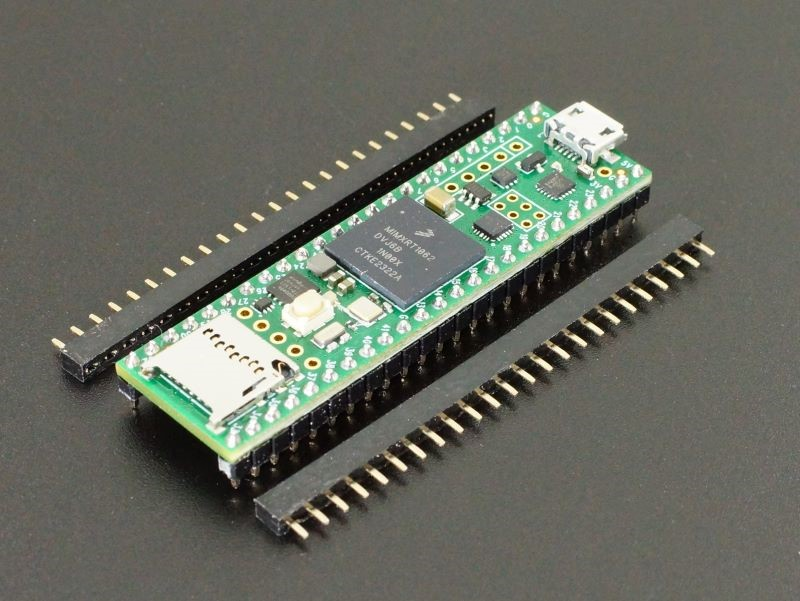
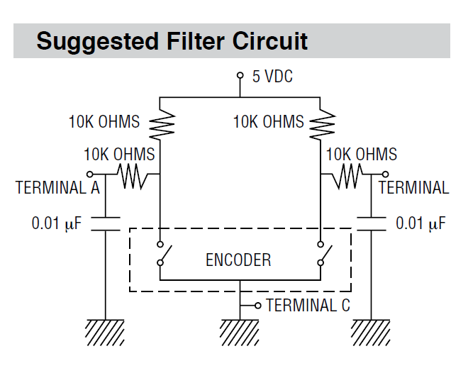
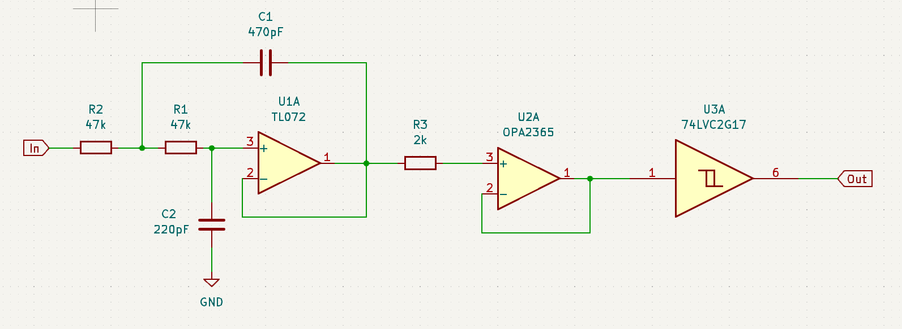
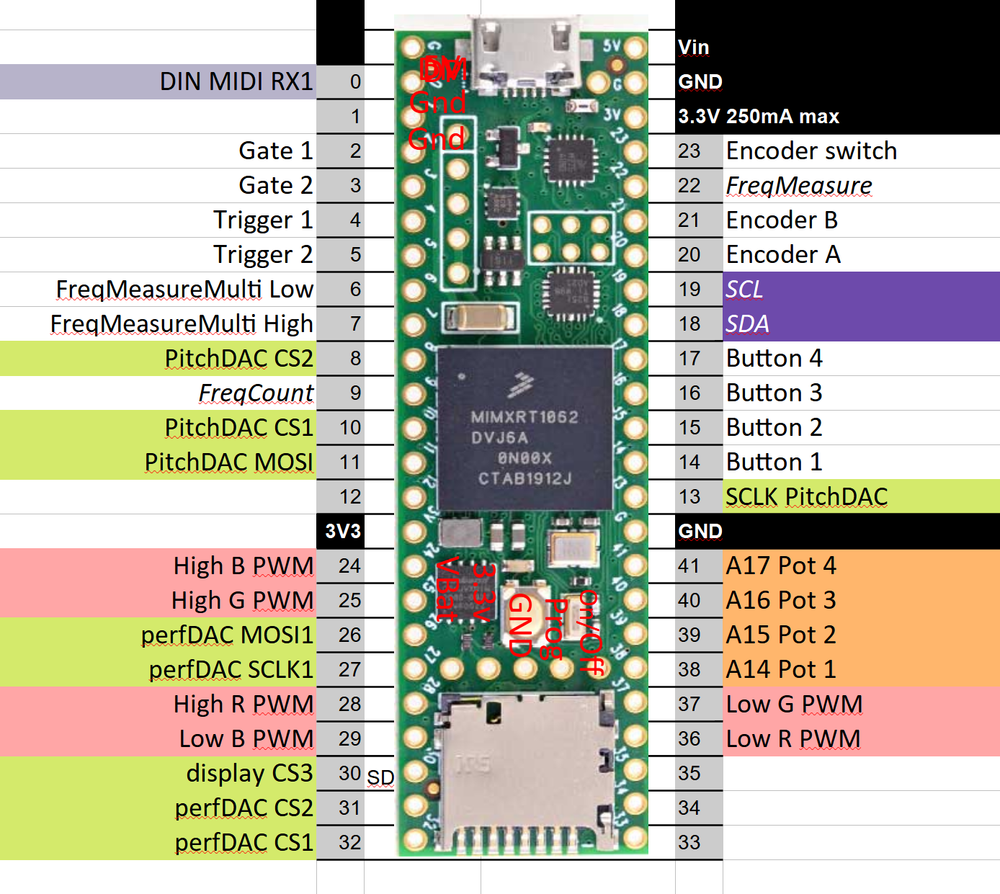
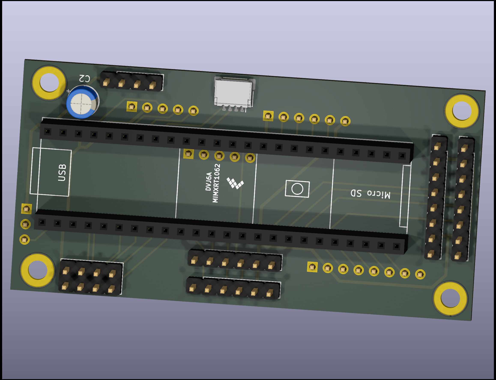
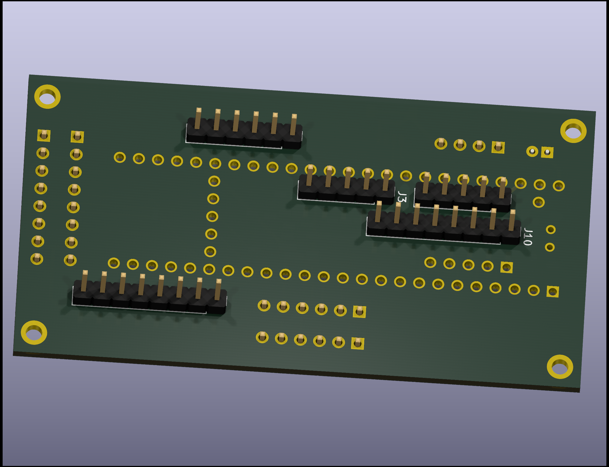

# Duophonic MPE MIDI - Main MPU board.

## Power

Driven by Eurorack 5V power, generates logic 3V3 Vdd (from Teensy onboard, <250mA).

## MCU choice

MPU needs USB host and hardware floating point, so Teensy 3.6 (now discontinued) or **Teensy 4.1**. Both are 3V3-only.

T4.1 ($26.85) is somewhat overpowered but has 480Mbit/s on both USB and Host so potentially lower latency (T3.6 was 480 on Host only). T4.1 has 100mA power consumption at full clock speed (or [68ms if you switch off the orange LED and don't use USB Serial](https://forum.pjrc.com/index.php?threads/the-power-consumption-of-teensys-processor.74442/#post-338912)).

[T4 power consumption](https://forum.pjrc.com/threads/69159-Teensy-4-0-at-24Mhz-still-drawing-100mA-Why?p=297146&viewfull=1#post297146):
freq    current
24      60mA
150     80mA
600     100mA

T3.6 ($29.25) had less memory, has 2 DAC outs (not needed here), power draw unspecified (@@measure it) but less than 4.1. Unobtainable due to NXP parts shortage, was discontinued along with 3.5, 3.2 and LC!

Ensure USB cable plugged into the micro-USB (which leads to the panel-mount USB socket) clears the back of the [Gate LED board](./Gate-LED.md).

Perhaps use [ProtoSupplies low-profile headers](https://protosupplies.com/product/header-set-low-profile-1x24/) to connect Teensy 4.1 to the MPU board [as seen here](https://forum.pjrc.com/index.php?threads/construction-suggestions-for-midi-synth-project.77136/#post-359959). Also [available pre-soldered to Teensy 4.1](https://protosupplies.com/product/teensy-4-1-low-profile/) with modifications:

- The VUSB/VIN trace is cut
- An SMD 1A Schottky diode is placed across the VUSB / VIN pads

## MIDI

For software details, see [EuroMPE MIDI](./MIDI.md). This section relates to the input hardware portions on the MPU board, only.

### DIN MIDI

MIDI hardware spec states < 5mA to turn on, < 2μs rise and fall times. Also pin 2 and shield go from not connected, to connected by 100nF caps for RF purposes.

[DIN MIDI](https://www.pjrc.com/teensy/td_libs_MIDI.html) in needs serial input and 6N138 optoisolator with [1k pulldown](https://forum.pjrc.com/threads/54891-MIDI-serial-(DIN)-to-usbMIDI-issues-got-weird-MIDI-messages?p=287082#post287082)
and [4.7-10 kΩ base-emitter resistor](https://forum.pjrc.com/index.php?threads/midi-5-pin-din-and-trs-swiching-circuit.71303/#post-343562). 

6N139 is lower-current (0.5mA) version of 6N138 (1.6mA).  

Avago Max propogation delay to low: 6N139 25μs, 6N138 10μs. To high, 6N139 60μs, 6N138 35μs.

Fairchild is worse, max propogation delay to low: 6N139 30μs, 6N138 15μs. To high, 6N139 90μs, 6N138 50μs.

Vishay 6N137 max propogation delay to low: 75ns; to high: 75ns.

NO use 6N137, with transistor for level shift and inversion.

> The PC900 suggested by the specification is still a good choice. (Well, it's discontinued, but "PC900" was just Sharp's way of spelling "H11L1", and the H11L1 is still made by many manufacturers.)
> The original 6N137 works only at 5 V. LiteOn's model also works at 3.3 V, while other manufacturers offer a separate 3.3 V variant, for a higher price: HCPL-260L, FOD260L, TLP2962. If you do use the LiteOn 6N137, you should ensure that nobody tries to substitute a different 6N137 model later. [source](https://www.midi.org/forum/1475-best-optoisolator-for-3-3v)

Apparently 6N138 and or H11L1 are too slow per MIDI spec and 6N137 is better. These are not drop-in replacements, the support circuitry differs.

> _(6N137 with)_ An NPN transistor with the collector pulled up to 3.3V. This will also give you a second inversion. The diagram below shows my circuit. The difference is you would have R41 pull up to 3.3V (not isolated 5V as in mine). I would probably make it 10K. C2 is a bypass cap, the datasheet recommends it. Put it as close to pins 8 and 5 as you can. [source](https://forum.pjrc.com/threads/66877-Teensy-4-0-serial-optocoupler-6n137s?p=276314&viewfull=1#post276314)

- [Opto-couple confusion – 6N137 or 6N138?](https://gr33nonline.wordpress.com/2019/05/15/opto-couple-confusion-6n137-or-6n138/)
- [Teensy 4.0 serial optocoupler 6n137s](https://forum.pjrc.com/threads/66877-Teensy-4-0-serial-optocoupler-6n137s)
- [MIDI Input with 6N137, 6N138, or 6N139](https://www.kieranreck.co.uk/blog/midi-input-with-6n137-6n138-or-6n139)
- [Optocouplers: Defending Your Microcontroller, MIDI, And A Hot Tip For Speed](https://hackaday.com/2018/05/09/optocouplers-defending-your-microcontroller-midi-and-a-hot-tip-for-speed/) especially the comments
- [speeding up 6N138 with a pull-down resistor](https://electronics.stackexchange.com/questions/165255/midi-in-many-circuits/165267#165267)

[Vishay 6N137](https://www.mouser.com/ProductDetail/Vishay-Semiconductors/6N137?qs=xCMk%252BIHWTZMrQz4FyDXhMg%3D%3D) PDIP8, $1.76/1.

- 00 RX1

### USB MIDI (device)

[USB MIDI](https://www.pjrc.com/teensy/td_midi.html) 

### USB MIDI (host)

 [USB Host MIDI](https://github.com/PaulStoffregen/USBHost_t36).- [Multiple USB MIDI on USBHost](https://forum.pjrc.com/index.php?threads/resolved-multiple-midi-devices-must-be-defined-to-support-connectivity-thru-a-usb-hub-on-t4-usbhost.74561/#post-339883)

> You need 2 MIDIDevice_BigBuffer. Each MIDI instrument/controller/device you connect gets serviced by 1 of those. To use 2 devices, you need 2 instances.
> You only need 1 USBhost. In fact, you can't use more than 1, because Teensy has only 1 USB host port.

## SPI

Two [SPI](https://www.pjrc.com/teensy/td_libs_SPI.html) outputs for DACs (use SPI0, the faster FIFO one, for the  pitch DAC, because MPE pitchbend messages send a lot of data; use SPI1, the second one, for the octal performance DAC and octal CC DAC) with associated chip selects. Or maybe, if the perf dacs are being updated at high frequency to do smoothing in software, they would be better on the FIFO one.

SPI Display is also on SPI1.

### SPI 0

- 8 CS-Pitch2 (not 9 which is used for FreqCount)
- 10 CS-Pitch1 (any convenient)
- 11 MOSI pitchDACs
- _12 MISO not needed_
- 13 SCLK pitchDAC

### SPI 1

- 26 MOSI1 perfDACs
- _39 MISO1 not needed_
- 27 SCLK1 perfDACs
- 30 CS1-Perf (any convenient)
- 31 CS2-CC  (any convenient) 
- 32 spare
- 33 CS3-Display  (any convenient)
- 34 RST-Display  (any convenient)
- 35 DC-Display (any convenient)

Use pull-up resistors on chip selects, per 
[Better SPI Bus Design in 3 Steps](https://www.pjrc.com/better-spi-bus-design-in-3-steps/)

> The rising and falling edges of the SPI clock have very high bandwidth, even though the actual clock rate is only 1 MHz. High bandwidth signals on long cables have all sorts of difficult problems when the source impedance isn't matched to the cable's characteristic impedance. The most common solution is to place a resistor in series close to Teensy pin 13 (SCK). Same of MOSI. [Paul Stoffregen](https://forum.pjrc.com/index.php?threads/weird-spi-clock-signal-on-teensey-4-1-pin-13.74169/#post-336114)

Experiment with different resistance values for clock and data lines, and monitor with scope to find optimal values for the cable length in use. Around 50 to 75 ohm seems like a good start.

also (same forum post):

> Bursts of 8 clocks is very common for SPI. The gaps between are software overhead. You can usually minimize this with SPI.transfer(buffer, size) rather than calling SPI.transfer(byte) for each individual byte.

## UI: Display & Controls

The Encoder, the four buttons, and the display are all mounted on the [display board](./display-board.md) with their signals routed to the MPU board.

## SPI Display

Using [Adafruit OLED 128x64 1.3inch](./display.md). Needs DC, CS, and RST.

See SPI section, above and [display](./display.md).

[Advice on ground noise and OLED displays](https://modwiggler.com/forum/viewtopic.php?p=3999696#p3999696)

## Encoder, buttons

Buttons and [encoder](https://www.pjrc.com/teensy/td_libs_Encoder.html) for option selection and menu navigation. T3.6 & T4.1 can use any pins for encoders.

- 20 Encoder-A
- 21 Encoder-B
- 23 Encoder-switch
- 14 Button-1
- 15 Button-2
- 16 Button-3
- 17 Button-4

Encoder circuit (from Bourns PEC12R datasheet) four 10k, two 10nF:

- [Hardware debounce vs. software hysteresis for encoders](https://forum.arduino.cc/t/rotary-encoder-debouncing/361438/12)
- [Measurig bounce on a scope](https://electronics.stackexchange.com/questions/430983/why-cant-i-see-bouncing-of-a-switch-on-an-oscilloscope#answer-431043)

Use encoder switch as OK, needs anther button for "back".

Also needs "Calibrate" "Tune" and "Setup" ? Single button for common functions.

## Mode switch(es) ?

Unclear if MPE/non-MPE is needed. Could be a menu option.

Duophonic/Unison switch at minimum, perhaps Duophonic/Unison/Harmonic or use another switch (plus the encoder) for Harmonic. Double press to reset.

### Non-MPE channel selector ?

Could hide this in a menu; main usage is MPE. Also hide MPE behaviour on split (unlikely) in a setup menu.

## Frequency measurement

Frequency measuring circuitry for auto calibration. How to select channel? Should there be a 440Hz reference output?

> FreqCount: best for 1 kHz to 8 MHz (up to 65 MHz with Teensy 3.0 & 3.1)

> FreqMeasure: best for 0.1 Hz to 1 kHz

Test how low FreqCount can go, or connect both circuits and choose between inputs depending on result.

- 9 [FreqCount](https://www.pjrc.com/teensy/td_libs_FreqCount.html)
- 22 [FreqMeasure](https://www.pjrc.com/teensy/td_libs_FreqMeasure.html)

> (for FreqMeasure) At relatively low frequencies, under 1 kHz, only minimal CPU time is used. However, as the frequency increases, the interrupt demands more CPU time. A hardware low-pass filter is recommended if the input frequency could possibly be much higher than several kHz.

For [FreqMeasureMulti](https://github.com/PaulStoffregen/FreqMeasureMulti) the supported pins on Teensy 4.1 are:

0-9, 22-25, 28, 29, 33, 36, 37, 42-47, 48-50(dups), 51, 52-53 (dups), 54

- 2 FreqMeasureMulti Low (FlexPWM4.2)
- 3 FreqMeasureMulti High (FlexPWM4.2)

Useful frequency range for calibration (see [MIDI](./MIDI.md)) is 16.35Hz to 7040.00Hz, and for oscillator tuning and musical use is 65.41 Hz to 4186.01 Hz.

**Check** pin 7 [conflicts with PWM timers](https://www.pjrc.com/teensy/td_pulse.html), maybe swap the two Gate outs with the two FreqMeasureMulti to avoid.

[fast rising edges](https://forum.pjrc.com/index.php?threads/can-flexpwm-inputs-be-configured-to-have-hys-schmitt-trigger.73509/#post-331551) perhaps use 74LVC14.

Input signals are audio frequency, Eurorack so typically ±5V but could reach ±12 in theory. Input frequencies will be in the range 16Hz to 7040Hz (musical notes A-1 to A8); this is for a two-voice MIDI-to-CV autotune function.

To avoid any interference with the frequency counter, I was thinking a low pass filter at about 10k would be needed. So I start with a second-order Sallen-Key built around the usual TL072 op amp, running off ±12V. Then to clip the waveform to a safe 0 to 3V3 range, after wondering about more complex solutions with clamping diodes, I came across a super simple solution on EEVBlog involving just a current-limiting input resistor feeding a rail-to rail (input and output) fast recovery op-amp such as OPA2365, running on a unipolar 3V3 supply. (Yes, I know this is basically using an op-amp as a comparator). Lastly to firm up the edges a Schmitt-trigger buffer, here 74LVC2G17, again running on unipolar 3V3. That should give a nice square wave for the frequency counters.

## Gate and Trigger outs

Gate logic outputs. Any convenient pins can be used.

- 04 Low Trigger
- 05 High Trigger
- 06 Low Gate
- 07 High Gate

But maybe better to group these closer to the RGB LED outs as they all get routed to the same [Gate-LED](./Gate-LED.md) board.

### RGB LED control

Now using 2 Neopixels, see [Gate LED](./Gate-LED.md). Needs 3V3, GND and any two data pins.

### "Fader" pots

Four 10k low-rise trimmer pots for the four performance outputs. These are read by Teensy ADC and used to digitally fade down the perfDAC values on both channels of that output. Set pinMode to INPUT ([ADC pinmode input check](https://forum.pjrc.com/threads/68621-ADC-voltage-measurements-wrong-and-jumping-on-Teensy-4-1?p=292784&viewfull=1#post292784)).

Current draw for four 10k pots on 3V3 is 13.2 mA which seems fine.

[1nF between wiper and AGND](https://forum.pjrc.com/threads/73545-Solutions-for-Erratic-Potentiometers?p=331814&viewfull=1#post331814) for each pot. But [values are hard to predict](https://forum.pjrc.com/threads/67463-Suitable-op-amp-for-driving-the-teensy4-ADC?p=281188&viewfull=1#post281188) and [20x the value of the 1.5pF ADC internal cap, ie 30-40pf](https://forum.pjrc.com/threads/67463-Suitable-op-amp-for-driving-the-teensy4-ADC?p=281200&viewfull=1#post281200) is also recommended.

_Might_ need low-pass RC filter or op-amp buffer but try the software solution first.

[ResponsiveAnalogRead](https://github.com/dxinteractive/ResponsiveAnalogRead) for the values. 10bit is sufficient. Use [pinMode(pin, INPUT_DISABLE)](https://forum.pjrc.com/threads/69671-Teensy-4-0-4-1-web-pages-need-a-warning-about-INPUT_DISABLE-on-Analog-Inputs)

> pinMode(A0, INPUT_DISABLE);

- 38 (A14)
- 39 (A15)
- 40 (A16)
- 41 (A17)

- [GND vs. AGND on Teensy 4.1 and 3.6](https://forum.pjrc.com/index.php?threads/teensy-4-1-agnd-retired.65599/#post-319809)

So treat the GND between pins 13 and 41/A17 as AGND and the one between Vin and 3V3 as DGND seems prudent.

## Digital outs?

**No** Two pedal logic outputs, if desired. ?Not really needed?

- ?? Pedal 1
- ?? Pedal 2

## Case & Osc temp monitoring (?)

Could need analog ins, or I2C, depending on hardware. Not _at all_ a must-have.

## Overall pinout

_Italic_ items are not immediately needed but, if used, need specific pins, so they are reserved in case.
Depending on testing of [PerfDAC](), an additional pin for LDAC might be needed.

## Schematic

Few components on the board, mainly breaking out to multi-pin connectors to other boards.
The Eurorack power connector is now on a separate [power board](./Power.md).

[MPU on socket in KiCad](https://forum.kicad.info/t/advise-one-choosing-components/51516/5)

## Board

From the front panel mockup, dimensions are tight: 77mm wide by 39.5mm high. Could expand _one mm_ wider before colliding with the [Gate, LED, Tune](./Gate-LED.md) board, but needs enough room for the micro USB cable (unless using the D+, D- pads). Could expand _very slightly_ higher, constraints are staying within safe rack rail distances and not coliding with or pushing down the [PerfDAC2 (MIDI CC)](./performance-dac.md) board.

Curent in-progress mockup is 76mm by 39mm so just fits within that. However connections to the DACs and display are suboptimal. SD slot is obstructed, too.

Connectors on back of board go to the display/buttons/encoder board.

## BOM

## Development & Testing plan

- [ ] T4.1 on breadboard, power from +5V, measure current consumption at various clock speeds.
- [ ] 10k pot, ADC, ResponsiveAnalogRead
- [ ]  Create comparative DIN-MIDI input board with several alternatives, for testing.
- [ ] Test I2C display, see if update speed okay and feasible for menus
- [x] Test SPI display
- [ ] start on menu/dashboard layout
- [ ] Measure switch bounce, test software bounce, try hardware debounces
- [ ] Get Thonk encoders, encoder knobs, buttons
- [x] Test PWM of RGB LED.
  - [x] [Problems getting to exactly 0 and 100%](https://forum.pjrc.com/index.php?threads/full-range-pwm-for-rgb-led-control.74386/)
  - [x] Solved by special-casing PWM extremes.
  - [x] Test Adafruit LEDs instead
- [ ] Test 10V gate output.
- [ ] Fabricate [Gate-LED](./Gate-LED.md) board.
- [ ] Test FreqCount
- [x] Test FreqMeasure (and FreqMeasureMulti)
- [ ] Test DIN MIDI input
- [x] Sketch [front panel](./Panel.md) to get PCB dimensions.
- [ ] Fabricate & test [octal perfDAC/CCDAC](./performance-dac.md) board (same board, different CS)
  - DAC and level shift board ordered
- [ ] Fabricate [pitch CV](./pitch-dac.md) board, test
- [ ] Write higher-level, MPE-capable MIDI library
- [ ] Fabricate MCU and display carrier board
- [ ] Front panel

