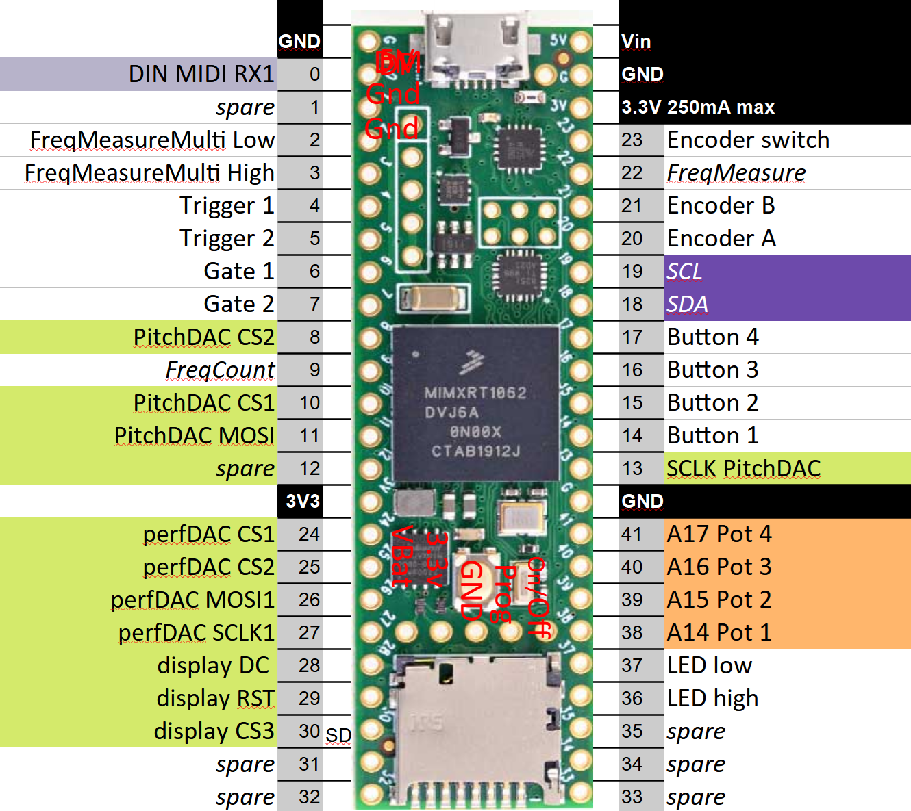

# Duophonic MPE MIDI - Main MPU board.

## Power

Driven by Eurorack 5V power, generates logic 3V3 Vdd (from Teensy onboard, <250mA).

## MCU choice

MPU needs USB host and hardware floating point, so Teensy 3.6 (now discontinued) or **Teensy 4.1**. Both are 3V3-only.

T4.1 ($26.85) is somewhat overpowered but has 480Mbit/s on both USB and Host so potentially lower latency (T3.6 was 480 on Host only). T4.1 has 100mA power consumption at full clock speed though.

[T4 power consumption](https://forum.pjrc.com/threads/69159-Teensy-4-0-at-24Mhz-still-drawing-100mA-Why?p=297146&viewfull=1#post297146):
freq    current
24      60mA
150     80mA
600     100mA

T3.6 ($29.25) had less memory, has 2 DAC outs (not needed here), power draw unspecified (@@measure it) but less than 4.1. Unobtainable due to NXP parts shortage, was discontinued along with 3.5, 3.2 and LC!

Ensure USB cable plugged into the micro-USB (which leads to the panel-mount USB socket) clears the back of the [Gate LED board](./Gate-LED.md).

## MIDI

For software details, see [EuroMPE MIDI](./MIDI.md). This section relates to the input hardware portions on the MPU board, only.

### DIN MIDI

MIDI hardware spec states < 5mA to turn on, < 2μs rise and fall times. Also pin 2 and shield go from not connected, to connected by 100nF caps for RF purposes.

[DIN MIDI](https://www.pjrc.com/teensy/td_libs_MIDI.html) in needs serial input and 6N138 optoisolator with [1k pulldown](https://forum.pjrc.com/threads/54891-MIDI-serial-(DIN)-to-usbMIDI-issues-got-weird-MIDI-messages?p=287082#post287082)
and 4.7-10 kΩ base-emitter resistor. 

6N139 is lower-current (0.5mA) version of 6N138 (1.6mA).  

Avago Max propogation delay to low: 6N139 25μs, 6N138 10μs. To high, 6N139 60μs, 6N138 35μs.

Fairchild is worse, max propogation delay to low: 6N139 30μs, 6N138 15μs. To high, 6N139 90μs, 6N138 50μs.

Vishay 6N137 max propogation delay to low: 75ns; to high: 75ns.

NO use 6N137, with transistor for level shift and inversion.

> The PC900 suggested by the specification is still a good choice. (Well, it's discontinued, but "PC900" was just Sharp's way of spelling "H11L1", and the H11L1 is still made by many manufacturers.)
> The original 6N137 works only at 5 V. LiteOn's model also works at 3.3 V, while other manufacturers offer a separate 3.3 V variant, for a higher price: HCPL-260L, FOD260L, TLP2962. If you do use the LiteOn 6N137, you should ensure that nobody tries to substitute a different 6N137 model later. [source](https://www.midi.org/forum/1475-best-optoisolator-for-3-3v)

Apparently 6N138 and or H11L1 are too slow per MIDI spec and 6N137 is better. These are not drop-in replacements, the support circuitry differs.

> _(6N137 with)_ An NPN transistor with the collector pulled up to 3.3V. This will also give you a second inversion. The diagram below shows my circuit. The difference is you would have R41 pull up to 3.3V (not isolated 5V as in mine). I would probably make it 10K. C2 is a bypass cap, the datasheet recommends it. Put it as close to pins 8 and 5 as you can. [source](https://forum.pjrc.com/threads/66877-Teensy-4-0-serial-optocoupler-6n137s?p=276314&viewfull=1#post276314)

- [Opto-couple confusion – 6N137 or 6N138?](https://gr33nonline.wordpress.com/2019/05/15/opto-couple-confusion-6n137-or-6n138/)
- [Teensy 4.0 serial optocoupler 6n137s](https://forum.pjrc.com/threads/66877-Teensy-4-0-serial-optocoupler-6n137s)
- [MIDI Input with 6N137, 6N138, or 6N139](https://www.kieranreck.co.uk/blog/midi-input-with-6n137-6n138-or-6n139)
- [Optocouplers: Defending Your Microcontroller, MIDI, And A Hot Tip For Speed](https://hackaday.com/2018/05/09/optocouplers-defending-your-microcontroller-midi-and-a-hot-tip-for-speed/) especially the comments

[Vishay 6N137](https://www.mouser.com/ProductDetail/Vishay-Semiconductors/6N137?qs=xCMk%252BIHWTZMrQz4FyDXhMg%3D%3D) PDIP8, $1.76/1.

- 00 RX1

### USB MIDI (device)

[USB MIDI](https://www.pjrc.com/teensy/td_midi.html) 

### USB MIDI (host)

 [USB Host MIDI](https://github.com/PaulStoffregen/USBHost_t36).

## SPI

Two [SPI](https://www.pjrc.com/teensy/td_libs_SPI.html) outputs for DACs (use the faster FIFO one for the  pitch DAC, because MPE pitchbend messages send a lot of data; use the second one for the octal performance DAC and octal CC DAC) with associated chip selects. Or maybe, if the perf dacs are being updated at high frequency to do smoothing in software, they would be better on the FIFO one.

If the display ends up using SPI rather than I2C then that would need a third set of MOSI/SCLK and another CS.

- 11 MOSI pitchDACs
- _12 MISO not needed_
- 13 SCLK pitchDAC
- 10 CS-Pitch1 (any convenient one, like 10)
- 8 CS-Pitch2 (9 is used for FreqCount)
- 26 MOSI1 perfDACs
- _39 MISO1 not needed_
- 27 SCLK1 perfDACs
- 28 CS-Perf (any convenient, 28)
- 29 CS-CC  (any convenient, 29)
- 30 CS-Display  (any convenient, 30)

Use pull-up resistors on chip selects, per 
[Better SPI Bus Design in 3 Steps](https://www.pjrc.com/better-spi-bus-design-in-3-steps/)

> The rising and falling edges of the SPI clock have very high bandwidth, even though the actual clock rate is only 1 MHz. High bandwidth signals on long cables have all sorts of difficult problems when the source impedance isn't matched to the cable's characteristic impedance. The most common solution is to place a resistor in series close to Teensy pin 13 (SCK). Same of MOSI. [Paul Stoffregen](https://forum.pjrc.com/index.php?threads/weird-spi-clock-signal-on-teensey-4-1-pin-13.74169/#post-336114)

Experiment with different resistance values and monitor with scope to find optimal values for the cable length in use.

also (same forum post):

> Bursts of 8 clocks is very common for SPI. The gaps between are software overhead. You can usually minimize this with SPI.transfer(buffer, size) rather than calling SPI.transfer(byte) for each individual byte.

## UI: Display & Controls

### Display

Display: LC/3.2 for display?  if so, I2C (or CAN bus) for communication with LC/3.2.
Or use main MCU, and I2C for display. Slow, but high speed not needed. Remember the external pull-up resistors.

- 18 SDA = A4
- 19 SCL = A5

OLED display [Adafruit 128x32 I2C OLED](https://www.adafruit.com/product/4440) might be too small, but the bigger displays are SPI only. 20mA.35mm by 20mm.
Or [Adafruit 128x64 I2C OLED](https://www.adafruit.com/product/938) 40mA.

> I found that with both u8g2 and Adafruit SSD1306, I was getting extremely slow frame updates. 37ms with u8g2 and 25ms with Adafruit SSD1306. By changing the bus clock speed (setBusClock(1000000) for u8g2, constructor argument for Adafruit), my update time went to 8us and 2us respectively. The frame is doing a clear, drawing a single line of text (which moves over time), and then updates.
[I2C OLED performance on Teensy 4.0 with different clock speeds](https://forum.pjrc.com/threads/61060-I2C-OLED-performance-on-Teensy-4-0-with-different-clock-speeds)

[Advice on ground noise and OLED displays](https://modwiggler.com/forum/viewtopic.php?p=3999696#p3999696)

### Encoder, buttons

Buttons and [encoder](https://www.pjrc.com/teensy/td_libs_Encoder.html) for option selection and menu navigation. T3.6 & T4.1 can use any pins for encoders.

- 20 Encoder-A
- 21 Encoder-B
- 23 Encoder-switch
- 14 Button-1
- 15 Button-2
- 16 Button-3
- 17 Button-4

Encoder circuit (from Bourns PEC12R datasheet) four 10k, two 10nF:

[Hardware debounce vs. software hysteresis for encoders](https://forum.arduino.cc/t/rotary-encoder-debouncing/361438/12)

Use encoder switch as OK, needs anther button for "back".

Also needs "Calibrate" "Tune" and "Setup" ? Single button for common functions.

### Mode switch(es)

Unclear if MPE/non-MPE is needed.

Duophonic/Unison switch at minimum, perhaps Duophonic/Unison/Harmonic or use another switch (plus the encoder) for Harmonic. Double press to reset.

### Non-MPE channel selector

Could hide this in a menu; main usage is MPE. Also hide MPE behaviour on split (unlikely) in a setup menu.

## Frequency measurement

Frequency measuring circuitry for auto calibration. How to select channel? Should there be a 440Hz reference output?

> FreqCount: best for 1 kHz to 8 MHz (up to 65 MHz with Teensy 3.0 & 3.1)

> FreqMeasure: best for 0.1 Hz to 1 kHz

Test how low FreqCount can go, or connect both circuits and choose between inputs depending on result.

- 9 [FreqCount](https://www.pjrc.com/teensy/td_libs_FreqCount.html)
- 22 [FreqMeasure](https://www.pjrc.com/teensy/td_libs_FreqMeasure.html)

> (for FreqMeasure) At relatively low frequencies, under 1 kHz, only minimal CPU time is used. However, as the frequency increases, the interrupt demands more CPU time. A hardware low-pass filter is recommended if the input frequency could possibly be much higher than several kHz.

For [FreqMeasureMulti](https://github.com/PaulStoffregen/FreqMeasureMulti) the supported pins on Teensy 4.1 are:

0-9, 22-25, 28, 29, 33, 36, 37, 42-47, 48-50(dups), 51, 52-53 (dups), 54

- 6 FreqMeasureMulti Low
- 7 FreqMeasureMulti High

Useful frequency range for calibration (see [MIDI](./MIDI.md)) is 16.35Hz to 7040.00Hz, and for oscillator tuning and musical use is 65.41 Hz to 4186.01 Hz.

## Gate and Trigger outs

Gate logic outputs. Any convenient pins can be used.

- 02 Low Gate
- 03 High Gate
- 04 Low Trigger
- 05 High Trigger

But maybe better to group these closer to the RGB LED outs as they all get routed to the same [Gate-LED](./Gate-LED.md) board.

### RGB LED control

Two (Low, High channel) RGB LEDs need 6 PWM outputs. See [PWM Frequency](https://www.pjrc.com/teensy/td_pulse.html) these are at 4.482 kHz by default:

- 34 Low R
- 35 Low G
- 36 Low B
- 37 High R
- 38 High G
- 39 High B

### "Fader" pots

Four 10k low-rise trimmer pots for the four performance outputs. These are read by Teensy ADC and used to digitally fade down the perfDAC values on both channels of that output. Set pinMode to INPUT ([ADC pinmode input check](https://forum.pjrc.com/threads/68621-ADC-voltage-measurements-wrong-and-jumping-on-Teensy-4-1?p=292784&viewfull=1#post292784)).

[1nF between wiper and AGND](https://forum.pjrc.com/threads/73545-Solutions-for-Erratic-Potentiometers?p=331814&viewfull=1#post331814) for each pot. But [values are hard to predict](https://forum.pjrc.com/threads/67463-Suitable-op-amp-for-driving-the-teensy4-ADC?p=281188&viewfull=1#post281188) and [20x the value of the 1.5pF ADC internal cap, ie 30-40pf](https://forum.pjrc.com/threads/67463-Suitable-op-amp-for-driving-the-teensy4-ADC?p=281200&viewfull=1#post281200) is also recommended.

_Might_ need low-pass RC filter or op-amp buffer but try the software solution first.

[ResponsiveAnalogRead](https://github.com/dxinteractive/ResponsiveAnalogRead) for the values. 10bit is sufficient. Use [pinMode(pin, INPUT_DISABLE)](https://forum.pjrc.com/threads/69671-Teensy-4-0-4-1-web-pages-need-a-warning-about-INPUT_DISABLE-on-Analog-Inputs)

> pinMode(A0, INPUT_DISABLE);

- 24 (A10)
- 25 (A11)
- 40 (A16)
- 41 (A17)

## Digital outs

Two pedal logic outputs, if desired. ?Not really needed?

- ?? Pedal 1
- ?? Pedal 2

## Case & Osc temp monitoring (?)

Could need analog ins, or I2C, depending on hardware. Not _at all_ a must-have.

## Overall pinout

_Italic_ items are not immediately needed but need specific pins, so reserved in case.
Depending on testing of [PerfDAC](), an additional pin for LDAC might be needed. Pins 33-35 still available.

## Development & Testing plan

- [ ] T4.1 on breadboard, power from +5V, measure current consumption at various clock speeds.
- [ ] 10k pot, ADC, ResponsiveAnalogRead
- [ ]  Create comparative DIN-MIDI input board with several alternatives, for testing.
- [ ] Test I2C display, see if update speed okay and feasible for menus
- [x] Test SPI display
- [ ] start on menu/dashboard layout
- [x] Test PWM of RGB LED.
- [ ] Test 10V gate output.
- [ ] Fabricate [Gate-LED](./Gate-LED.md) board.
- [ ] Test FreqCount
- [x] Test FreqMeasure (and FreqMeasureMulti)
- [ ] Test DIN MIDI input
- [x] Sketch [front panel](./Panel.md) to get PCB dimensions.
- [ ] Fabricate & test [octal perfDAC/CCDAC](./performance-dac.md) board (same board, different CS)
- [ ] Fabricate [pitch CV](./pitch-dac.md) board, test
- [ ] Write higher-level, MPE-capable MIDI library
- [ ] Fabricate MCU and display carrier board
- [ ] Front panel

## Testing results

### Frequency measurement results

Frequencies tested by loopback of pwm output to FreqMeasureMulti inputs (sketch Three_PWM_in_Serial_Output). Tested 20Hz, 20kHz, 440 Hz. Limit to verifying accuracy is the exact frequency produced by PWM, especially at higher frequencies, and the limits of a gate-interval frequency meter at low frequencies.

Teensy 4.0 (FreqMeasureMulti, at 600MHz) compared to Keysight 34465A (gate time 1s).

PWM at 16.35 Hz, Teensy reports 17.8819, Keysight (AC Filter >3Hz) 17.88204 Hz, sd 1.4 μHz. Seems PWM cannot reliably go that low.

PWM at 20Hz, Teensy reports 20.0003 Hz while Keysight (AC Filter >3Hz, 1s gate) reports 20.000382 Hz sd 129nHz, an error of -82 ppm. Keysight is doing gate interval not timing between rising edges, so Keysight is more likely to be incorrect here! Also 20Hz is a third of the 60Hz mains frequency.

PWM at 45Hz, Teensy reports 45.0003 Hz while Keysight (AC filter >3 Hz, 1s gate) reports 45.000567 Hz sd 0.45 μHz, an error of -267 ppm. Again likely the Keysight is in error there.

PWM at 200Hz, Teensy reports 200.0000 while Keysight (AC Filter >20Hz, 1s gate) reports 200.00123 Hz sd 1.55 μHz, an error of -1.23 ppb

On 440Hz (concert A), Teensy reports 440.0066 Hz while Keysight 34465A (AC filter >20Hz, gate time 100ms) reports 440.009 Hz, sd 30 μHz which is an error of -2.4ppb !

PWM at 2kHz, Teensy reports 2000.0000 while Keysight (AC Filter >20Hz, 1s gate) reports 2.000012 kHz sd 13.5 μHz, an error of -12 ppb

PWM at 4kHz, Teensy reports 4000.0000 while Keysight (AC Filter >20Hz, 1s gate) reports 4.000025 kHz sd 33 μHz, an error of -25 ppm. Still good agreement there, but likely the Teensy is starting to be in error and we should be using FreqCount instead.

PWM at 8kHz, Teensy reports 7999.5732 while Keysight (AC Filter >20Hz, 1s gate) reports 8.000050 kHz sd 50 μHz, an error of -476 ppm.

Worryingly with PWM specified as 20kHz, Teensy reports 20000Hz while Keysight (AC Filter >20Hz, 1s gate) reports 18.18kHz sd 439 Hz (!) implying the PWM frequency is both inaccurate and unstable.
