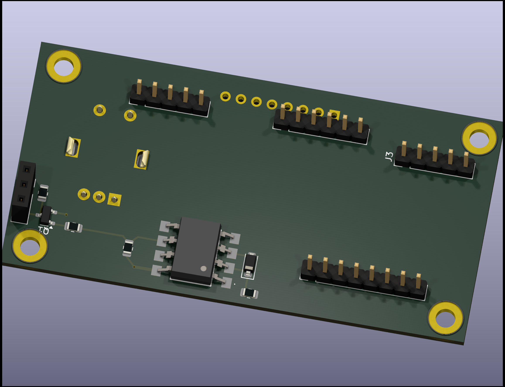
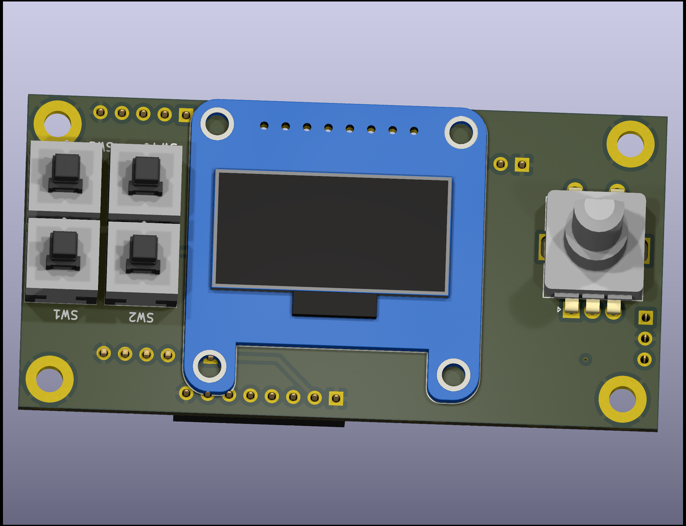

# MPU Display

This stacks with the [MPU board](./MPU-board.md) and contains the display, buttons, and encoder.

For space reasons, the MIDI opto-isolator is also placed here.

## Schematic

## Board

Connections to the MPU board, optocoupler, and buffers for the potentiometers are on the front.

Connections to the OLED display, the encoder, and the buttons are on the back (nearest the front panel).

