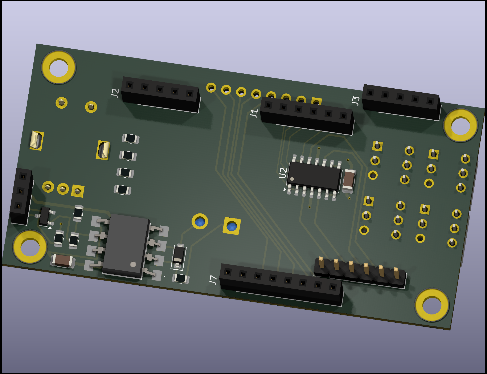

# MPU Display

This stacks with the [MPU board](./MPU-board.md) and contains the display, buttons, and encoder.

For space reasons, the MIDI opto-isolator is also placed here.

## Schematic

## Board

Connections to the MPU board, optocoupler, and buffers for the potentiometers are on the front.

Connections to the OLED display, the encoder, and the buttons are on the back (nearest the front panel).

## UI: Display & Controls

The Encoder, the four buttons, and the display are all mounted on the [display board](./display-board.md) with their signals routed to the MPU board.

## SPI Display

Using [Adafruit OLED 128x64 1.3inch](./display.md). Needs DC, CS, and RST.

See [MPU board, SPI section](./MPU-board.md) and [display](./display.md).

[Advice on ground noise and OLED displays](https://modwiggler.com/forum/viewtopic.php?p=3999696#p3999696)

## Encoder, buttons

Buttons and [encoder](https://www.pjrc.com/teensy/td_libs_Encoder.html) for option selection and menu navigation. T3.6 & T4.1 can use any pins for encoders.

- 20 Encoder-A
- 21 Encoder-B
- 23 Encoder-switch
- 14 Button-1
- 15 Button-2
- 16 Button-3
- 17 Button-4

Encoder circuit (from Bourns PEC12R datasheet) four 10k, two 10nF (obviously connect to 3V3 not 5V):

Encoder is Thonk EC11S-24P-0C-20KQ, T18 switched shaft.

Probably emits 4 counts for one detent forwards or backwards.

- [Hardware debounce vs. software hysteresis for encoders](https://forum.arduino.cc/t/rotary-encoder-debouncing/361438/12)
- [Measuring bounce on a scope](https://electronics.stackexchange.com/questions/430983/why-cant-i-see-bouncing-of-a-switch-on-an-oscilloscope#answer-431043)

Use encoder switch as OK, needs anther button for "back".

Also needs "Calibrate" "Tune" and "Setup" ? Single button for common functions.