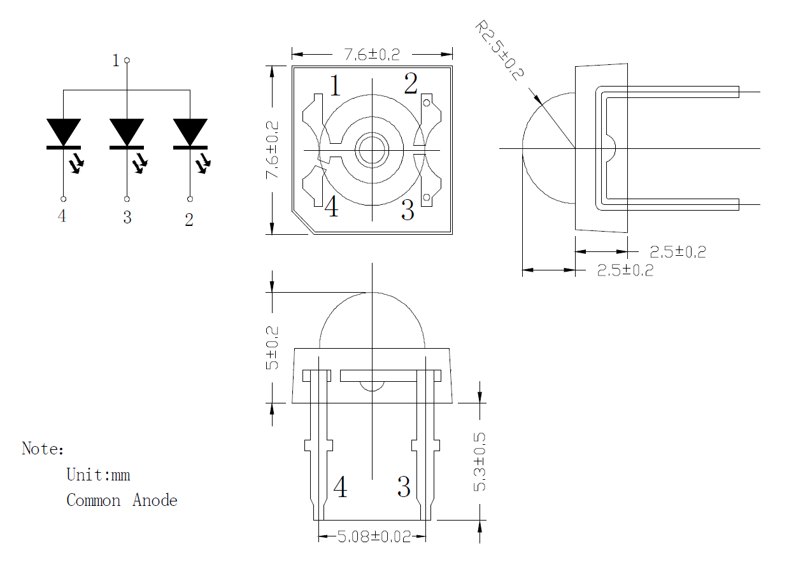
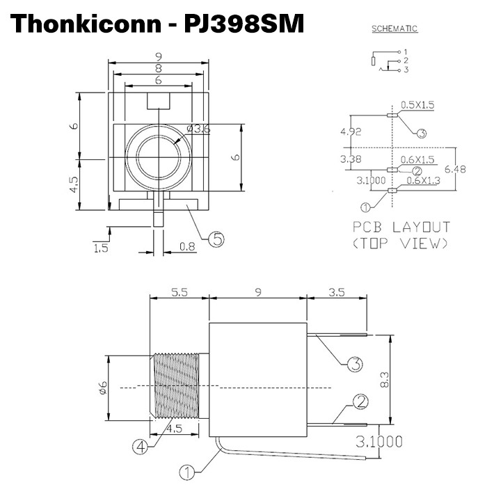
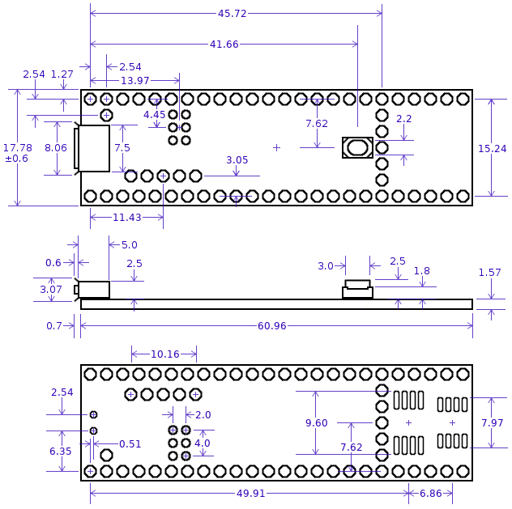
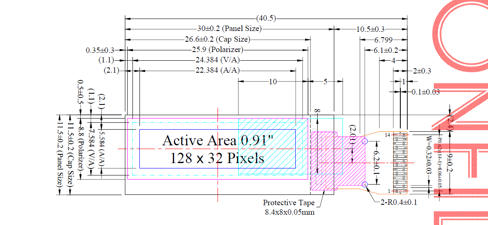
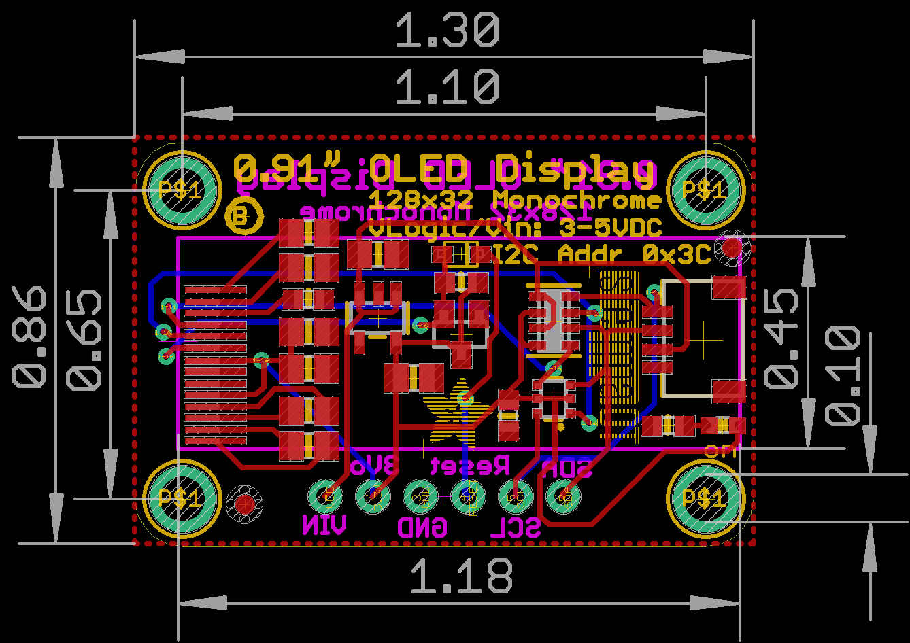
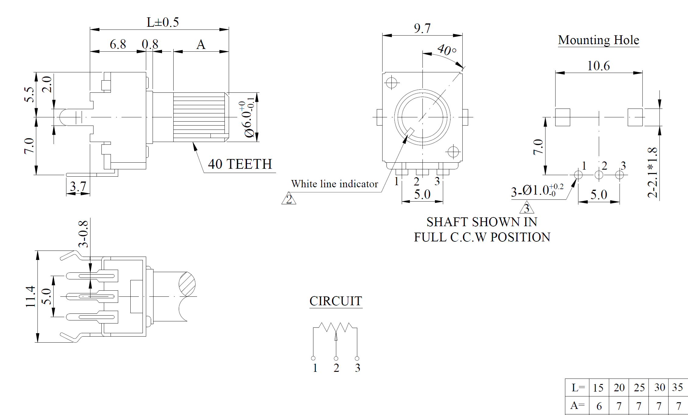
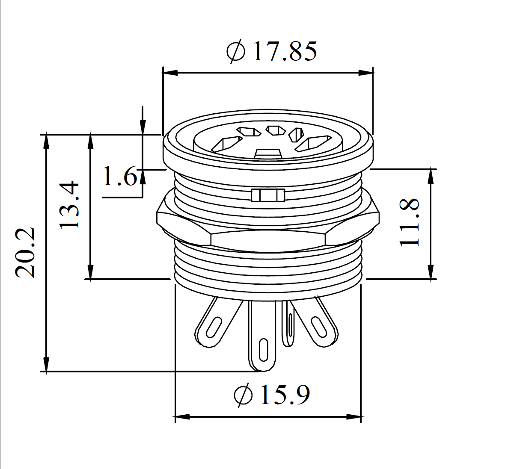
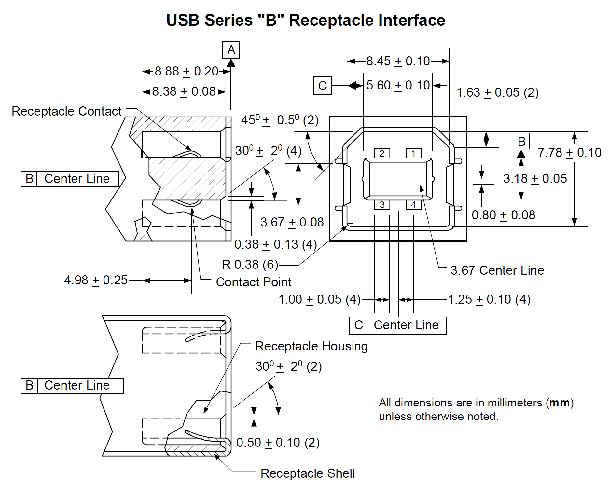
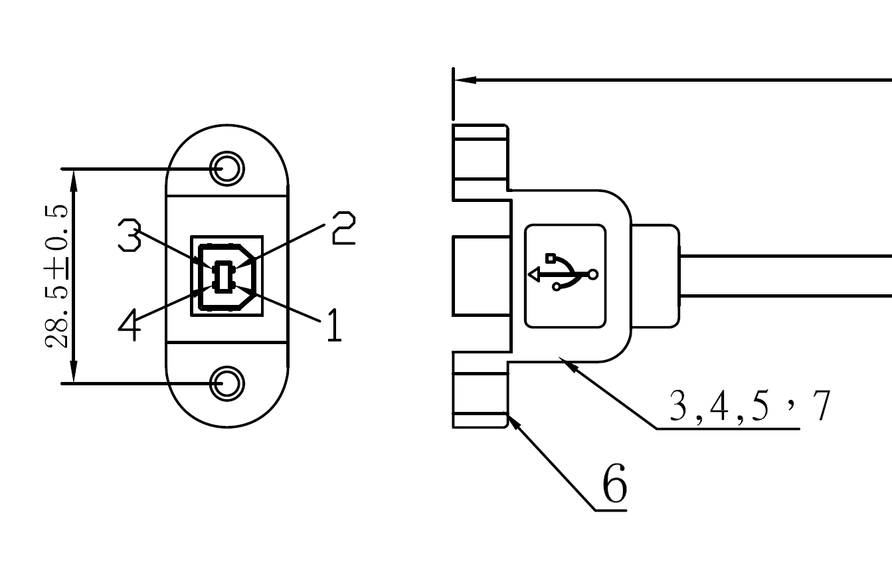

# Panel

## Max PCB dimensions

Panel height 128.5mm but with mounting holes and rails, 
Usable panel height 112mm.

Max PCB height **108mm**.

## Width of two output channels

Using paired jacks (gate and trig, two pitch)
then 8HP (40mm).

[Panel mockup (svg)](./mock-channel-front.svg) and [Panel mockup layout view with daughter boards, connectors etc (svg)](./mock-channel.svg)

## Front jack spacing for duophonic output

8 Thoniconn PJ398SM jacks (4 perf, two pitch, trigger, gate)
which use 6.2mm holes,
plus 5mm LED, 7.6mm square so allow 9mm?

Thoniconn jacks are 12mm high, 9mm wide.

Staggered spacing allows more room for inserting jacks; single-in-line looked neater but would not fit (9 jacks plus LED all in one line) and impossibly cramped.

Consider using reverse-mounted pin connectors for shallower depth; electronics boards need to be snug against thr jack boards to not foul the MPU board.

## Perf DAC boards

Perf DAC boards are 4 jacks high by 2 wide (for the front panel, jack board).

Behind that an op-amp board for buffering and slew, likely similar size;
behind that the Perf DAC board itself, likely smaller.

Need another set of controls next to that,
4 pots for perf faders.

## Pitch DAC boards

Pitch DAC boards are 2 jacks high by 2 wide (for the front panel, jack board).

Behind that a sandwich (three horizontal boards) two pich dac with the vref in between.

- (2 * 9) + 5.08 = **23.08mm** high
- (2 * 12) = 5.08? = again 24 to 30mm wide.

With paired outputs they are now 1 high by 4 wide,
with spacing between the channels for visual grouping.
Put the jacks vertically in that case,
so 12mm high for jack body by 4 * 9 = 36mm wide
in 8HP that leaves (40 - 36) = 4mm between channels,
even if jacks but exactly against each other!

Stacking headers 2.54mm allow 3mm.
Tall ones are 8.5 to 11mm above the board; shorter ones are 7mm.
Ensure good mechanical support (square pins, not blade pins)

- (1 * 12) + (2 * 3) = **18mm** high
- (4 * 9) = 36mm wide, minimum plus inter-channel space **40mm**

## Gate, Trigger & LED board

Board for gate and trigger transistors, level translators for LEDs, horizontal behind jack panel and LED board.

- 9 + 9 + 9 + 2? = 27 - **29mm** high.

Check: 51.24 + 23.08 + 29 +5.08 + 5.08 = 113.48mm so will not fit in 108!

Will need to use staggered or offset jacks, not a single vertical row per channel.

- (1 * 12) + 3 + 9 = **24mm** high
- (4 * 9) = 36mm wide, minimum plus inter-channel space **40mm**

One edge connector for all connections so:

- 4 for gate and trig
- 6 for two rgb
- 4 for gnd

at 40mm max width, 2.54 per connection, up to 15. So 14 wide fits well.

Also needs the two tuning inputs.

Check: 51.24 + 18 + 24 + 5.08 + 5.08 = 103.4 so fits nicely in 108mm.
But is now super wide and a bit cramped.

## MPU board

Main constraint in [layout mockup](./mock-channel.svg) is mechanical attachment of MPU board to display/button/encoder board (at the top) and fader board (at the bottom) while clearing  the global output (secondary perfDAC) board which will need to be fairly shallow.

[Teensy 4.1](https://www.pjrc.com/store/teensy41.html) is 60.96mm long plus 0.7mm for the USB connector = 61.7mm plus (if a cable is plugged in there, but not if a cable goes to D+ and D- pads.) room for the USB plug. Width is 17.78±0.6 so say 18.3.

Display is likely to be above the Teensy and the display PCB is 20 x 35mm. (Adafruit diagram says 1.1 inches which is 33.02mm by 0.86 inch which is 21.844mm)

Display panel Size：30.00mm × 11.50mm × 1.45mm
[0.91" 128x32 I2C OLED Display](https://www.adafruit.com/product/4440)

Wow that looks tiny on such a big panel!

**Check which version** the original and the STEMMA QT are slightly different sizes!

Group of pushbuttons to left of display, 3 plus "back". See [User Interface](./ui.md)

<!-- Thonk C&K are huge, 12mm diameter, far too big -->

[Adafruit Mini Soft Touch Push-button Switches](https://www.adafruit.com/product/3983) 6x6mm SMD.

Rotary encoder to right of display.

[Rotary Encoder - Illuminated](https://www.sparkfun.com/products/15141) Sparkfun

Use Sparkfun encoder as placeholder, not clear RGB led is needed here. It does need to be firmly attached to panel as it supports this board and then the MPU board too,14mm wide 13.2m high but that excludes pins (14mm with pins). M9 threaded shaft, 6mm turning shaft.

## Perf fading pots

Song Huei short trimmer 9mm pots [from Thonk](https://www.thonk.co.uk/shop/short-trimmer-pots/). 10k gives 330μA per pot, *4 is 1.32mA total which seems fine. May be enough to avoid a buffer for the ADC?

10.6mm wide at PCB footprint, 9.7mm wide body, 6mm shaft. 12.5mm high including pins. Shaft 5.5mm from top of body.

## Global outputs

Need global outs, 8 jacks, same as perf dac board but rotated to be 4 wide and 2 high.

## MIDI inputs

USB Host, USB device, DIN Midi (not on PCB; panel mount).

- [Panel mount USB-B to Micro-B cable](https://www.sparkfun.com/products/15463)
(M3 holes 28.5mm spacing)
- [USB host cable](https://www.pjrc.com/store/cable_usb_host_t36.html) no data sheet; **GOT**
- [Deltron 650-0500](https://www.mouser.com/ProductDetail/Deltron/650-0500?) **GOT**

USB-B socket is 12mm wide, 11.16mm high. Hole is 8.45mm high, 7.78mm wide. Internal block 3.18mm high 5.6mm wide.

Dimensions of external bracket unknown, measure. For now assume 34mm wide, 16mm high

Dimensions of PJRC Host cable unknown, but as a placeholder [this cable](https://thepihut.com/products/panel-mount-usb-cable-a-male-to-a-female) has M3 screws 30mm apart, is 38.30 wide and 11.90 high.

If adding a TRS MIDI input, use a circuit which accepts either Type-A or Type-B, like [this one](https://github.com/kay-lpzw/LPZW_TRS_MIDI/)