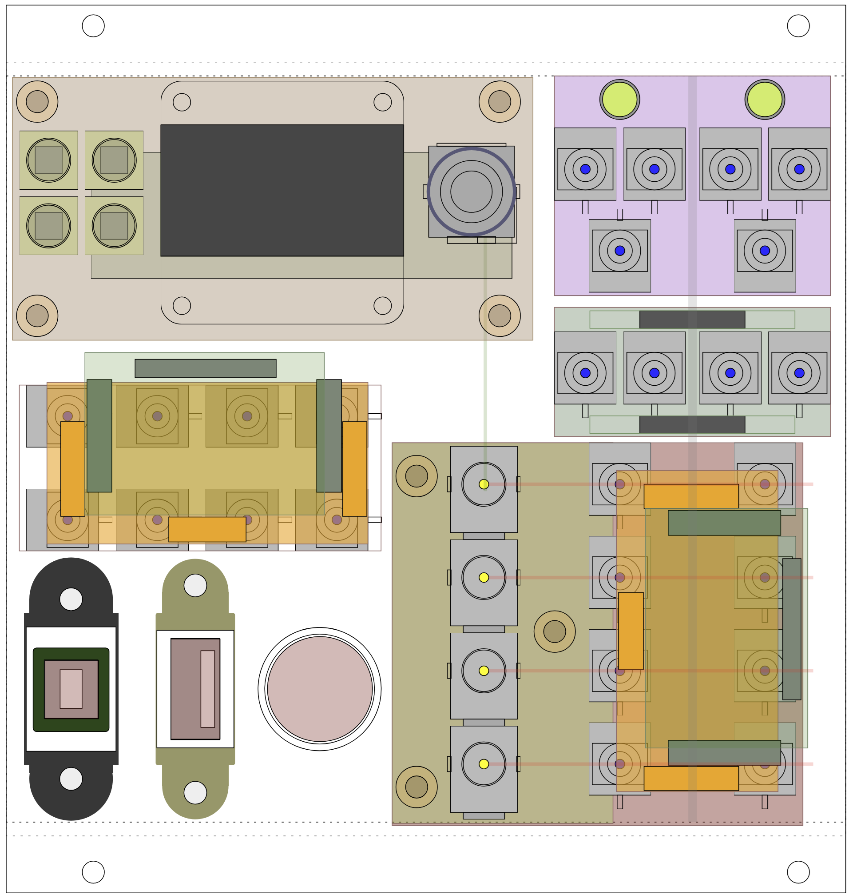

# Panel

Doepfer standard height is **128.5mm** and 2mm thickness but perhaps for a large panel with many heavy components mounted behind it, 2.5mm for rigidity is better.

## Max PCB dimensions

Panel height 128.5mm but with mounting holes and rails, 
Usable panel height 112mm.

Max PCB height **108mm**.

## Panel width

Current design is **24HP** = (24 × 5.08 = 121.92) - about 0.3 = 121.60mm, see [A100 Construction Details](https://www.doepfer.de/a100_man/a100m_e.htm).

[Panel concept](./mock-channel-front-v2-bigscreen-wider.svg) (SVG) and in Front Panel Designer [panel](./EuroMPE.fpd) (FPD)

and also [current panel with boards and components](./mock-channel-v2-bigscreen-wider.svg) (SVG)

Completely blank 24Hp panel (black anodizing, white infill, no holes at all) is $34.00 and with 4 mounting holes, $38.23. Current panel is **$116.55**

## Front jack spacing for duophonic output

8 Thoniconn PJ398SM jacks (4 perf, two pitch, trigger, gate)
which use 6.2mm holes,

Thoniconn jacks are 12mm high, 9mm wide.

Consider using reverse-mounted pin connectors for shallower depth; electronics boards need to be snug against thr jack boards to not foul the MPU board.

## Perf DAC boards

Perf DAC boards are 4 jacks high by 2 wide (for the front panel, jack board).

Behind that an op-amp board for buffering and slew, likely similar size;
behind that the Perf DAC board itself, likely smaller.

Need another set of controls next to that,
4 pots for perf faders.

## Pitch DAC boards

Pitch DAC boards are 2 jacks high by 2 wide (for the front panel, jack board).

Behind that a sandwich (three horizontal boards) two pich dac with the vref in between.

- (2 * 9) + 5.08 = **23.08mm** high
- (2 * 12) = 5.08? = again 24 to 30mm wide.

Ensure good mechanical support (square pins, not blade pins)

- (1 * 12) + (2 * 3) = **18mm** high
- (4 * 9) = 36mm wide, minimum plus inter-channel space **40mm**

## Gate, Trigger & LED board

Board for gate and trigger transistors, level translators for LEDs, horizontal behind jack panel and LED board.

One edge connector for all connections so:

- 4 for gate and trig
- 6 for two rgb
- 4 for gnd
Also needs the two tuning inputs.

[NeoPixel Diffused 5mm Through-Hole LED](https://www.adafruit.com/product/1938) is 5.2mm dia

## MPU board

Main constraint in [layout mockup](./mock-channel.svg) is mechanical attachment of MPU board to display/button/encoder board (at the top) and fader board (at the bottom) while clearing  the global output (secondary perfDAC) board which will need to be fairly shallow.

[Teensy 4.1](https://www.pjrc.com/store/teensy41.html) is 60.96mm long plus 0.7mm for the USB connector = 61.7mm plus (if a cable is plugged in there, but not if a cable goes to D+ and D- pads.) around 40mm more to leave room for the USB plug. Width is 17.78±0.6 so say 18.3.

### Display

The Adafruit [1.3" 128x64 OLED graphic display](https://www.adafruit.com/product/938) **GOT** I2C or SPI.

35.19mm wide by 35.18mm high (including lower mounting lugs). Display width 35.19mm, height 19.0mm.

OLED screen is 3mm thick above PCB surface.

### Buttons

Group of pushbuttons to left of display, 3 plus "back". See [User Interface](./ui.md)

[Thonk Low profile](https://www.thonk.co.uk/shop/low-profile-push-buttons/) 8.5x8.5mm through-hole.

Does not need daughterboard, use 3.2mm radius circular hole per button (checked with Thonk). Button caps in several colors, 6mm diameter. Available as momentary or latching, use the momentary ones. Height above PCB 14.3mm similar to the encoder.

### Encoder

Rotary encoder to right of display.

[Rotary Encoder - Illuminated](https://www.sparkfun.com/products/15141) Sparkfun
[Bourns PEC11 Series encoder, Adafruit](https://www.adafruit.com/product/377)

Use Sparkfun encoder as placeholder, not clear RGB led is needed here. It does need to be firmly attached to panel as it supports this board and then the MPU board too. Better to use mounting standoffs as well.

Sparkfun 14mm wide 13.2m high but that excludes pins (14mm with pins). M9 threaded shaft, 6mm turning shaft. M9 implies 11mm clearance hole diameter **but check this**

Bourns PEC11 (D shaft) 12.5mm wide 13.4mm high, has M7 x0.75 shaft, so 8mm clearance hole diameter **but check this**

Sifam encoder knob (with skirt to cover nut) is **17mm** dia! 
Smaller one without skirt is **12.5mm** dia, D shaft only on [Thonk](https://www.thonk.co.uk/shop/sifam-soft-touch-encoder-knobs/).

## Perf fading pots

Song Huei short trimmer 9mm pots [from Thonk](https://www.thonk.co.uk/shop/short-trimmer-pots/). 10k gives 330μA per pot, *4 is 1.32mA total which seems fine. May be enough to avoid a buffer for the ADC?

10.6mm wide at PCB footprint, 9.7mm wide body, 6mm shaft. 12.5mm high including pins. Shaft 5.5mm from top of body. Measure width at bushing, hole should be a snap fit for the trimmer.

These are _not threaded_ so cannot be used to attach the front PCB to the panel. Maybe make [one PCB](./power-jacks-trimmers.md) for the perfdac jacks and the trimmers?

Or (more rigid)

- [Alpha 9mm T18 shaft pot, 10k](https://www.thonk.co.uk/shop/alpha-9mm-pots-vertical-t18/) [GOT]
- [T18 micro knobs](https://www.thonk.co.uk/shop/micro-knobs/) [GOT]

11.4mm wide at PCB footprint, 9.5mm wide body, 13.5mm high including pins and pin pads. T18 shaft. Shaft 15mm from top of body. Bolts to panel, M7 bushing. So, need to widen spacing on pots and on jacks to 13.5mm from 13mm. Will the board fit?

**NO** these will not fit vertically in the space.

## Global outputs

Need global outs, 8 jacks, same as perf dac board but rotated to be 4 wide and 2 high.

## MIDI inputs

USB Host, USB device, DIN Midi (not on PCB; panel mount).

- [Sparkfun Panel mount USB-B to Micro-B cable](https://www.sparkfun.com/products/15463)
(M3 holes 28.5mm spacing) **GOT**
- [USB host cable](https://www.pjrc.com/store/cable_usb_host_t36.html) no data sheet; **GOT**
- [Deltron 650-0500](https://www.mouser.com/ProductDetail/Deltron/650-0500?) **GOT**

### DIN

Deltron 5-way 45° needs 8mm radius circular cut-out plus 3.2mm wide 1.2mm rect key. Outer flange is 17.85mm diameter,

### USB-B Device

USB-B socket is 12mm wide, 11.16mm high. Hole is 8.45mm high, 7.78mm wide. Internal block 3.18mm high 5.6mm wide.

<!-- Dimensions of Sparkfun external bracket unknown, measure. For now assume 34mm wide, 16mm high. Actually measures 36.91mm wide, 14.17mm high. -->

<!--  -->

<!-- Alternative from [Adafruit](https://www.adafruit.com/product/937) -->

Or [DataPro 1581-01C](https://www.datapro.net/products/usb-2-0-panel-mount-b-to-micro-b-extension.html) has 26mm mounting hole spacing, dia 3.2 (3.3 for safety) and 12.1 wide by 13mm high receptacle with 0.5mm corner radius. Overal dimensions 33.5mm by 14mm. In general has a better, more detailed spec sheet.

<!--  -->

Or the [DataPro left-angle version](https://www.datapro.net/products/panel-mount-usb-2-0-type-b-to-left-angle-micro-b-extension.html) (only available with a 2-foot cable, though) wait that would go up, not down. Unless the MPU board is rotated so the Teensy faces the other way. Still worth a shot, order one to try.

Need to measure the cables in-situ taking account of bending radius.

Failing which, cutting off the micro-B end and soldering direct to D+ D- under the Teensy is a last resort. Or pogo pins.

<!-- > Two 12mm M3 mounting screws, ~29mm apart (they also say 1.1inch which is 27.94mm _so check_)
> Bracket 14.6mm wide, 38.6mm long
> mounting hole spacing 29mm, dia 3.2
> Receptacle 12.1mm long, 11.0mm wide, corner radisu 0.5mm -->

<!--  -->

### USB-A Host

Dimensions of PJRC Host cable 11.15mm high and 38.85mm wide. (33.72 + 24.76) ÷ 2 = 29.24 centers (really?).
Dimensions of receptacle 12.5mm by 5.12mm.

Alternative [DataPro 1590-01C](https://www.datapro.net/products/usb-panel-mount-to-5-pin-socket.html) with 5-pin header has 14.7 by 7.3 cutout, corner radius 1.6mm (!), mounting holes 30mm spacing, overall dimensions 11.5mm by 37.7mm.

Although recommended clearance is more conservative, 39mm by 13mm.

In general the DataPro cables are better specified, so order some and maybe switch to using them exclusively. But the USB host panel mount is very tall already, a shorter one is better and taller again might not fit. However max between mounting rails is a little larger than max pcb so maybe can move down 1mm more.

**NO** If adding a TRS MIDI input, use a circuit which accepts either Type-A or Type-B, like [this one](https://github.com/kay-lpzw/LPZW_TRS_MIDI/)

## Panel measurements 

(relative to bottom left corner at (x,y) = (0,0), in mm)

- width 121.6
- height 128.5

### Mounting

- mounting hole bottom-left: (7.45, 3.0) double, dia 6.1 width 3.5 rotate 90 cutter 2.4mm
- mounting hole top-left: (7.45, 125.4) double, dia 6.1 width 3.5 rotate 90 cutter 2.4mm
- mounting hole bottom-right (N=21): (114.13, 3.0) double, dia 6.1 width 3.5 rotate 90 cutter 2.4mm
- mounting hole top-right (N=22): (119.21, 125.4) double, dia 6.1 width 3.5 rotate 90 cutter 2.4mm

### LED

Assume a 5.2mm hole for a 5mm LED for now.

- low  ( 88.9,  114.35)
- high (109.9,  114.35)

### Jacks, Gate and Trigger

Jacks use 6.3mm dia hole. 10mm between pairs of the same channel, extra 1mm to separate low and high channels.

- low gate  ( 83.9,  101.09)
- low trig  ( 93.9,  101.09)
- high gate (104.9,  101.09)
- high trig (114.9,  101.09)

### Jacks, tune

- low ( 88.9,  88.93)
- high (109.9, 88.93)
- text ( 99.4, 88.93)

### Jacks, PitchDAC

- low 1  ( 83.9, 72.62)
- low 2  ( 93.9, 72.62)
- high 1 (104.9, 72.62)
- high 2 (114.9, 72.62)

### Jacks, PerfDAC

13mm spacing vertically, 21mm horizontal

#### Strike

- low ( 88.9, 56.25)
- high (109.9, 56.25)
- text ( 99.4, 56.25)

#### Lift

- low ( 88.9,  43.25)
- high (109.9, 43.25)
- text ( 99.4, 43.25)

#### Slide

- low ( 88.9, 30.25)
- high (109.9, 30.25)
- text ( 99.4, 30.25)

#### Press

- low ( 88.9, 17.25)
- high (109.9, 17.25)
- text ( 99.4, 17.25)

### Pots

6mm shaft with bushing so 6.1mm hole
19.73mm from low channel jacks
13mm vertically

- strike ( 69.17, 56.25)
- lift   ( 69.17, 43.25)
- slide  ( 69.17, 30.25)
- press  ( 69.17, 17.25)

### Jacks, PerfDAC 2

6.3mm hole, 13mm horizontal, 15mm vertical spacing

- A ( 11.9, 72.03)
- B ( 24.9, 72.03)
- C ( 37.9, 72.03)
- D ( 50.9, 72.03)
- A text (11.9, 78.79)

- E ( 11.9, 57.03)
- F ( 24.9, 57.03)
- G ( 37.9, 57.03)
- H ( 50.9, 57.03)
- E text (11.9, 63.89)

### USB-B receptacle

Allow 1mm all round to cope with rounded corners on the front panel.

Mounting bolts are 26mm apart,  imperial bolts so 3.2 clearance hole.

- hole 12.1 mm wide 13 mm high, center (9.49 29.42) corner radius 1.0 mmm (spec allows up to 1.6 mm)
- top mount (9.49 43.92)
- bottom mount (9.49 14.92)
<!-- thus in FPD coords, x = x +71.4; y = 128.5 - y -->
<!-- center-x -61.91 center-y 98.08 -->
<!-- <rect  style="fill: maroon; fill-opacity: 0.3" x="-65.8" y="93.85" width="7.78" height="8.45" /> -->

### USB-A receptacle

Mounting bolts are 30mm apart,  imperial bolts so 3.2 clearance hole.

- hole 7.3 wide 14.7mm high, center (27.42,29.42)
- top mount (27.42, 44.42)
- bottom mount (27.42, 14.42)
<!-- center-x -43.98 center-y 98.08 -->

### DIN receptacle

16mm circular hole with 3.2 x 2.4 rectangle at top, , center is 0.6mm above circular hole edge.
Use same y-dimension as the two usb receptacles, was 30.46

- circle (45.45, 29.42) radius 8
- rectangle center (45.45, 37.42) width 3.2 height 2.4

<!-- thus in FPD coords, x = x +71.4; y = 128.5 - y -->
<!-- <circle style="fill: maroon; fill-opacity: 0.3" cx="-25.95" cy="98.04" r="7.6"/> -->
### Screen

Display width 35.19mm, height 19.0mm

- screen center (39, 101) width 35.19 height 19

### Buttons

- circle (6 105.75) radius 3.1
- circle (6 96.25) radius 3.1
- circle (15.5 105.75) radius 3.1
- circle (15.5 96.25) radius 3.1

 - text depends on final button placement

### Encoder

- circle (68 101) radius 8

### Mounting holes for MPU board

Position not clear yet

### Mounting holes for PerfDAC/faders/PSU board

Not sized yet

## Cost

> Price calculation for the file: EuroMPE.fpd
> Based on price list of: Front Panel Express, LLC
> Price list date: 2022-12-12

> Total: **$116.55**
> Estimated weight: 89.3 g

## Work Plan

- [x] Experiment with font sizes on 128x64 display
- [x] Order the tact switches **2023-11-04, GOT**
- [ ] Order a rub-panel just to experiment with fit for the screen, encoder and buttons
- [ ] Order a sub-panel just for the USB and DIN connectors, to check fit
- [ ] Order a sub-panel of just the two channels, omitting the rest.
- [ ] Mock up starting menu with Tune, Conf, Run

