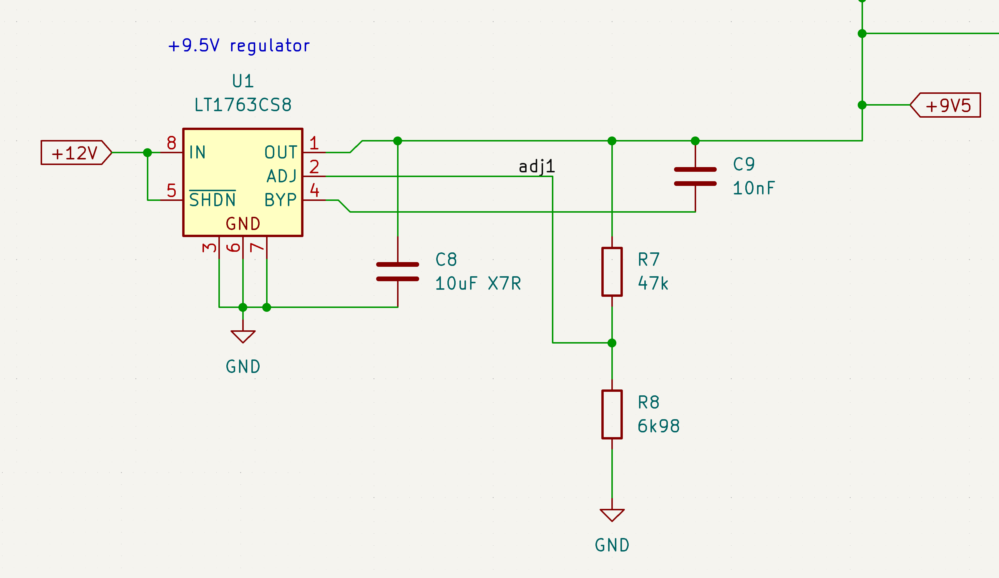
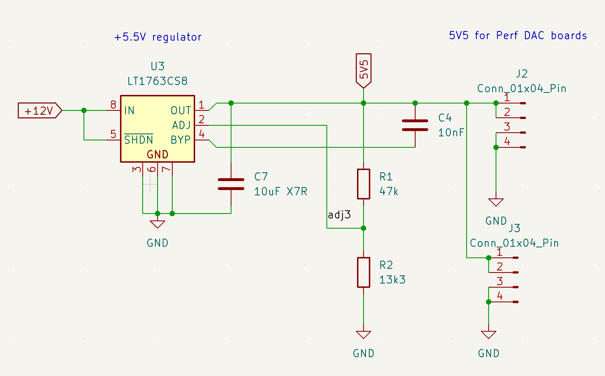
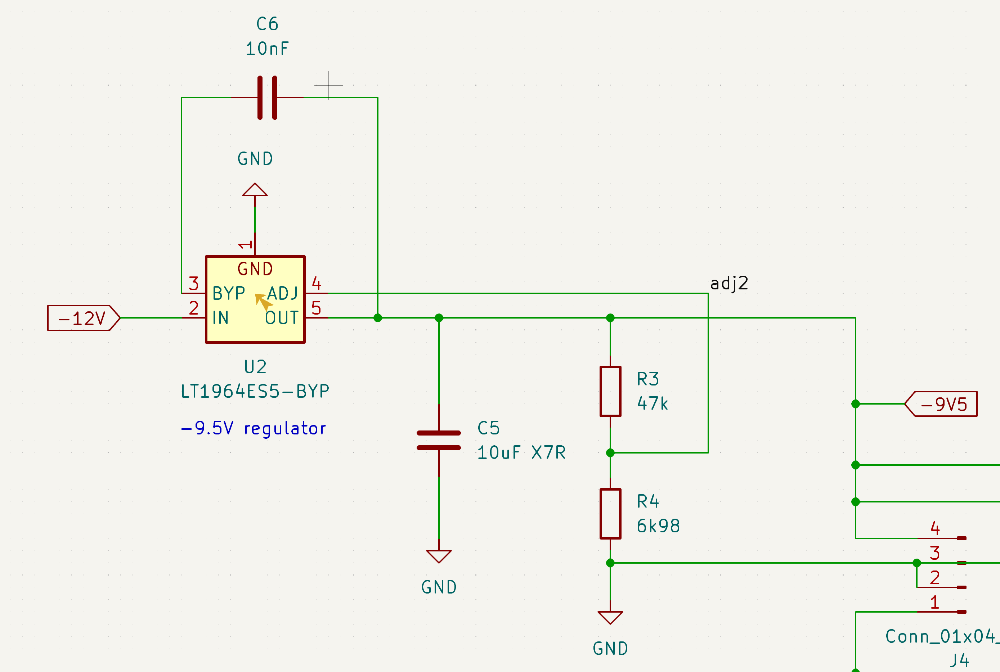
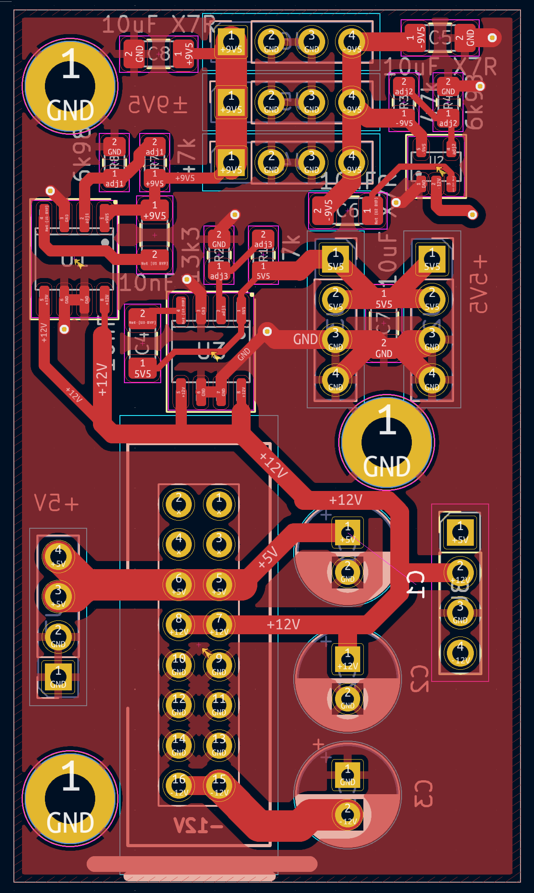
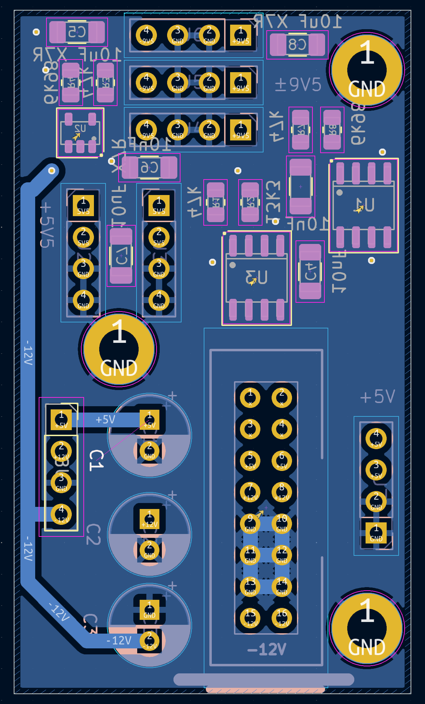
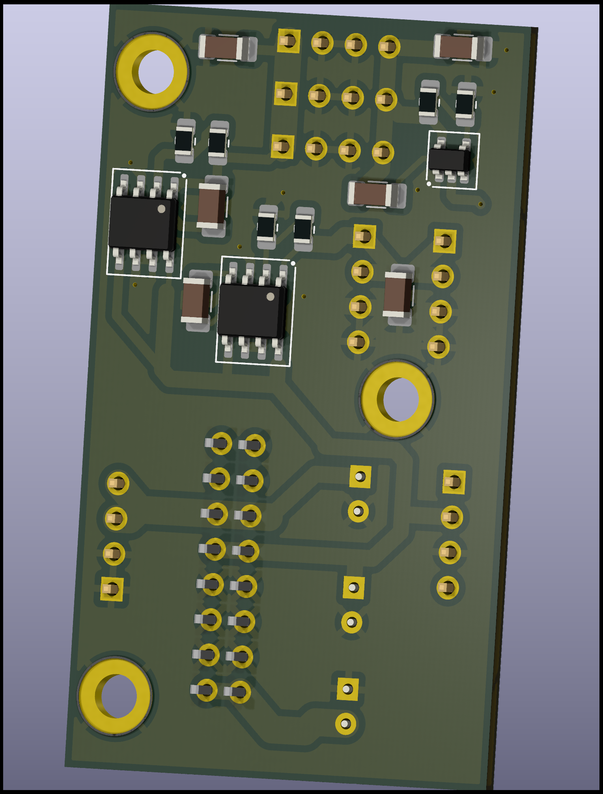
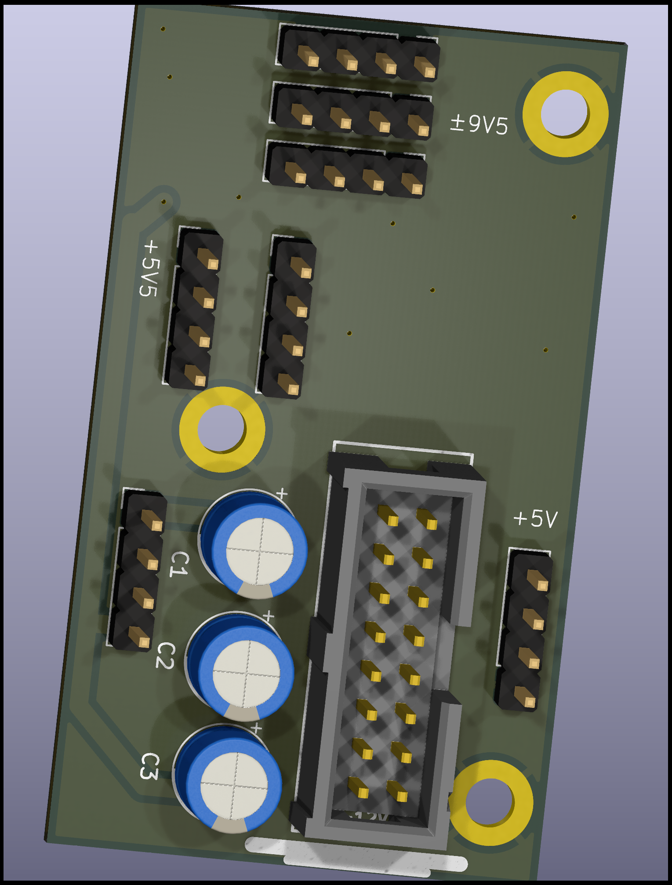

# Power supply

## Eurorack power

Usual (bad) Eurorack power over ribbon cable with +12V, 0V, -12V and optional +5V, Gate and CV (latter two not used here). Module assumes each power rail is poorly regulated, with up to 0.5V droop likely.

Given the 5V power draw, a beefier cable seems desirable. ModularAddict [sells those](https://www.modularaddict.com/parts/cables/premium-eurorack-power-cables) in 15cm, 30cm and 45cm lenghths, for 16 to 16 cables.

> instead of using 28AWG IDC connectors, we've changed to a compatible connector that accepts crimped wire connections, and have bumped up to 22AWG.

(16 10-pin and 3 16-pin modules in [existing case](https://modulargrid.net/e/modules_racks/data_sheet/61770) draw 50mA to 170mA and would benefit from beefier cables)
(they also sell [box headers](https://modularaddict.com/parts/cables/power-cables/box-header-for-eurorack-power))

## Digital and Analog 0V

**NO** Module uses two ribbon cables. 0V on one is treated as digital ground, and +5V on that cable powers digital circuits.
0V on the other is treated as analog ground, with +12 and -12 powering op-amps and secondary voltage regulators.  
This means the connection between digital and analog occurs at the PSU busboard. 
This should reduce digital return currents on analog ground. However, digital 0V to SPI DAC meets analog 0V unless isolator is used, and other connections between grounds will occur due to panel jacks and external patching.

Instead, just one ribbon cable becase DGnd and AGND unavoidably connect at multiple places.

## DAC power

[Performance DACs](./performance-dac.md), and the Global DAC which re-uses the same boards, run at 5V5 so there is headroom above the internal 5V reference. High voltage side of the logic level converters for those DACs use 5V5 also. Derived from +12V.

[Pitch DACs](./pitch-dac.md) run at ±9.5V and the Vref for those uses ±9.5V as well. No logic level conversion needed, pitch DAC is 3V3 compatible.

Use LT1763 (SOIC-8, 500mA) adjustable regulators (500mA is ample) to produce 5V5 and 9V5, with 6μ8 C0G output cap. -9V5 from LT1964-BYP adjustable (SOT-23, 200mA still plenty). LT1763 noise (10Hz-100kHz) is 20 μVRMS.

For testing, a 317 regulator (noise, 10Hz - 100kHz is 165 μVRMS). With R1 = 240R and R2 = 820R gives 5V5, while with R2 = 1k54 it gives 9V3.

## Microcontroller power

Teensy 4.1 [main board](./MPU-board.md) is a 3V3 device with onboard 3V3 regulators and a Vin pin which accepts 3V6 to 6V0 input. Use Eurorack 5V supply (reduces asymmetric loading on +12V rail). Current draw can be 100mA, depends on clock speed.

## Analog power

Direct from Eurorack, perhaps with Schottky diodes for reverse power protection. Usual electrolytic caps onboard, and small ceramics by each op-amp package.

Pitch DAC op-amps can run on ±9.5V to handle ±5V CV. Perf DAC op-amps, if RRIO, could run on unipolar 5V5 but bipolar 12V makes it easier to hit 0V easily. Depends on opamp choices.

## Voltage reference power

[Vref](./voltage-ref-MAX6226.md) power is same +9V5 as Pitch DAC power.

## Gate

To be determined. Options for (about) 5V, 8V gates useful. Exact level not critical.

Same [Gate and LED board](./Gate-LED.md) needs voltage level conversion and current drive for the two RGB LEDs.

## USB Host

The 5V on the USB Host port is driven from the 5V source powering the Teensy.

> The USB host port has a TDP3S014 current limit chip. So the maximum current is either the limit this chip imposes (~850mA), or the remaining amount of current available from whatever power source is powering Teensy 4.1.
[PaulStoffregen](https://forum.pjrc.com/index.php?threads/usb-host-teensy-4-1-current-limit.76302/#post-353611)

TDP3S014 provides overcurrent, over temperature, reversal, and short-circuit protection. 

From the data sheet, the max continuous operating current however is 500mA. Teensy 4.1 current draw is around 100mA. Teensy Vin passes via a 500mA fuse (F1) before splitting to the TDP3S014 and the TLV75733P LDO regulator that powers the Teensy, implying the max available current for the TDP3S014 is (500-100) = 400ma, assuming no other peripheral is powered from the Teensy 3V3.

> The circuitry on Teensy 4.1 is built around a 0.5 amp maximum current, which is the USB 2.0 spec.
[PaulStoffregen](https://forum.pjrc.com/index.php?threads/teensy-4-1-usb-host-power-question.70566/#post-308639)

Teensy 4.1 schematic shows 100μF ceramic output cpacitance (C33). Input capacitance (shared with the 3V3 regulator) is two 0.22μF capacitors (C9 and C15).

Thus the 5V from Eurorack can, at max, be called on to provide 500mA.

[code to turn on just the USB Host power, without bringing up the USB stack](https://forum.pjrc.com/index.php?threads/noise-issue-with-teensy-4-1-audio-shield-and-pam8403-amplifier.76400/page-2#post-355223)

## Analog power board

Eurorack power connector, usual 22μF smoothing caps (68μF for +5V due to large power draw).

Top plane mostly gnd (for low impedance and also cooling) with traces for ±9V5 and for +5V5 outputs;
bottom plane gnd (again for cooling), well stitched to top, with traces for ±12V inputs. Also needs a low current GND,+12V output for the gate and trigger circuits; and a high current (500mA) GND,+5V output to drive the Teensy, the devices powered by Teensy 3V3, and the USB Host power output. Terminal block would have been great but is sadly too big, so I went with a 4-pin connector (two GND, two +5V).

Stacked behind the perfdac-jack and pots board, and add two standoffs after the pots to make it more stable.
See [Power, Jacks and Trimmers](power-jacks-trimmers.md)

Available space is limited: 30mm wide, 55.4mm high.

> We detected a 2 layer board of 1.26 x 2.17 inches (32.0 x 55.1mm)
> 3 boards will cost $13.65

### LT1763 for 9V5 (U1)

> Output Capacitance and Transient Response
The regulators are designed to be stable with a wide range
of output capacitors. Output capacitor ESR affects stability,
most notably with small capacitors. A 3.3μF minimum
output value with ESR of 3Ω or less is recommended to
prevent oscillation. Transient response is a function of
output capacitance. Larger values of output capacitance
decrease peak deviations, providing improved transient
response for large load current changes. Bypass capacitors,
used to decouple individual components powered by
the regulator, increase the effective output capacitor value.
Larger values of reference bypass capacitance dictate
larger output capacitors. For 100pF of bypass capacitance,
4.7μF of output capacitor is recommended. With 1000pF
or more of bypass capacitance, a 6.8μF output capacitor
is required.

> The shaded region of Figure B1 defines the regulator’s
stability range. The minimum ESR needed is set by the
amount of bypass capacitance used, while maximum
ESR is 3Ω.
> (source: DEMO MANUAL DC368A)

10μF input cap, 10nF noise bypass cap, 6μ8F to 10μF output cap (see Fig 3. Stability and discussion of ceramic dielectrics: go for X7R).

Input caps are electrolytics, shared with entire power board.

Bypass is 1206 10nF C0G 5%, use Kemet C1206C103J3GECTU (**$0.249/10**)

Output is 1206 10μF X7R 10%, use Murata GRM31CR71E106KA12K  (**$0.158/10**)

_Minimum_ top resistor (R2) value is 2.6k. Try with **r2 = 47k**. First approximation:

9.5 = 1.22(1 + r2/r1)

9.5 = 1.22 + 1.22 × r2/r1

8.28 = 1.22 × r2/r1

r1 = (1.22 × r2)/8.28

r1 = (1.22 × 47000)/8.28

**r1 = 6k98** which happily is an E96 value.

Second approximation:

Vout = 1.22(1 + 47000/6980) + 30E-9 ×  47000 = 9.436V. Second term is 1.41mV so ignore.

Current through r1 is 1.22/6980 = 170μA
Current through r2 is (9.5-1.22)/47000 = 170μA. 

Power = output current times in-out voltage differential, plus ground current times input voltage. Say 50mA × (12.5 - 9.5) + 2mA × 12.5 = 175mW.

From datasheet, table 2: use 100mm² top-side ground plus 25000mm² lower ground plane = 10 × 10mm top; no go bigger, 1000mm² = 32 ײ 32mm top. 50 × 500mm bottom seems unfeasibly large (19 inches!!). Going to need much better current draw estimates!

But assuming 74C/W, rise above ambient is just 13C.

**Note:** If unused, the SHDN pin must be connected to VIN.

### LT1763 for 5V5 (U3)

Part no LT1763CS8#PBF **$8.28/1** or **$4.85/10**

Higher rise due to bigger voltage drop. Again **r2 = 47k**

5.5 = 1.22 + 1.22 × r2/r1

4.28 = 1.22 × r2/r1

r1 = (1.22 × 47000)/4.28

r1 = 13k4, closest E96 is **r1 = 13k3**.

Vout = 1.22(1 + 47000/13300) + 30E-9 ×  47000 = 5.53V.

Power = 50mA × (12.5 - 5.5) + 2mA × 12.5 = 375mW.

At 74C/W, rise above ambient is 28C.

### LT1964-BYP for -9V5 (U2)

10μF? input cap, 1nF noise bypass cap, 6μ8F to 10μF output cap. Again **r2 = 47k**

-9.5 = -1.22(1 + r2/r1)

-9.5 = -1.22 + 1.22 × r2/r1

-8.28 = -1.22 × r2/r1

r1 = (-1.22 × r2)/-8.28

r1 = (-1.22 × 47000)/-8.28

Thus **r1 = 6k98**

Vout = -1.22(1 + 47000/6980) - 30E-9 ×  47000 = -9.436V.

Power = -50mA × (-12.5 - -9.5) + -2mA × -12.5 = 175mW.

At 135C/w, 23.5C above ambient.

**Note:** LT1964-BYP does not have SHDN.

## Board

v0.1 ordered from OSH Park 8 April 2025

## Work Plan

- [ ] Measure current draw of perf DAC board (5V5 regulator needs to power 2) before ordering PSU parts, to be sure the SMD 5V5 will be suitable. Might need a 3-pin regulator.
- [ ] Check min spacing for cables to plug into the power headers!
- [x] Check size and spacing of standoff holes, with jacks board and with panel.
- [ ] More vias to connect front and back ground planes
- [ ] Order parts from Mouser

