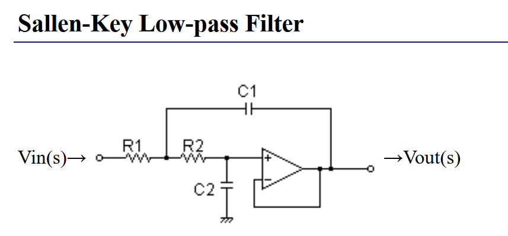
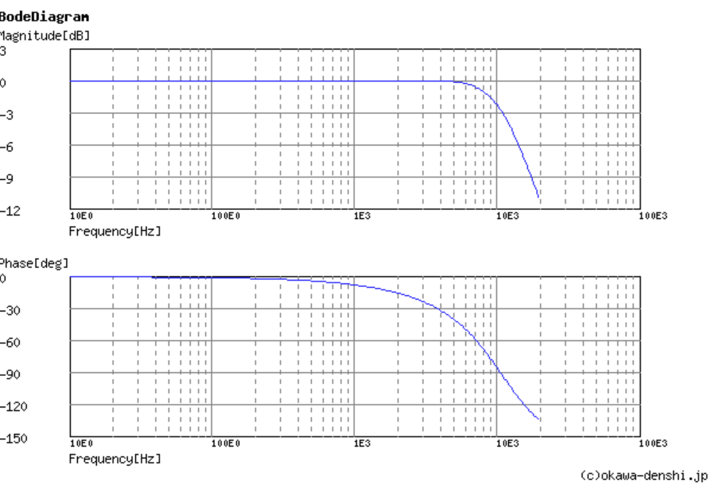
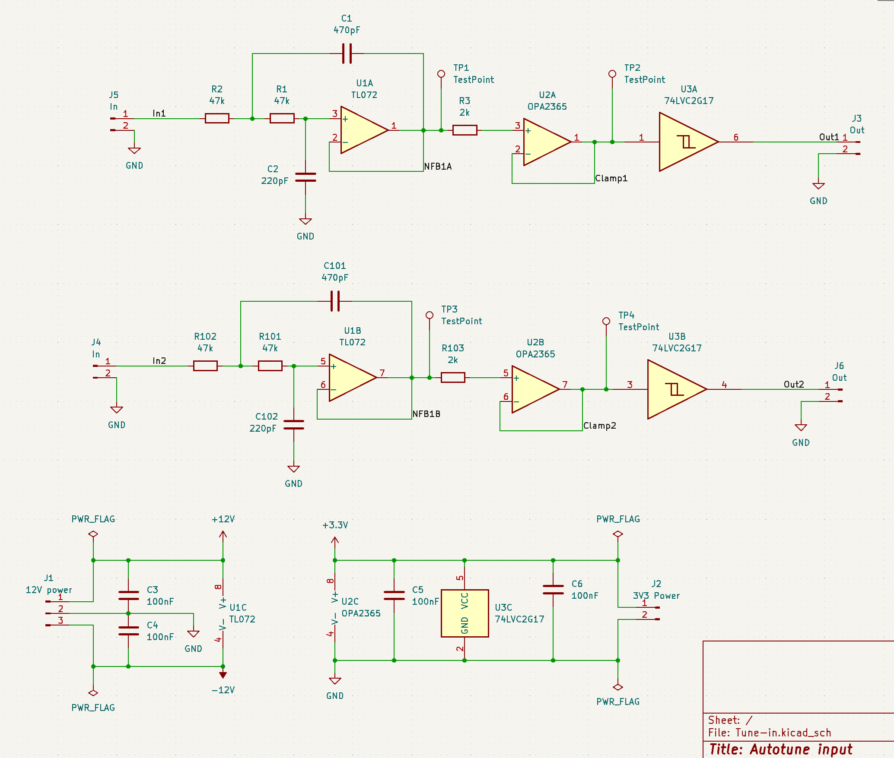
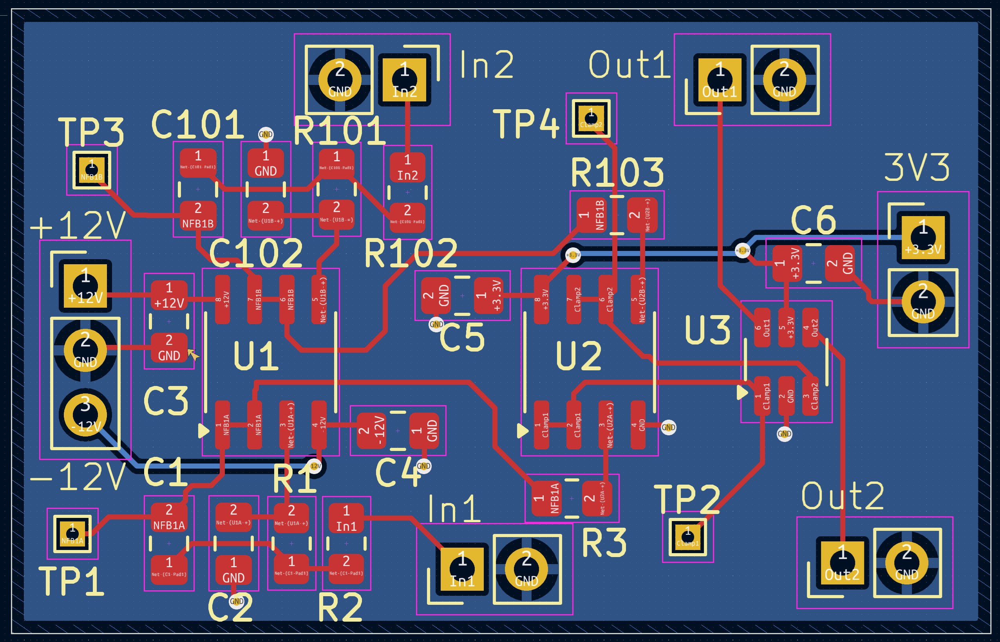
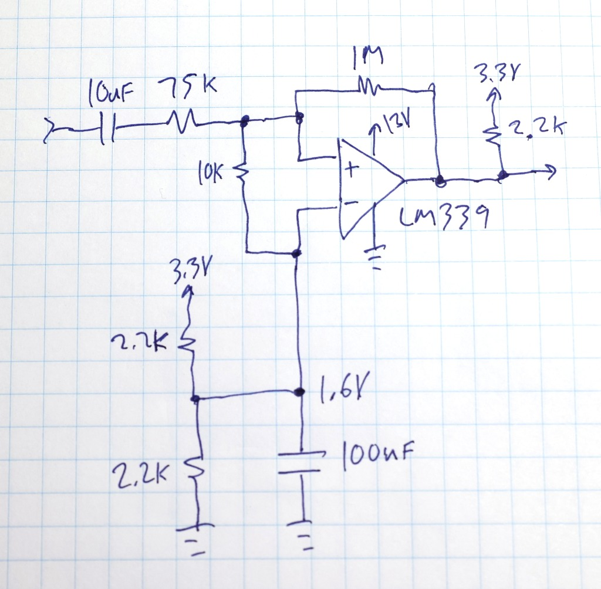

# Calibration

There are two types of calibration:

## Initial setup trimming

Pitch Vref has no pitch trimmers; calibration of Pitch DAC output to account for Vref inaccuracy, DAC zero and DAC max errors is done in software.

The 14bit performance outputs are untrimmed, 0-5V within 5-10mV is fine.

Vref needs extensive measurement (for ageing) outside case anyway.

Might be better to allow re-calibration after pitch Vref drift though (annual maintenance).

## Per-voice oscillator calibration (tuning)

### Manual Tuning

Tune ... Manual ... Low | High | Both

Puts out 0.75V for concert A. LED shows by color (red is low, blue is high, green is in tune) and OLED displays closest note (eg B4#) and cents high/low.

### Auto tuning

Tune ... Auto ... Low | High | Both

Avoid non-linear calibration curves. These are fine for pulling poorly-tracking oscillators into tune but then the same errors affect the other modules using pitch (filters etc). Instead go for high linearity, and use with well tracking oscillators.

Two stages: analog coarse tune (manual oscilator tuning to a fixed pitch) then digital fine tune and linearization (measuring frequency per-oscillator at a range of voltages, for linearity and for oscillator range).

Output the same voltage (frequency calculated for the given CV, e.g. for 440Hz) on both  pitch channels. Use FreqMeasure library to provide a frequency input, showing the frequency on the LCD screen. This allows each oscilator to be tuned the same. Use the LEDs to visually indicate high or low (by color) and closeness to exact tuning (slower pulsing means closed to exact).

Once in tune, run a frequency sweep measuring at least 30 steps and calculating a correction factor to account for slope inaccuracy (not exactly 1V/oct) and high frequency droop. Optionally, log the temperature at which tuning was done.

[FreqMeasureMulti](https://github.com/PaulStoffregen/FreqMeasureMulti) can measure multiple inputs simultaneously, providing the option to calibrate both voice channels at the same time. It is best for lower frequencies, 0.1Hz to 1kHz. Available pins 0-9,22-25,28,29,33,36,37,42-47, 48-50(dups),51, 52-53 (dups), 54.

[FreqCountMany](https://github.com/PaulStoffregen/FreqCountMany) also measures multiple inputs, best for 1kHz and up. Available pins 6, 9, 10, 11, 12, 13, 14, 15, 18, 19.

Current [panel](./Panel.md) has per-voice tuning inputs.

> calibrating only octaves it also runs foul of the same quirk in some oscillators where they go out of tune just a semitone or two before 0v – with possibly even worse results, as you would now have a bad data point for 0v.
>
> Not all sound sources can take a full negative to positive swing pitch control voltages. Many digital modules in particular only listen to positive voltages, and may be go of tune as you get close to 0 volts no matter what you do. Also, I’ve seen some analog modules which track differently above 0 volts than they do below 0 volts.
>
> [Calibr8or firmware for Ornament & Crime](https://learningmodular.com/calibr8or/)

### Calibration curve save/read

> To simplify and put into context - EEPROM.put on the T4 will do the same as .update for you, so use EEPROM.put. If the user constantly saves their settings every hour, 24 hours a day, 7 days a week, it will take them almost 12 years to do 100,000 saves and likely 50-100 years of doing this before wearing from repeated writes may be an issue, so for this use case, don't worry about wearing, its a non-issue for this use case. It's hard to get to 100,000 events with purely human interaction, but easy when machine driven.
> [--beermat](https://forum.pjrc.com/index.php?threads/best-way-to-store-64-bits-of-user-parameters.76368/#post-353976)

### MIDI Tune Request

Respond to F6 Tune Request by tuning both channels. Will only work if the oscillator outputs are looped back to the tune inputs.

### Tune-in conditioning circuitry

Level from oscillator should be plenty high, no need for amplification. May need some low-pass filtering to get rid of above-audio signals that could cause false triggering?

Highest note for tuning (**A8** = 7040.00Hz ) so 10kHz low-pass filter on input seems wise.

[Sallen-Key low-pass design tool](http://sim.okawa-denshi.jp/en/OPstool.php) R1=R2=47k, C1 = 470pF, C2 = 220pF. Higher input resistance avoids need for buffer on input. Use a dual 072 op-amp with ±12V supplies for interfacing to modular signals.

Then hard clip to a 0..3V3 unipolar signal with a dual, rail-to-rail, single supply (3V3) fast recovery op-amp so it can be safely fed to the Teensy. OPA2365 ($3.74/1) has specified overload recovery time < 0.1μs and RRIO. Use 2k current-limiting input resistor (<10mA) then rely on protection diodes.

Better to follow the clamp with a dual Schmitt-trigger (SN74LVC2G17DBVR, SOT-23-6 $0.259/10) also on 3V3 to sharpen up the edge transitions.

 ([PDF](./Tune-in-sch.pdf))

 ([PDF](./Tune-in-brd.pdf))

> We detected a 2 layer board of 1.52 x 0.97 inches (38.6 x 24.6mm)
> 3 boards will cost $7.35
** Ordered 18 Oct 2024**

Paul Stoffregen [said](https://www.facebook.com/photo.php?fbid=7913976078691226&set=p.7913976078691226&type=3)

> That ought to be pretty easy. Unless you're expecting high frequency noise, I'd probably omit the filter and just go with a "simple" voltage comparator using resistors to scale the signal. Hysteresis is the main feature you (probably) need. With an analog comparator you can adjust the feedback resistor to trade off sensitivity versus rejection of noise. It'll also give your hysteresis pretty good temperature stability since the response depends on the resistor ratio which is pretty stable even with cheap resistors, rather than the transistors inside a CMOS chip with vary with temperature.

Johny Reckless said:

> I would configure U2A as an inverting integrator with a small time constant (10us or so) to remove any ringing in the response as you square up the edges. Something like 1k / 10nF might work well, maybe a slightly smaller cap if you need faster response. With a decent rail to rail cmos opamp you won't then need the Schmitt trigger.

Experiment on breadboard.

> The FlexPWM timer used by FreqMeasureMulti requires very fast edges. Your signal looks like it has rather slow rise/fall times, and that will not work with FreqMeasureMulti. Can you add a schmitt trigger on your input?
>
> [PJRC](https://forum.pjrc.com/index.php?threads/teensy-4-1freqmeasuremulti-library.75304/#post-345574)

[Simple and fast bipolar-supply precision clamp with RRIO](https://www.eevblog.com/forum/projects/limiting-op-amp-output/msg441564/#msg441564) and [even simpler, unipolar-supply](https://www.eevblog.com/forum/projects/limiting-op-amp-output/msg732673/#msg732673)

Should this have a Schmidt-trigger inverter or something like that to ensure even low-level signals are square-wave like? Build and test the simple op-amp clamp and check results on scope.

#### Tune-In BOM

- (2) Panasonic ECH-U1H471JX5 470pF PPS film 0805 **$0.397/10**
- (2) Panasonic ECH-U1H221JX5 220pF PPS film 0805 **$0.211/10**
- (4) 4k7 0805 nothing special 1%
- (1) TL072 general purpose dual op-amp TL072BIDT **$1.15/10** 
- (2) 2k 0805 1%
- (1) TI OPA2365AID RRIO SOIC-8 **$3.74/1**
- (1) TI SN74LVC2G17DBVR SOT-23-06 **$0.259/10**
- (3) 100nF decoupling caps 0805

"Reference","Value","Datasheet","Footprint","Qty","DNP"
"C1,C101","470pF","~","Capacitor_SMD:C_0805_2012Metric_Pad1.18x1.45mm_HandSolder","2",""
"C2,C102","220pF","~","Capacitor_SMD:C_0805_2012Metric_Pad1.18x1.45mm_HandSolder","2",""
"C3,C4,C5,C6","100nF","~","Capacitor_SMD:C_0805_2012Metric_Pad1.18x1.45mm_HandSolder","4",""
"J1","12V power","~","Connector_PinHeader_2.54mm:PinHeader_1x03_P2.54mm_Vertical","1",""
"J2","3V3 Power","~","Connector_PinHeader_2.54mm:PinHeader_1x02_P2.54mm_Vertical","1",""
"J3,J6","Out","~","Connector_PinHeader_2.54mm:PinHeader_1x02_P2.54mm_Vertical","2",""
"J4,J5","In","~","Connector_PinHeader_2.54mm:PinHeader_1x02_P2.54mm_Vertical","2",""
"R1,R2,R101,R102","47k","~","Resistor_SMD:R_0805_2012Metric_Pad1.20x1.40mm_HandSolder","4",""
"R3,R103","2k","~","Resistor_SMD:R_0805_2012Metric_Pad1.20x1.40mm_HandSolder","2",""
"TP1,TP2,TP3,TP4","TestPoint","~","TestPoint:TestPoint_THTPad_1.0x1.0mm_Drill0.5mm","4",""
"U1","TL072","http://www.ti.com/lit/ds/symlink/tl071.pdf","Package_SO:SOIC-8_3.9x4.9mm_P1.27mm","1",""
"U2","OPA2365","https://www.ti.com/lit/gpn/opa2365","Package_SO:SOIC-8_3.9x4.9mm_P1.27mm","1",""
"U3","74LVC2G17","http://www.ti.com/lit/sg/scyt129e/scyt129e.pdf","Package_TO_SOT_SMD:SOT-23-6_Handsoldering","1",""

<table border=1 class="table table-striped table-bordered table-hover table-condensed">
<thead><tr><th title="Field #1">Reference</th>
<th title="Field #2">Value</th>
<th title="Field #3">Datasheet</th>
<th title="Field #4">Footprint</th>
<th title="Field #5">Qty</th>
<th title="Field #6">DNP</th>
</tr></thead>
<tbody><tr><td>C1,C101</td>
<td>470pF</td>
<td>~</td>
<td>Capacitor_SMD:C_0805_2012Metric_Pad1.18x1.45mm_HandSolder</td>
<td align="right">2</td>
<td> </td>
</tr>
<tr><td>C2,C102</td>
<td>220pF</td>
<td>~</td>
<td>Capacitor_SMD:C_0805_2012Metric_Pad1.18x1.45mm_HandSolder</td>
<td align="right">2</td>
<td> </td>
</tr>
<tr><td>C3,C4,C5,C6</td>
<td>100nF</td>
<td>~</td>
<td>Capacitor_SMD:C_0805_2012Metric_Pad1.18x1.45mm_HandSolder</td>
<td align="right">4</td>
<td> </td>
</tr>
<tr><td>J1</td>
<td>12V power</td>
<td>~</td>
<td>Connector_PinHeader_2.54mm:PinHeader_1x03_P2.54mm_Vertical</td>
<td align="right">1</td>
<td> </td>
</tr>
<tr><td>J2</td>
<td>3V3 Power</td>
<td>~</td>
<td>Connector_PinHeader_2.54mm:PinHeader_1x02_P2.54mm_Vertical</td>
<td align="right">1</td>
<td> </td>
</tr>
<tr><td>J3,J6</td>
<td>Out</td>
<td>~</td>
<td>Connector_PinHeader_2.54mm:PinHeader_1x02_P2.54mm_Vertical</td>
<td align="right">2</td>
<td> </td>
</tr>
<tr><td>J4,J5</td>
<td>In</td>
<td>~</td>
<td>Connector_PinHeader_2.54mm:PinHeader_1x02_P2.54mm_Vertical</td>
<td align="right">2</td>
<td> </td>
</tr>
<tr><td>R1,R2,R101,R102</td>
<td>47k</td>
<td>~</td>
<td>Resistor_SMD:R_0805_2012Metric_Pad1.20x1.40mm_HandSolder</td>
<td align="right">4</td>
<td> </td>
</tr>
<tr><td>R3,R103</td>
<td>2k</td>
<td>~</td>
<td>Resistor_SMD:R_0805_2012Metric_Pad1.20x1.40mm_HandSolder</td>
<td align="right">2</td>
<td> </td>
</tr>
<tr><td>TP1,TP2,TP3,TP4</td>
<td>TestPoint</td>
<td>~</td>
<td>TestPoint:TestPoint_THTPad_1.0x1.0mm_Drill0.5mm</td>
<td align="right">4</td>
<td> </td>
</tr>
<tr><td>U1</td>
<td>TL072</td>
<td><a href="http://www.ti.com/lit/ds/symlink/tl071.pdf">PDF</a></td>
<td>Package_SO:SOIC-8_3.9x4.9mm_P1.27mm</td>
<td align="right">1</td>
<td> </td>
</tr>
<tr><td>U2</td>
<td>OPA2365</td>
<td><a href="https://www.ti.com/lit/gpn/opa2365">PDF</a></td>
<td>Package_SO:SOIC-8_3.9x4.9mm_P1.27mm</td>
<td align="right">1</td>
<td> </td>
</tr>
<tr><td>U3</td>
<td>74LVC2G17</td>
<td><a href="http://www.ti.com/lit/sg/scyt129e/scyt129e.pdf">PDF</a></td>
<td>Package_TO_SOT_SMD:SOT-23-6_Handsoldering</td>
<td align="right">1</td>
<td> </td>
</tr>
</tbody></table>

### Temperature compensation

Measuring the case internal temperature might be helpful and is easy to do, but not clear how well that would predict tracking of individual oscillators.

Not a must-have, and complicates addition and removal and tuning of modules, but one idea is to use thermal epoxy to attach a Dallas DS18B20 thermal sensor to the expo converter of each oscillator, then measure the temperatures and adjust linearization calibration curves based on the temperature, likely through linear interpolation of closest calibrated temperatures. Perhaps a _temperature bus board_ with pluggable conectors?

The EuroMPE would need to know which oscillator was connected to which tne input, which implies messing with the menu. Usefully, each DS18B20 has a unique 64bit serial number which could be used to identify oscillators.

Reading all temperature sensors rquires just one pin on Teensy.

 - [Interfacing Multiple DS18B20 Digital Temperature Sensors with Arduino](https://lastminuteengineers.com/multiple-ds18b20-arduino-tutorial/)

### Calibrating the calibrator

#### Keysight 34465A

Bench dmm, voltage (and frequency?) measurement device. **GOT**

Reciprocal counting for frequency.

- DC Voltage (10V scale): 0.0010 + 0.0003 (24hr), 0.0045 + 0.0004 (2 year)
- Frequency (100 Hz – 1 kHz, 1sec aperture): 0.003 (24hr), 0.010 (2 year) so 440Hz ±0.044 (439.956 - 440.044)

> All frequency counters are susceptible to errors when measuring low–voltage, low–frequency signals. The effects of both internal noise and external noise pickup are critical when measuring "slow" signals. The error is inversely proportional to frequency. Measurement errors also occur if you attempt to measure the frequency (or period) of an input following a DC offset voltage change. You must allow the multimeter's input DC blocking capacitor to fully settle before making frequency measurements.

#### AimTTi [TF930](https://www.aimtti.com/product-category/frequency-counters/aim-tf900series) 

Bench/portable universal counter with USB interface 3GHz **$471**

- Frequency, period, pulse width, frequency ratio, duty cycle, and event counter modes
- 0.001 Hz to 125 MHz and 80 MHz to 3 GHz range, 0.001mHz resolution
- high-quality temperature compensated internal frequency reference which
has a low aging rate and is stable to within ±1ppm over the full temperature range.
- USB interface, remote controllable
- accepts 10 MHz clock for GPS conditioning

> Measurement accuracy is timebase accuracy + measurement resolution + 2 counts.
> Timebase accuracy ± 0.2ppm
> Eight digits in 1s, nine digits in 10s and ten digits in 100s

So 440Hz (1s) 440.00000 ± 8.8E-5 ± 000.0002 (439.99971 - 440.00029), or 100x better than 35565A even on 1s.

#### Leo Bodnar [LBE-1420 ](https://www.leobodnar.com/shop/index.php?main_page=product_info&cPath=107&products_id=393&zenid=fef464de4ee6cf4f24df5e55bba72372)

GPS locked clock source, as reference. **$155.96**

- Multi-loop digital-analog PLL allows output frequency to be set to any value between 1 Hz and 1.1 GHz with infinite resolution. For example, 144,800,000.025 Hz.

#### Ian Johnston [PDVS2](https://www.ianjohnston.com/index.php/onlineshop/handheld-precision-digital-voltage-source-v2-detail)

Precision Digital Voltage Source **GOT** Retired, no longer available.

- 0 Vdc to 10 Vdc user adjustable output in 10 V mode (4d.p’s effective, approx. 38uV)
- [DAC9881S](https://www.ti.com/product/DAC9881) 18bit DAC with an accuracy/stability down in the uV’s (using a PLC filter of 1.0 or higher)
- Voltage reference = LM399AH (0.5 - 1 ppm/degC temperature coefficient)

## Testing results

### PWM loopback frequency measurement results

Frequencies tested by loopback of pwm output to FreqMeasureMulti inputs (sketch Three_PWM_in_Serial_Output). Tested **20Hz**, **20kHz**, **440Hz**. Limit to verifying accuracy is the exact frequency produced by PWM, especially at higher frequencies, and the limits of a gate-interval frequency meter at low frequencies.

Teensy 4.0 (FreqMeasureMulti, at 600MHz) compared to Keysight 34465A (gate time 1s).

PWM at **16.35Hz**, Teensy reports **17.8819Hz**, Keysight (AC Filter >3Hz) **17.88204Hz**, sd 1.4 μHz. Seems PWM cannot reliably go that low.

PWM at **20Hz**, Teensy reports **20.0003Hz** while Keysight (AC Filter >3Hz, 1s gate) reports **20.000382Hz** sd 129nHz, an error of **-82 ppm**. Keysight is doing gate interval not timing between rising edges, so Keysight is more likely to be incorrect here! Also 20Hz is a third of the 60Hz mains frequency.

PWM at **45Hz**, Teensy reports **45.0003Hz** while Keysight (AC filter >3 Hz, 1s gate) reports **45.000567Hz** sd 0.45 μHz, an error of **-267 ppm**. Again likely the Keysight is in error there.

PWM at **200Hz**, Teensy reports **200.0000** while Keysight (AC Filter >20Hz, 1s gate) reports **200.00123Hz** sd 1.55 μHz, an error of **-1.23 ppb**

On **440Hz** (concert A), Teensy reports **440.0066Hz** while Keysight 34465A (AC filter >20Hz, gate time 100ms) reports **440.009Hz**, sd 30 μHz which is an error of **-2.4 ppb** ! _Repeat measurement with 1s gate_.

PWM at **2kHz**, Teensy reports **2,000.0000Hz** while Keysight (AC Filter >20Hz, 1s gate) reports **2.000012kHz** sd 13.5 μHz, an error of **-12 ppb**

PWM at **4kHz**, Teensy reports **4,000.0000** while Keysight (AC Filter >20Hz, 1s gate) reports **4.000025kHz** sd 33 μHz, an error of **-25 ppm**. Still good agreement there, but likely the Teensy is starting to be in error and we should be using FreqCount instead.

PWM at **8kHz**, Teensy reports **7999.5732Hz** while Keysight (AC Filter >20Hz, 1s gate) reports **8.000050kHz** sd 50 μHz, an error of **-476 ppm**. Note that **8.372kHz** is upper limit of useful frequencies for a [MIDI-range](./MIDI.md) calibration.

Worryingly with PWM specified as **20kH**z, Teensy reports **20,000Hz** while Keysight (AC Filter >20Hz, 1s gate) reports **18.18kHz** sd 439 Hz (!) implying the PWM frequency is both inaccurate and unstable.

### Leo Bodnar frequency standard vs. Keysight 34465A

Test temperature 19.3 to 21.7C (window slightly ajar for GPS antenna).

Frequencies tested with GPS-locked Leo Bodnar LBE-1420 clock source (assumed accurate) and measured on Keysight 34465A (which uses the reciprocal counting technique) with 1s gate and LPF >20Hz (except 10Hz measurement, which was >3Hz). 1000 samples.
Connection via 50R BNC cable, with SMA-to-BNC at the Leo Bodnar and BNC-to-pair-4mm at the DMM.

At **10Hz** Keysight reports **10.000125Hz** sd 223nHz

At **100Hz** Keysight reports **100.00124Hz** sd 4.65μHz

At **1kHz** Keysight reports **1.0000123kHz** sd 26.4μHz

At **10kHz** Keysight reports **10.000123kHz** sd 292μHz

At **100kHz** Keysight reports **100.00122kHz** sd 6.63mHz

At **440Hz** Keysight reports **440.00553Hz** sd 4.06μHz

Results extremely good, 8 figure precision ±1 digit, and constant +12.3ppm error across the range tested. Vastly better than the Keysight Frequency Accuracy Verificatin figures (Operating and Service Guide, p. 517) which are 10Hz ± 3 mHz and 300kHz at ±60 Hz (24 hours) to ±270 Hz (2 years); or the datasheet:

- 3Hz-10Hz ±0.1% (24hr)  ±0.1% (2yr)
- 10Hz-100Hz ±0.03% (24hr)  ±0.035% (2yr)
- 100Hz-1kHz ±0.03% (24hr)  ±0.017% (2yr) so 440Hz ± 74.8mHz (439.9252 to 440.0748)
- 1kHz-300kHz ±0.002% (24hr)  ±0.017% (2yr)

±0.017% is a 0.29428 cent (294 millicent) error, which if the same order of magnitude as the oscillator deviations I am trying to measure. 12.3ppm is an order of magnitude better, 0.02129404784514272 cents (21.29 millicents), ample for the purpose. 