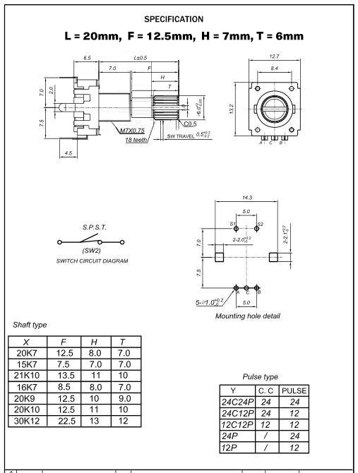
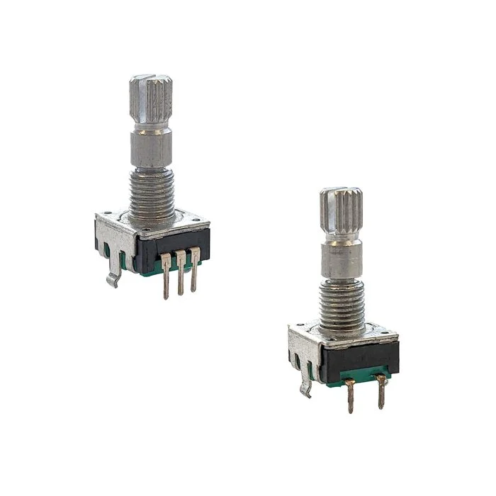
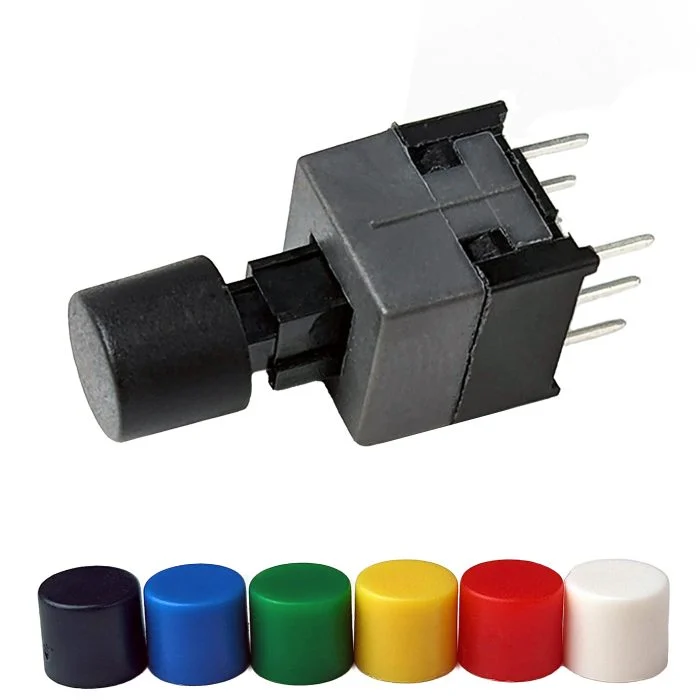

# Screen, button, encoder heights

Needs a test panel to check assembly of encoder, buttons, panel (on daughterboard).

## Screen

1.67mm pcb
**3.16mm** pcb+screen => 1.49mm screen thickness

**4.33mm** pcb+edge connector insulation => 2.66mm connector (excluding pins)

total height 4.33 + 3.16 - 1.67 = **5.82mm**
so needs -5.86 + 8.6 = **2.74mm** lift.
Long pin connector?

## Thonk encoder

Thonk EC11S-24P-0C-20KQ, T18 switched shaft, 20mm above casing
7mm bushing height
casing **6.54mm** above PCB

## Buttons

[Thonk Low profile](https://www.thonk.co.uk/shop/low-profile-push-buttons/)  **8.6mm** PCB to top of switch mechanism.

