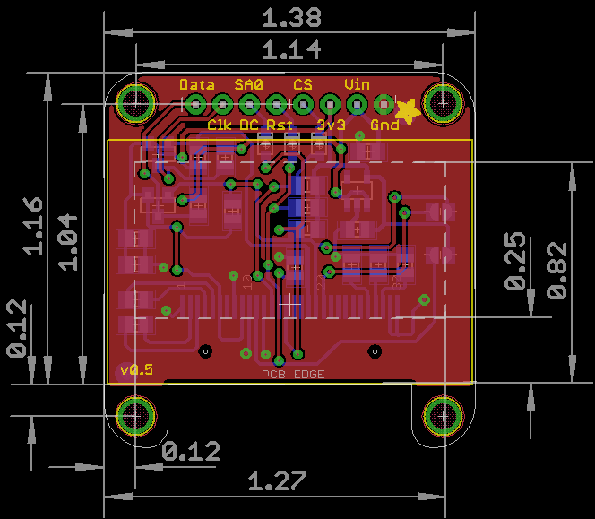

# Adafruit Monochrome 1.3 inch OLED display (original)

## Stupid inches to mm

|inch |mm |description |
|-----|---|------------|
| 1.38 | 35.052 | board width |
| 1.14 | 28.956 | horizontal spacing of **top** mounting holes |
| 1.27 | 32.258 | active screen width |
| 1.16 | 29.464 | board height without lugs |
| 1.04 | 26.416 | board base to PCB pin connector |
| 0.82 | 20.828 | active screen height |
| 0.25 | 6.350 | board base to bottom of active screen |
| 0.24 | 6.096 | estimated lug height |
| 0.12 | 3.048 | mounting hole offsets from corners |

Mounting holes are 2.5mm

## Connector

1. MOSI
2. SCLK
3. DC 
4. RST (reset)
5. CS (chip select)
6. 3V3 in or out
7. 5V in (optional)
8. GND

- [wiring 128x64 oleds](https://learn.adafruit.com/monochrome-oled-breakouts/wiring-128x64-oleds)

