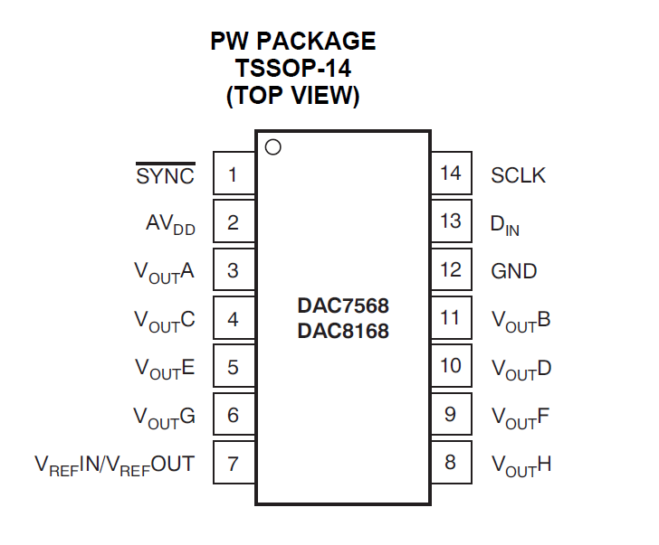

# Performance (Control Change) DAC

One octal DAC does 2 voices  of attack veocity, lift velocity, pressure, glide. 

*Note* final MPE specification reduces precision of pressure & glide to 7bit. However, later expansion to 14bit not ruled out. Implement 14bit as an experiment; 7bit still supported.

Similar circuitry also used to provide the global performance controls (mod wheel, sustain, etc).

## Chip selection

Needs to be 14-bit capable to fully implement the HR aspect, but precision requirement lower than for pitch; most devices send 7bit data and the ones that are high resolution have ENOB less than 14. 1 LSB at 14bit is 300μV but 1 LSB at 7bit is a huge 39mV. Aim for at least 10 ENOB (4.8mV), preferably 12 ENOB (1.2mV).

_AD5648-2_ octal 14-bit DAC ($19.91, got one) NO unsuitable due to zero and gain offsets. Internal VRef of 2.5V gives unipolar 5V output. Better performance from the -2 devices at 5V than the -1 devices at 3V3. Fig. 31 shows **100mV** (!!) error when sourcing or sinking 2mA. Internal 2V5 reference with 2x gain, can use external (5V) ref. Notice most of the graphs in datasheet use an external reference :)
Vref seems to give a couple of mV error in output wrt temperature. Fig.54 shows 4mV error in internal ref wrt temperature.

**DAC8168C** (or DAC8168ICPW  seems more available) octal 14-bit DAC (TSSOP-16, $27.26) much better offsets ±1 / ±4 mV.

(Note to self:_ This is the 14-bit version of the DAC8568 which I used in another  (mainly through-hole) project, OctalDAC wavemix).

## Power

Clean 5.5V. Most graphs in datasheet are at AVdd =  5.5V.

## Digital interface

Logic level high is 0.625 * Vdd so 3.4V, ie it is a 5V logic device with that Vdd.

Needs level shifter for SPI. Use second SPI channel on Teensy 4.1. One quad shifter handles CS (SYNC) plus SCLK and MOSI

**74AHCT125** Quad Level-Shifter (SSOP-14)  good for SPI, fast enough.
Vdd abs max -0.5V to +7V so good for 5V5. Enables are active low, so tie all to ground.

TSSOP-14 DAC has neither CLR nor LDAC, only needs 3 lines through level shifter.

## Vref

DAC8168C Internal 2.5V VRef has initial accuracy of 100μV (0.004%), good temperature stability (especially 2x gain C grade) and long-term drift. External Vref not needed.
Internal Vref in DAC8168C is adequate for general non-pitch CV duties. Output is 0 to 5V.
Note internal Vref is disabled by default, see datasheet Table 5 for enable command.

## Initial accuracy

From **DAC8168C** datasheet, assuming internal Vref:

INL 300μV / 1.2mV (±1 / ±4 LSB)

DNL 30μV / 150μV (±0.1 / ±0.5 LSB)

Gain error 0.5mV / 7.5mV (±0.01% / ±0.15% of FSR) with  5μV (±1 ppm of FSR)/°C drift

Offset error  ±1 / ±4 mV with ±0.5 μV/°C drift

Zero error 	1mV / 4mV with  ±2 μV/°C drift

At 0 to 5V, 1LSB is 306μV. TL071 with 3mV offset is now significant wrt typical (but not max) offsets.

DAC is not trimmable without external conditioning circuitry.

Long term drift (Fig.7) inside ±500μV (±100ppm) /2k hours

## Line regulation

10μV/V is fine here

"The power applied to AVDD should be well-regulated and low noise. Switching power supplies and dc/dc converters often have high-frequency glitches or spikes riding on the output voltage. In addition, digital components can create similar high-frequency spikes as their internal logic switches states. This noise can easily couple into the DAC output voltage through various paths between the power connections an analog output"

## Load

30μV/mA (sourcing)

Internally buffered, but _poor_ load regulation; will need external buffer to protect from modular environment (like getting 12V plugged into an output by mistake) and to give current drive.

## Support circuitry

4.7μF + 100nF supply bypass caps on AVdd. 
"a 1μF to 10μF capacitor and 0.1μF bypass capacitor are strongly recommended".

Optional 150nF cap for lower noise on Vref (likely not needed).

## Output conditioning

3mV offset on TL074B is 3LSB; not that significant, though if an inexpensive alternative op-amp is better (1mV or less, does not need to be high precision) use that.

Quad amps: TL074A is cheap (TL074ACDT 3mV/6mV, $0.867/10) but consider **OPA4172IPW** (200μV/1mV, 0 V/μs, 75mA 60Ω, $3.32/10, TSSOP-14, currently in stock) or OPA4197IDR (25μV/100μV, $3.96/10, out of stock), **OPA4202ID** (20μV/250μV, low slew rate 0.35V/μs, $2.81/10 SOIC-14 in stock) as non-inverting output buffers. Use innie current limiting resistor. 

Better to use a slew limiter on the output, so one quad op-amp only does for 2 outputs. See circuit in TI [Single Op-Amp Slew Rate Limiter](http://www.ti.com/lit/pdf/TIDU026) for slew limiter. Needs rfast recovery from overload, adequate slew rate. 5V/ms (160Hz lowpass) seems like a good starting point. Breadboard then examine stepped ramp on scope to determine optimal slew rate. "Op-amp slew rate = 10x-100x slew rate limiter value." OPA4202 likely too slow.
OPA4192 out of stock at Mouser. OPA4187?? (0.2V/μs $5.60/10 in stock) seems over-specified for Vos, slow slew, and expensive

- [Mathematical analysis of lag/slew](https://modwiggler.com/forum/viewtopic.php?t=270580&sid=4bbb23507cc03653a38cad97c82f4882)
- [my slew rate question on MW in 2018](https://modwiggler.com/forum/viewtopic.php?t=202240)
- [interpolation in midi-vs-cv](https://www.elektronauts.com/t/midi-vs-cv/156000/123)
- [zipper noise in MIDI to CV](https://gearspace.com/board/electronic-music-instruments-and-electronic-music-production/718498-zipper-noise-kenton-pro-2000-mkii.html)

Bipolar operation is possible (datasheet p.47) but not needed here, all the MIDI CC are unipolar for the MPE performance controls. So *could* use singe-rail op-amps which swing to 0V on input and output. Probably easier to use bipolar devices though.

Given wide variety of op-amp capabilities, fluctuating pricing and wildly varying lead times and availability, split perf dac board into the DAC part and the buffer/slew part so one can be built with cheap parts then another with better parts, for testing and to avoid replacing the DAC. Standardize on one op-amp footprint, so SOIC-14 quad or TSSOP-14 quad.

Op-amp board needs bipolar supply OR R/R in and out op-amps to ensure accurate 0V. Bipolar is easier. Check CMRR though.

## Fading (all voice 'attenuators')

(Not on same board).

Use 4 pots with rail-to-rail input and output buffer amps connected to 4 adc inputs. Teensy 4.1 only has 10bit (enob) ADC. Then use these values to digitally scale the 14bit performance values (on *all* voices), providing per-performance-output attenuator function across all channels.

Experiment to see if buffering is needed. 10k pots should be low enough to drive ADC but check current draw of 4 in parallel (1.3mA, seems fine).

Allow a dead zone at each end so easy to get "fully off" or "fully on" values. Experiment with curve between the two extremes, linear is probably not what is wanted here.

- [Alpha 9mm T18 shaft pot, 10k](https://www.thonk.co.uk/shop/alpha-9mm-pots-vertical-t18/) [GOT]
- [T18 micro knobs](https://www.thonk.co.uk/shop/micro-knobs/) [GOT]

or (takes more space, but easier to see the value)

- [Alpha B50K Slider](https://www.thonk.co.uk/shop/music-thing-modular-sliders-for-voltages/)

 Use Responsive Analog Read:

- [Writing a better noise-reduction algorithm](http://damienclarke.me/code/posts/writing-a-better-noise-reducing-analogread)
- [RAR on GitHub](https://github.com/dxinteractive/ResponsiveAnalogRead)
- [Example responsive analog read](https://forum.pjrc.com/threads/45376-Example-code-for-MIDI-controllers-with-Pots-and-Buttons)

May need buffering, though this project does not need a fast rate of reading these pots. Would use a 3V3 RR-I/O op-amp.

"It is advisable to place a 10nF capacitor from the wiper to ground against RF and other interference." [Gerrit, PJRC forum](https://forum.pjrc.com/threads/55126-MIDI-Faderbox-fader-choice?p=197818&viewfull=1#post197818)

Maybe use [elapsedMillis](https://www.pjrc.com/teensy/td_timing_elaspedMillis.html) to only ready the pots every so often.