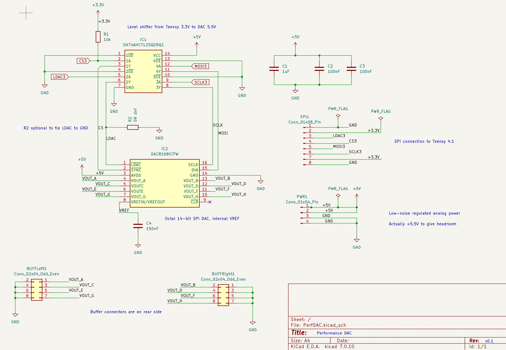
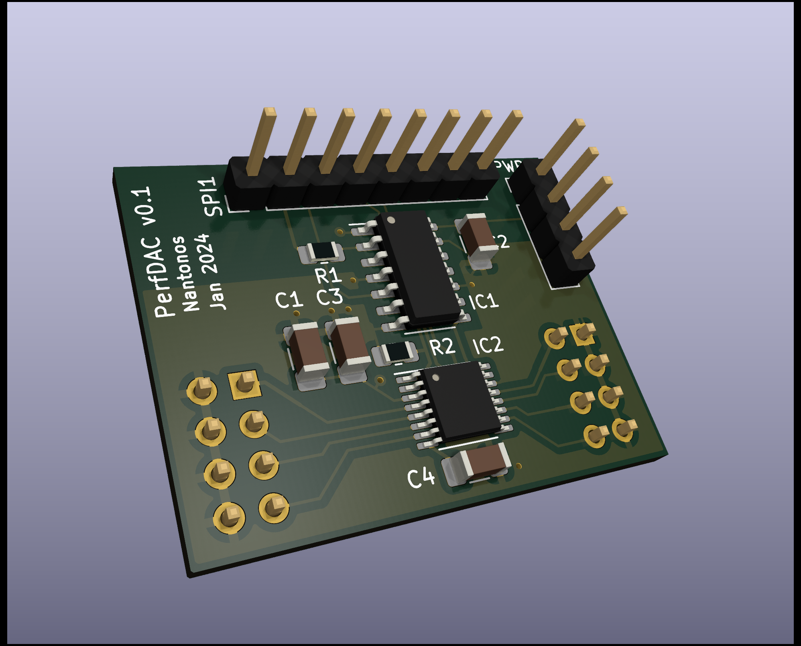

# Performance (Control Change) DAC

One octal DAC does 2 voices  of attack veocity, lift velocity, pressure, glide. 

*Note* final MPE specification reduces precision of pressure & glide to 7bit. However, later expansion to 14bit not ruled out. Implement 14bit as an experiment; 7bit still supported.

Similar circuitry also used to provide the global performance controls (mod wheel, sustain, etc).

## Chip selection

Needs to be 14-bit capable to fully implement the HR aspect, but precision requirement lower than for pitch; most devices send 7bit data and the ones that are high resolution have ENOB less than 14. 1 LSB at 14bit is 300μV but 1 LSB at 7bit is a huge 39mV. Aim for at least 10 ENOB (4.8mV), preferably 12 ENOB (1.2mV).

_AD5648-2_ octal 14-bit DAC ($19.91, got one) NO unsuitable due to zero and gain offsets. Internal VRef of 2.5V gives unipolar 5V output. Better performance from the -2 devices at 5V than the -1 devices at 3V3. Fig. 31 shows **100mV** (!!) error when sourcing or sinking 2mA. Internal 2V5 reference with 2x gain, can use external (5V) ref. Notice most of the graphs in datasheet use an external reference :)
Vref seems to give a couple of mV error in output wrt temperature. Fig.54 shows 4mV error in internal ref wrt temperature.

**DAC8168C** (or DAC8168ICPW  seems more available) octal 14-bit DAC (TSSOP-16, $27.26, **got 3, 4 Jan 2018** ) much better offsets ±1 / ±4 mV.

(_Note to self:_ This is the 14-bit version of the DAC8568 which I used in another  (mainly through-hole) project, OctalDAC wavemix).

TSSOP-14 DAC has neither CLR nor LDAC, only needs 3 lines through level shifter. However best (C) grade is TSSOP-16.

## Power

Clean 5.5V. Most graphs in datasheet are at AVdd =  5.5V.

## Digital interface

Logic level high is 0.625 * Vdd so 3.4V, ie it is a 5V logic device with that Vdd.

Needs level shifter for SPI. Use second SPI channel on Teensy 4.1. One quad shifter handles CS (SYNC) plus SCLK and MOSI and optionally LDAC.

**74AHCT125** Quad Level-Shifter (SSOP-14, **got 10 Jan 2018** plus 10 DIP)  good for SPI, fast enough.
Vdd abs max -0.5V to +7V so good for 5V5.

Enables are active low, so tie all to ground.

[Check for MISO tri-state behavior](https://www.pjrc.com/better-spi-bus-design-in-3-steps/) with a pair of 10 resistors.

## Vref

DAC8168C Internal 2.5V VRef has initial accuracy of 100μV (0.004%), good temperature stability (especially 2x gain C grade) and long-term drift. External Vref not needed.
Internal Vref in DAC8168C is adequate for general non-pitch CV duties. Output is 0 to 5V.
Note internal Vref is disabled by default, see datasheet Table 5 for enable command.

## Initial accuracy

From **DAC8168C** datasheet, assuming internal Vref:

INL 300μV / 1.2mV (±1 / ±4 LSB, typ / max)

DNL 30μV / 150μV (±0.1 / ±0.5 LSB)

Gain error 0.5mV / 7.5mV (±0.01% / ±0.15% of FSR) with  5μV (±1 ppm of FSR)/°C drift

Offset error ±1 / ±4 mV with ±0.5 μV/°C drift

Zero error 1mV / 4mV with  ±2 μV/°C drift

At 0 to 5V, 1LSB is 306μV. TL071 with 3mV offset is now significant wrt typical (but not max) offsets.

DAC is not trimmable without external conditioning circuitry.

Long term drift (Fig.7) inside ±500μV (±100ppm) /2k hours

## Line regulation

10μV/V is fine here

"The power applied to AVdd should be well-regulated and low noise. Switching power supplies and dc/dc converters often have high-frequency glitches or spikes riding on the output voltage. In addition, digital components can create similar high-frequency spikes as their internal logic switches states. This noise can easily couple into the DAC output voltage through various paths between the power connections an analog output"

So powering from the analog, regulated 5V5 supply helps here.

## Load

30μV/mA (sourcing)

Internally buffered, but _poor_ load regulation; will need external buffer to protect from modular environment (like getting 12V plugged into an output by mistake), to provide a constant high-impedance load for the DAC, and to give current drive with low output impedance.

> **8.2.3 Output Amplifier**
> The output buffer amplifier is capable of generating rail-to-rail voltages on its output, giving a maximum output range of 0V to AVDD. It is capable of driving a load of 2kΩ in parallel with 3000pF to GND. The source and sink capabilities of the output amplifier can be seen in the Typical Characteristics. The typical slew rate is 0.75V/μs, with a typical full-scale settling time of 5μs with the output unloaded.

## Support circuitry

4.7μF + 100nF supply bypass caps on AVdd.

> a 1μF to 10μF capacitor and 0.1μF bypass capacitor are strongly recommended.

Optional 150nF cap for lower noise on Vref (likely not needed, but place footprint on board).

## Output conditioning

3mV offset on TL074B is 3LSB; not that significant, though if an inexpensive alternative op-amp is better (1mV or less, does not need to be high precision) use that.

Quad amps: TL074A is cheap (TL074ACDT 3mV/6mV, $0.867/10) but consider **OPA4172IPW** (200μV/1mV, 0 V/μs, 75mA 60Ω, $3.32/10, TSSOP-14, currently in stock) or OPA4197IDR (25μV/100μV, $3.96/10, out of stock), **OPA4202ID** (20μV/250μV, low slew rate 0.35V/μs, $2.81/10 SOIC-14 in stock) as non-inverting output buffers. Use innie current limiting resistor.

DAC settling time, 1/4 scale to 3/4 scale is 10μs typ, so 20μs full scale and 40μs for fastest possible square wave = 25kHz in theory (will be slower). Spec sheet slew rate is 0.75 V/μs.

Better to use a slew limiter or low-pass filter on the output to avoid stair-stepping and VCA crackles; so one quad op-amp only does for 2 outputs. See circuit in TI [Single Op-Amp Slew Rate Limiter](http://www.ti.com/lit/pdf/TIDU026) for slew limiter. Needs fast recovery from overload, adequate slew rate. 5V/ms (160Hz lowpass) seems like a good starting point. Breadboard then examine stepped ramp on scope to determine optimal slew rate. "Op-amp slew rate = 10x-100x slew rate limiter value." OPA4202 likely too slow.
OPA4192 out of stock at Mouser. OPA4187?? (0.2V/μs $5.60/10 in stock) seems over-specified for Vos, slow slew, and expensive

OR do slew in software so it is configurable and can be disabled for true 14bit inputs.
Uses half the amount of op-amps (one per output). Needs testing.

Capture some MIDI output from the Roli Seaboard to see what rate of changes is sent on changes in pressure etc; suspect it is fairly slow (and 7bit).

Remember same board is used for the analog general CC CV section, so also capture some data on that (mod wheel, breath, etc). Some of these are 14bit CC:

- Modulation Wheel (CC01+CC33)
- Breath (CC02+CC34)
- Expression Controller (CC11+CC43)

might also be driven by 14bit NRPN. Avoid over-slewing on 14bit inputs, which argues for software limiting.

- [Mathematical analysis of lag/slew](https://modwiggler.com/forum/viewtopic.php?t=270580&sid=4bbb23507cc03653a38cad97c82f4882)
- [my slew rate question on MW in 2018](https://modwiggler.com/forum/viewtopic.php?t=202240)
- [interpolation in midi-vs-cv](https://www.elektronauts.com/t/midi-vs-cv/156000/123)
- [zipper noise in MIDI to CV](https://gearspace.com/board/electronic-music-instruments-and-electronic-music-production/718498-zipper-noise-kenton-pro-2000-mkii.html)
- [MIDI vs I2C CV control on Haken Continuum driving Moog Voyager](https://www.hakenaudio.com/voltage-converter) notes excessive smoothing in Moog MIDI to CV generation limits expressive attack

Bipolar operation is possible (datasheet p.47) but not needed here, all the MIDI CC are unipolar for the MPE performance controls. So *could* use singe-rail op-amps which swing to 0V on input and output. Probably easier to use bipolar devices though.

Given wide variety of op-amp capabilities, fluctuating pricing and wildly varying lead times and availability, split perf dac board into the DAC part and the buffer/slew part so one can be built with cheap parts then another with better parts, for testing and to avoid replacing the DAC. Standardize on one op-amp footprint, so SOIC-14 quad or TSSOP-14 quad.

Op-amp board needs bipolar supply OR R/R in and out op-amps to ensure accurate 0V. Bipolar is easier. Check CMRR though.

## Fading (all voice 'attenuators')

(Not on same board).

Use 4 pots with rail-to-rail input and output buffer amps connected to 4 adc inputs. Teensy 4.1 only has 10bit (enob) ADC. Then use these values to digitally scale the 14bit performance values (on *all* voices), providing per-performance-output attenuator function across all channels.

Experiment to see if buffering is needed. 10k pots should be low enough to drive ADC but check current draw of 4 in parallel (1.3mA, seems fine).

Allow a dead zone at each end so easy to get "fully off" or "fully on" values. Experiment with curve between the two extremes, linear is probably not what is wanted here.

- [Alpha 9mm T18 shaft pot, 10k](https://www.thonk.co.uk/shop/alpha-9mm-pots-vertical-t18/) [GOT]
- [T18 micro knobs](https://www.thonk.co.uk/shop/micro-knobs/) [GOT]

or (takes more space, but easier to see the value)

- [Alpha B50K Slider](https://www.thonk.co.uk/shop/music-thing-modular-sliders-for-voltages/)

 Use Responsive Analog Read:

- [Writing a better noise-reduction algorithm](http://damienclarke.me/code/posts/writing-a-better-noise-reducing-analogread)
- [RAR on GitHub](https://github.com/dxinteractive/ResponsiveAnalogRead)
- [Example responsive analog read](https://forum.pjrc.com/threads/45376-Example-code-for-MIDI-controllers-with-Pots-and-Buttons)

May need buffering, though this project does not need a fast rate of reading these pots. Would use a 3V3 RR-I/O op-amp.

"It is advisable to place a 10nF capacitor from the wiper to ground against RF and other interference." [Gerrit, PJRC forum](https://forum.pjrc.com/threads/55126-MIDI-Faderbox-fader-choice?p=197818&viewfull=1#post197818)

Maybe use [elapsedMillis](https://www.pjrc.com/teensy/td_timing_elaspedMillis.html) to only ready the pots every so often.

## Board

Three separate boards, stacking and parallel to panel, for:

- DAC and level shifter (5V5 power)
- op-amp buffers/slew (±12V power)
- jacks

SYNC is active-low CS. Din is MOSI. SCLK is SCLK :)
Synchronous update mode so LDAC tied to GND.
But check this allows updating only some channels, not (re)writing to them all.
Better to bring out LDAC through level shifter so there is flexibility on controlling it from Teensy or tying low permanently.

### DAC board

#### Schematic

### DAC PCB

> We detected a 2 layer board of 1.33 x 1.03 inches (33.8 x 26.3mm)
> 3 boards will cost $6.85

_Notice that the buffer board connections should be on the other side of the board!_

### DAC BOM  (per DAC board, need 2)

#### Resistors

(1) R1 10k 0805 any tolerance **GOT**
(1) R2 0R 0805 or solder bridge, optional (**GOT**)

#### Capacitors

(1) C1 Kemet C1206X105K3RACTU  25V 1μF X7R 10% 1206 ceramic $0.839/10 = **$8.39 GOT**
or
(1) [Kemet C1206C475K3RACTU](https://www.mouser.com/ProductDetail/KEMET/C1206C475K3RACTU?qs=sGAEpiMZZMvsSlwiRhF8qok1fkaRbtAXC1WGxIuEg%252Bg%3D) 25V 4.7μF X7R 10% 1206 MLCC $0.156/10 =  **$1.56**

(2) C2, C3 Kemet C1206C104K3GEC7210 25V 100nF C0G 1206 ceramics $0.051/100 = **$5.10 GOT**

(1) C4  [Murata GRM31C5C1H154JE02L](https://www.mouser.com/ProductDetail/Murata-Electronics/GRM31C5C1H154JE02L?qs=qSfuJ%252Bfl%2Fd70Xb0PJyHSQA%3D%3D) 50V 0.15μF 1206 C0G $0.241/10 = **$2.41**

(2) Kemet C1206C104K3GEC7210 25V 100nF C0G 1206 ceramics $0.051/100 = **$5.10 GOT**

#### DAC

(1) DAC8168ICPW  14-bit octal $25.98/1 = **$25.98 GOT**

#### Logic

(1) [SN74AHCT125QDRQ1](https://www.mouser.com/ProductDetail/Texas-Instruments/SN74AHCT125QDRQ1?qs=zhgwDAIOVxtE5BLiD9k5oQ%3D%3D) Quad bus buffer $0.385/10 = **$3.85 GOT**

## Code

Enable internal ref (disabled by default) in setup: command 090A0000h.

Then use broadcast mode to set all channels to zero (but zero is the C-grade power-on default).

See [32bit SPI to DAC8168](https://forum.pjrc.com/threads/72317-Dac8568-gt-dac8168?p=321896&viewfull=1#post321896) using SPI.transfer32()

[Asynchronous writes to multiple SPI channels](https://forum.pjrc.com/threads/61676-SPI-pins-teensy-4-1?p=245308&viewfull=1#post245308)

## Workplan

- [ ] Breadboard op-amp slew circuit, test with any DAC stepped at 7bit resolution. Get good capacitor values for sufficient slew.
- [ ] Check existing parts stock, to be sure.
- [ ] Select an op-amp for post-dac conditioning.
- [ ] Lay out panel jack PCB and op-amp PCB, check enough room for connectors and easy to route
- [ ] Lay out perf DAC board, send to OSH Park to enable testing a populated DAC board.
- [ ] Order parts
- [ ] Build perf DAC board
- [ ] Test perf DAC board with 5V5 supplies
- [ ] Test perf DAC with output to breadboarded op-amp circuit.
- [ ] Order op amp and panel boards from OSH Park
- [ ] Assemble completed perf DAC, measure, check against panel drawing