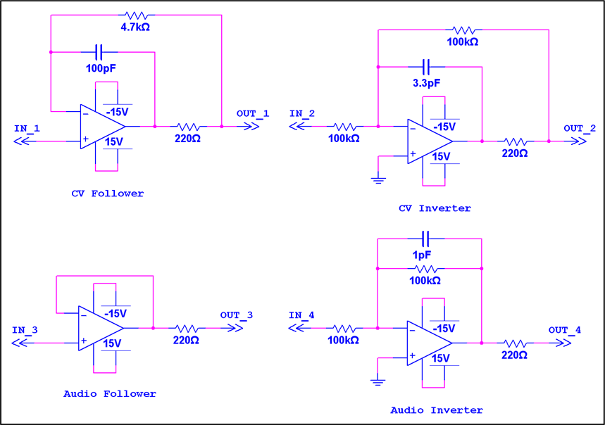
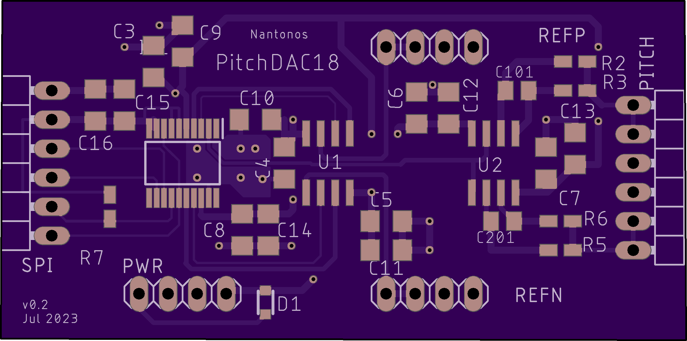

# Pitch DAC

Use a very linear, well behaved 16-bit DAC per voice (so, two needed).

Over 10 octaves, at the desired precision, 16 bits is barely sufficient (0.2 cents). More bits would be desirable, to give finer precision and to allow for the loss of precision from using a calibration curve. However, 20bit or 18bit DACs can be expensive, and some are no better than 16bit INL; 24bit DACs are widely available and cheap, but tuned for audio AC performance not DC accuracy and linearity.

_AD5542CRZ_ (SOIC-14, now $52.61/1 in stock **got 6 Jan 2018** when they were $35), same as I used in my previous, mono, MIDI2CV project, provides bipolar ±Vref output (so, ±5V) with one bipolar-powered op-amp in the output loop. Power up to +5V5. INL ±0.5LSB (typ) ±1.0LSB (max, = 15ppm) for best (C) grade. DNL is ±1 LSB max = 15ppm. SPI needs 16bit transfer.

**AD5781ARUZ** (TSSOP-20, $40.96/1 no stock til 03 April 2023) 18bit. INL ±1 LSB (max, 5V vref, = 3.6ppm) for B grade, ±4 LSB (max, = 15ppm) for A grade. _Mouser does not stock the best (B) grade. A grade has more resolution, but same INL, as the 16bit AD5542CRZ. Digikey has A grade at $40.96, no stock_    DNL however is ±1 LSB max = 3.6ppm for _both_ grades. Bipolar ±Vref output, power up to ±16.5V. SPI needs 24bit transfer. Needs Schottky diode for power rail syncronization, see datasheet fig. 50. A grade is actually less expensive than AD5542CRZ, with better DNL. Check that the layout is going to be reasonable on a 2-layer board.
**Got 1, May 2020**.

_AD5791BRUZ_ (TSSOP-20, $133.24/1 no stock) or _AD5791ARUZ_ (TSSOP-20, $84.45/1 no stock) 20bit, 1ppm linearity, bipolar ±Vref output, power up to ±16.5V. Very expensive.

Conclusion: AD5781ARUZ gives 16bit INL with 18bit DNL at slightly lower cost than AD5542CRZ.

## Power

AD5781ARUZ Vdd and Vss abs max of 16.5V. Spec sheet assumes VDD = +12.5 V to +16.5 V, VSS = −16.5 V to −12.5 V. Optimal supply for lowest zero-scale and gain errors is ±9.5V (datasheet, figs 20 & 22, _noting results are given for 5V and for ±10V spans while I need a ±5V span_).

Advantage of ±12V-derived ±9V5 rails, compared to using Eurorack 5V power, is that filtering and smoothing can be applied, reducing switching PSU noise and increasing decoupling from the digital circuitry running on Eurorack 5V.

## Digital interface

With Teensy 4.1, for AD5781ARUZ no level shifters needed.

Data is written to the AD5781 in a 24-bit word format.

To isolate from digital 0V noise, consider optical isolator. ISO724x high speed quad isolator (got 2, Jan 2018). MOSI, SCLK, CS/SYNC and ?LDAC however AD5781 has separate DGND, AGND pins. Also isolator would need separate, DAC-side 3V3 supply. So, NO.

[10k pullup on SPI CS line](https://www.pjrc.com/better-spi-bus-design-in-3-steps/).

## Initial accuracy

1LSB is 10V / 2^18 = 38μV. At 1V/Oct, 12 tones per octave, 100 cents per tone, 1 Cent is 833μV so 1 LSB is about 1/20 cent.

INL is ±2 (typ) ±4 (max) LSB for worst (A) grade = 15ppm.

DNL at 5V vref is ±0.5 (typ) ±1.0 (max) LSB = 3.6ppm.

Linearity Error Long-Term Stability is 0.03 LSB after 1k hours at 100C.

Gain error (away from output voltage extremes) is 0.4ppm (typ) 20ppm FSR (max) = 2μV (typ) 100μV (max) with a gain error TC of ±0.04ppm FSR/C.

## Line regulation

±1 LSB for  ΔVdd ±10%, nothing specal needed for Vdd regulation here but ensure supply is low noise.

Needs Schottky diode across power rails, see datasheet fig. 50.

## Load regulation

DAC output impedance is 3.4k for AD5781ARUZ so buffer with an op-amp on the output.

## Vref connection

A pair of op-amps (one non inverting for VrefP, one inverting for VrefN) then, per pitch DAC, a pair of unity gain buffers for (required) kelvin connections. 

AD5781 datasheet uses AD8676 (AD8676BRZ $6.89/1) dual op-amp for Vref buffers, which is 12uV typ 50uV max Vos, 2nA Ibias, very low noise rail-to-rail. R/R does not seem to be needed for a 5V output on ±12 or ±9.5 rails. Low input bias is _specifically needed_ to achieve the rated performance.

_OPA2197ID_ (OPA2197ID $2.97/1) dual is 25uV typ 100uV max Vos, 5nA Ibias so twice as bad at half the price. (Quad OPA4197ID, got 10 May 2020)

**OPA2186D** another (OPA2186DR $2.22/10 newer, more available; SOIC-8) option. 1μV/10μV Vos as it is chopper stabilized. 4.8 max nA Ibias over temp, 55pA @25C. Check **slew rate 0.35 V/μs** is ok for slew limiter, if used. Quad version has _4x worse Vos_ so use duals. The _maximum_ power supply voltage for the OPAx186 is 24 V (±12 V). (Abs Max 26V). So running on ±9.5V looks good.

OPA4187IPW (1μV/10μV TSSOP-14 $5.60/10 in stock) quad a bit expensive

DAC input resistance is highly code-dependent. For AD5781ARUZ, lowest (around 5kΩ) which is 1mA at 5V.

## Output conditioning

With a 5V ref and an output buffer [unity OP-C, no external components] this gives ±5V output (10 octaves) which includes Note-ON voltage, global pitchbend, and per-note pitchbend. Note that this does not cover the full MIDI note range of 128 notes = 10.66 octaves. Not an issue in practice.

Op-amps here need a max Vos of 38μV (1LSB at 18bits), preferably better. Input bias current however is not as crucial here (unless Vref buffers and output buffers use the same quad.) 

AD8675 is the Analog Devices recommendation (mouser only has the less good A grade).

OPA197 an alternative. Or use a quad OPA4197 for both vref buffers, output, and one left over for slew limit if desired (not a good idea for pitch) or to drive two outputs. All hinges on unstable availability and huge lead times!

**OPA2186D** same as Vref drivers looks suitable.

Are chopper amps suitable here? LT1150 operates on 12V bipolar supples, has 10μV max offset. Mouser $9.04 each, $8.28/10, $5.99/25 so go for 25 = 141.25 be damn sure they work first! **OPA4192D** (quad, SOIC-14 which performs better than the TSSOP) 8μV (typ) 50μV (max) $3.67/10 seems good, probably adequate (common-mode input to within 100mV of each rail) and cheaper.

Note "This unity-gain difference amplifier (equal resistors) causes the input difference voltage (V2-V1) to be impressed on R5; the resulting current flows to the load. The offset voltage, however, is applied directly to the noninverting input and is amplified by +2 – like a noninverting amplifier (G = 1 + R2/R1). Thus, a 10-mV offset voltage creates 20 mV across R5, producing a 20mA output current offset. A -10-mV offset would create a -20-mA output current (current sinking from the load)."

Should the output buffer be able to drive a capacitive load (so, two resistors and cap in feedback loop).

[Understanding stabilization capacitors](https://northcoastsynthesis.com/news/understanding-stabilization-capacitors/)

3 op-amps per channel = 6 or 4 if slew limit /  dual buffered outs = 8.

## Schematic

 ([PDF](./pitchdac-schematic.pdf))

## Board

Separate digital and analog ground planes.

> We detected a 2 layer board of 2.20 x 1.17 inches (55.8 x 29.7mm)
> 3 boards will cost $12.85

May be _slightly_ wide, check. Was going for 6HP (30mm).

Put a couple of standoff holes here to secure the two DAC boards together? NO tried and the boards are too small.

Board [ordered at OSH Park](https://oshpark.com/shared_projects/gQY5hg1l) 31 Mar 2023.

## BOM (per DAC board, need 2)

### DAC

(1) Analog Devices [AD5781ARUZ ](https://www.mouser.com/ProductDetail/Analog-Devices/AD5781ARUZ) $40.96  = **$40.96**

### Stabilization film caps

(2) Cornell Dubilier FCP0805H101J-J1 33pF 0805 $0.526/10 = **$5.26** [Mouser](https://www.mouser.com/ProductDetail/Cornell-Dubilier-CDE/FCP0805H101J-J1)

### Bulk ceramic caps

(2) Kemet C1206X105K3RACTU  25V 1μF X7R 10% 1206 ceramic $0.839/10 = **$8.39**

(10) Samsung CL31B106KAHNFNE  25V 10μF X7R 10% 1206 ceramic $0.094/10 =	**$1.88**  [Mouser](https://www.mouser.com/ProductDetail/Samsung-Electro-Mechanics/CL31B106KAHNFNE) get 20

### Decoupling and NR caps

(10) Kemet C1206C104K3GEC7210 25V 100nF C0G 1206 ceramics $0.051/100 = **$5.10 GOT**

### Resistors

(2) Susumu [RR1220P-472-D ](https://www.mouser.com/ProductDetail/Susumu/RR1220P-472-D) 0805 4k7 0.5% 25ppm $0.13/10 = **$1.30**

(2) Susumu [RR1220P-221-D ](https://www.mouser.com/ProductDetail/Susumu/RR1220P-221-D) 0805 220R 0.5% 25ppm $0.127/10 = **$1.27**

(1) Any 0805 10k will do.

### Op-Amps

(2) TI [OPA2186DR](https://www.mouser.com/ProductDetail/Texas-Instruments/OPA2186DR) $2.22/10 = **$22.20**

### Schottky diode

(1) Kyocera [SD0805S040S0R5](https://www.mouser.com/ProductDetail/KYOCERA-AVX/SD0805S040S0R5) 0805 40V $0.44/1 = **$1.32**

## Work Plan

- Have one DAC.
- Check slew rate and corner freq for 4k7, 220R, 1nF; breadboard with TL074 to check.
- Get OPA2186DR, other components for one board
- Lay out board, fab
- Build and test one DAC board with (previously tested) VREF board.
- If all okay, order 2 more DAC and components for other board. Else refine, redo board.
