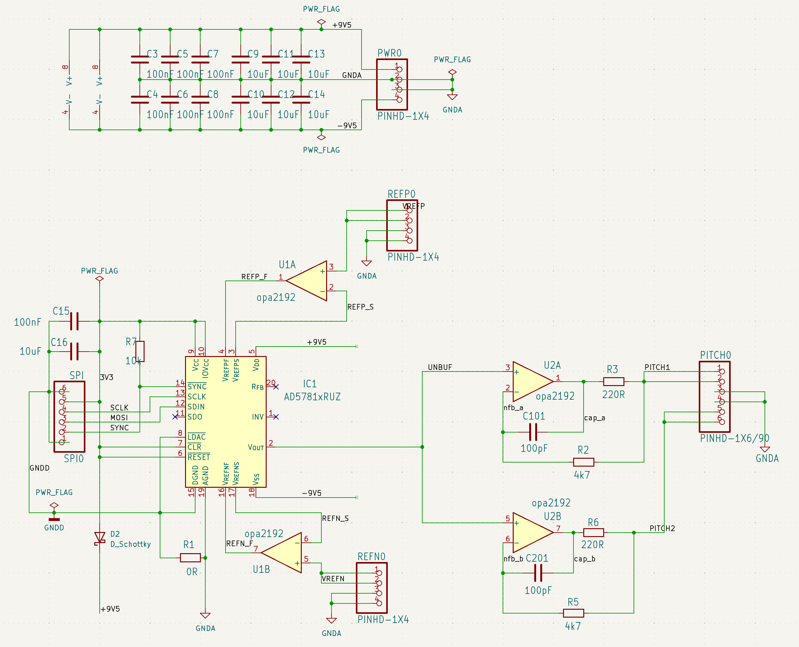

# Pitch DAC

Initial plan was to use a very linear, well behaved 16-bit DAC per voice (so, two needed).

Over 10 octaves, at the desired precision, 16 bits is barely sufficient (0.2 cents). More bits would be desirable, to give finer precision and to allow for the loss of precision from using a calibration curve. However, 20bit or 18bit DACs can be expensive, and some are no better than 16bit INL; 24bit DACs are widely available and cheap, but tuned for audio AC performance not DC accuracy and linearity.

_AD5542CRZ_ (SOIC-14, now $52.61/1 in stock **got 6 Jan 2018** when they were $35), same as I used in my previous, mono, MIDI2CV project, provides bipolar ±Vref output (so, ±5V) with one bipolar-powered op-amp in the output loop. Power up to +5V5. INL ±0.5LSB (typ) ±1.0LSB (max, = 15ppm) for best (C) grade. DNL is ±1 LSB max = 15ppm. SPI needs 16bit transfer.

**AD5781ARUZ** (TSSOP-20, $40.96/1 no stock til 03 April 2023) 18bit. INL ±1 LSB (max, 5V vref, = 3.6ppm) for B grade, ±4 LSB (max, = 15ppm) for A grade. Better B grade is $56.04/1. A grade has more resolution, but same INL, as the 16bit AD5542CRZ. Digikey has A grade at $40.96, no stock_    DNL however is ±1 LSB max = 3.6ppm for _both_ grades. Bipolar ±Vref output, power up to ±16.5V. SPI needs 24bit transfer. Needs Schottky diode for power rail syncronization, see datasheet fig. 50. A grade is actually less expensive than AD5542CRZ, with better DNL.
**Got 1, May 2020**.

_AD5791BRUZ_ (TSSOP-20, $129.80/1 in stock) or _AD5791ARUZ_ (TSSOP-20, $80.46/1 in stock) 20bit, 1ppm linearity, bipolar ±Vref output, power up to ±16.5V. Very expensive. However they are exactly pin-for-pin compatible with AD5781 so could be swapped in if needed.

Conclusion: 18 bit **AD5781ARUZ** gives 16bit INL with 18bit DNL at slightly lower cost than the 16-bit AD5542CRZ.

## Power

AD5781ARUZ Vdd and Vss abs max of 16.5V. Spec sheet assumes VDD = +12.5 V to +16.5 V, VSS = −16.5 V to −12.5 V. Optimal supply for lowest zero-scale and gain errors is ±9.5V (datasheet, figs 20 & 22, _noting results are given for 5V and for ±10V spans while I need a ±5V span_).

> The AD5781 accepts a positive reference input in the range 5V to VDD – 2.5 V and a negative reference input in the range VSS + 2.5 V to 0 V.

So on ±9V5 positive Vref up to +7V and negative Vref -7V to 0V.

Advantage of ±12V-derived ±9V5 rails, compared to using Eurorack 5V power, is that filtering and smoothing can be applied, reducing switching PSU noise and increasing decoupling from the digital circuitry running on Eurorack 5V. Bipolar supply is required; enables bipolar output and for 0V output, Vss -2.5 or lower is needed.

## Digital interface

With Teensy 4.1, for AD5781ARUZ no level shifters needed.

Data is written to the AD5781 in a 24-bit word format, which sadly precludes SPI.transfer16() or SPI.transfer32(); however there is an [SPI.transfer(buffer, size)](https://www.arduino.cc/reference/en/language/functions/communication/spi/transfer/), where size would be 3, which might work, see [example](https://forum.pjrc.com/index.php?threads/spi-write-24bits.74194/#post-336450). Another option (without buffer overwrite) is [SPI.transfer(txBuffer, rxBuffer, cnt);](https://forum.pjrc.com/index.php?threads/spi-write-24bits.74194/#post-336456) where rxbuffer can be NULL

Datasheet says 35 MHz Schmitt triggered Digital Interface. However, minimum CS (SYNC) high time 48ns. SCLK min cycle time 40ns which is 25MHz. So use well below that (start at 10MHz).

To isolate from digital 0V noise, consider optical isolator. ISO724x high speed quad isolator (got 2, Jan 2018). MOSI, SCLK, CS/SYNC and ?LDAC however AD5781 has separate DGND, AGND pins. Also isolator would need separate, DAC-side 3V3 supply. So, NO.

[10k pullup on SPI CS line](https://www.pjrc.com/better-spi-bus-design-in-3-steps/).

## Initial accuracy

1LSB is 10V / 2^18 = 38μV. At 1V/Oct, 12 tones per octave, 100 cents per tone, 1 Cent is 833μV so 1 LSB is about 1/20 cent.

**INL** is ±2 (typ) ±4 (max) LSB for worst (A) grade = 15ppm = ±153μV max (!!)

**DNL** at 5V vref is ±0.5 (typ) ±1.0 (max) LSB = 3.6ppm.

Linearity Error **Long-Term Stability** is 0.03 LSB after 1k hours at 100C.

**Gain error** (away from output voltage extremes) is 0.4ppm (typ) 20ppm FSR (max) = 2μV (typ) 100μV (max) with a gain error TC of ±0.04ppm FSR/C.

Poorly documented LIN COMP register applies third-order residual non-linearity compensation. See [EEBlog post on AD6791 LIN COMP](https://www.eevblog.com/forum/metrology/ad5791-based-dac-platform/msg4938403/#msg4938403)

> The specifications in this data sheet are obtained with LIN COMP = 0000 for reference spans up to and including 10 V and with LIN COMP = 1100 for a reference span of 20 V. The default value of the LIN COMP bits is 0000.

Maybe check the linear vs. R2R segmentation, like [this EEVBlog post](https://www.eevblog.com/forum/metrology/ad5791-based-dac-platform/msg4610125/#msg4610125)?

## Noise

**Spectral noise** 7.5 nV/√Hz at 1kHz, 10kHz and 100kHz.  Dwarfed by the Vref which is 10x noisier at 95 nV/√Hz even with the capacitor. **Flicker noise** 1.1 μV p-p, half that of the Vref.

Board shields SPI lines with digital ground.

## Line regulation

±1 LSB for  ΔVdd ±10%, nothing specal needed for Vdd regulation here but ensure supply is low noise.

Needs Schottky diode across power rails, see datasheet fig. 50.

## Load regulation

DAC output impedance is 3.4k for AD5781ARUZ so buffer with an op-amp on the output.

## Vref connection

See [The 20-Bit DAC Is the Easiest Part of a 1-ppm-Accurate Precision Voltage Source](https://www.analog.com/en/analog-dialogue/articles/20-bit-dac-and-accurate-precision-voltage-source.html) for general guidance (with the 20 bit version of this DAC, the AD5791); also
[AN-86: A Standards Lab Grade 20-Bit DAC with 0.1ppm/°C Drift](https://www.analog.com/en/resources/app-notes/an-86f.html)

A pair of op-amps (one non inverting for VrefP, one inverting for VrefN) then, per pitch DAC, a pair of unity gain buffers for (required) kelvin connections. DAC Vref input impedance is 5/6.6/? kΩ at midscale, but code dependent.

Low input bias is _specifically needed_ to achieve the rated performance.

AD5781 datasheet uses AD8676 (AD8676BRZ $6.89/1) dual op-amp for Vref buffers, which is 12uV typ 50uV max Vos, Ibias **±2 nA max** @25C, very low noise rail-to-rail. R/R does not seem to be needed for a 5V output on ±12 or ±9.5 rails.

_OPA2197ID_ (OPA2197ID $2.97/1) dual is 25uV typ 100uV max Vos, 5nA Ibias so twice as bad at half the price. (Quad OPA4197ID, got 10 May 2020)

**OPA2186D** another (OPA2186DR $2.22/10 newer, more available; SOIC-8) option. 1μV/10μV Vos as it is chopper stabilized. 4.8 max nA Ibias over temp, 55pA @25C. Check **slew rate 0.35 V/μs** is ok for slew limiter, if used. Quad version has _4x worse Vos_ so use duals. The _maximum_ power supply voltage for the OPAx186 is 24 V (±12 V). (Abs Max 26V). So running on ±9.5V looks good.

**OPA2192** ($4.63/10) Vos ±8μV typ, ±50μV max, drift ±0.1 typ, ±0.5 max μV/°C. Input bias ±5 pA typ, **±20 pA** max @25C. So much better than the recommended AD5781.

OPA4187IPW (1μV/10μV TSSOP-14 $5.60/10 in stock) quad a bit expensive

## Output conditioning

With a ±5V ref and an output buffer in the "Unity Gain configuration" from the data sheet Fig. 51 this gives ±5V output (10 octaves) which includes Note-ON voltage, global pitchbend, and per-note pitchbend. Note that this does not cover the [full MIDI note range](./MIDI.md) of 128 notes = 10.66 octaves. Not an issue in practice.

Op-amps here need a max Vos of 38μV (1LSB at 18bits), preferably better. Input bias current however is not as crucial here (unless Vref buffers and output buffers use the same quad.) 

AD8675 is the Analog Devices recommendation (mouser only has the less good A grade).

OPA197 an alternative. Or use a quad OPA4197 for both vref buffers, output, and one left over for slew limit if desired (not a good idea for pitch) or to drive two outputs. All hinges on unstable availability and huge lead times!

Initial plan was **OPA2186D** same as v0.1 Vref drivers, with Vos = ±1μV typ ±10 µV max. Given how the chopper amp destabilized the voltage reference and required extensive resistive decoupling from power supplies, inputs and outputs it seems better to go for a non-chopper design.

**OPA2192** as used in v0.2 voltage reference, with Vos ±8μV typ, ±50μV max, drift ±0.1 typ, ±0.5 max μV/°C still seems good so try it here too.

Because the OPA2186D has a low input bias of ±4.8nA the Fig. 52 Output Amplifier in Unity Gain with Amplifier Input Bias Current Compensation was not used on the first board revision. Also there are [reports](https://www.eevblog.com/forum/metrology/ad5791-based-dac-platform/msg4965718/#msg4965718) that this compensation has little effect:

> In the last two versions of AD5791-based multifunction calibrators, I have included support for both DAC modes (Gain 1x with Ib compensation and Gain 2x) to implement unipolar and bipolar ranges. During the tests, I did not find any measurable differences. Even the INL curve matches up to 0.1 ppm.

Note:

> This unity-gain difference amplifier (equal resistors) causes the input difference voltage (V2-V1) to be impressed on R5; the resulting current flows to the load. The offset voltage, however, is applied directly to the noninverting input and is amplified by +2 – like a noninverting amplifier (G = 1 + R2/R1). Thus, a 10-mV offset voltage creates 20 mV across R5, producing a 20mA output current offset. A -10-mV offset would create a -20-mA output current (current sinking from the load).

Should the output buffer be able to drive a capacitive load (so, two resistors and cap in feedback loop). Chosen values (4k7, 3n3) give a 10kHz cuttoff which seems ample.

DAC has a 3k4 output resistance so the feedback resistance [should be the same](https://eng.libretexts.org/Bookshelves/Electrical_Engineering/Electronics/Operational_Amplifiers_and_Linear_Integrated_Circuits_-_Theory_and_Application_(Fiore)/05%3A_Practical_Limitations_of_Op_Amp_Circuits/5.05%3A_Offsets#section_1) to reduce the effect of the input bias current.It is currently 4k7

[Understanding stabilization capacitors](https://northcoastsynthesis.com/news/understanding-stabilization-capacitors/)

[The Tale Of The 1 kΩ Output Resistor](https://www.njohnson.co.uk/index.php?menu=2&submenu=2&subsubmenu=16)

### Simulation results

Initial simulation was a 1nF load (guess at cable capacitance) in parallel with 100k (for the input module). Pulse input was

`y1=0 y2=5 td=1m tr=100n tf=1u tw=1 per=1`

where the pulse starts at 1ms (td), tr is the rise time, tf is the fall time (of less interest here) and pw is the pulse width.

With 2.2nF, overshoot on a 5V step is 95mV, without ringing, and falling to desired output level after 50 μs.

With 4.7nF, overshoot on a 5V step is 40mV, without ringing, and falling to desired output level after 120 μs.

However the typical eurorack patch cable is around 100pF per meter, so the load was reduced to 200pF.

With 4.7nF, overshoot on a 5V step is then 54mV, with some ringing, and falling to desired output level after 260 μs.

Even increasing the compensation cap to 100nF (!) still leaves the offshoot at 52mV, and slowly rising to correct output level after 920 μs. So at this point it is doing more harm than good in terms of settling time.

I also wonder if the simulation, with an high slew rate step, is no longer accurately representing the actual rise time of the DAC; the datasheet slew rate is 50V/μs (Unbuffered output, 10 MΩ||20 pF load) so for a 5V step thae rise time would be 100ns which is what the simulation shows.

## Schematic

 ([PDF](./pitchdac-schematic.pdf))

Should CLR and RESET have been tied high? YES oops v.01 board does not, fixed in v.02:

> If the RESET pin is not used, it should be hardwired to IOVCC.

## Board

Separate digital and analog ground planes.

> We detected a 2 layer board of 2.36 x 1.17 inches (59.9 x 29.7mm)
> 3 boards will cost $13.75

Board v0.1 [ordered at OSH Park](https://oshpark.com/shared_projects/gQY5hg1l) 31 Mar 2023. GOT.

Board v0.2 with missing traces from CLR and RESET, corrected.

Board v0.2 [ordered at OSH Park](https://oshpark.com/shared_projects/UpIebEcc) 15 Oct 2023. GOT.

## BOM (per DAC board, need 2)

### DAC

(1) Analog Devices [AD5781ARUZ](https://www.mouser.com/ProductDetail/Analog-Devices/AD5781ARUZ) $40.96  = **$40.96 GOT** has 1 already, got another 1 for now. Might be enough if no errors :)

### Stabilization film caps

(2) Cornell Dubilier FCP0805H101J-J1 33pF 0805 $0.526/10 = **$5.26 GOT** [Mouser](https://www.mouser.com/ProductDetail/Cornell-Dubilier-CDE/FCP0805H101J-J1)

**need to get the stabilization cap value finalized!**

### Bulk ceramic caps

(2) Kemet C1206X105K3RACTU  25V 1μF X7R 10% 1206 ceramic $0.839/10 = **$8.39 GOT**

(10) Samsung CL31B106KAHNFNE  25V 10μF X7R 10% 1206 ceramic $0.094/10 = **$1.88 GOT**  [Mouser](https://www.mouser.com/ProductDetail/Samsung-Electro-Mechanics/CL31B106KAHNFNE) get 20

### Decoupling and NR caps

(10) Kemet C1206C104K3GEC7210 25V 100nF C0G 1206 ceramics $0.051/100 = **$5.10 GOT**

### Resistors

(2) Susumu [RR1220P-472-D](https://www.mouser.com/ProductDetail/Susumu/RR1220P-472-D) 0805 4k7 0.5% 25ppm $0.13/10 = **$1.30 GOT** 

(2) Susumu [RR1220P-221-D](https://www.mouser.com/ProductDetail/Susumu/RR1220P-221-D) 0805 220R 0.5% 25ppm $0.127/10 = **$1.27 GOT** 

(1) Any 0805 10k will do for the pullup. Susumu RR1220P-103-D **GOT**

### Op-Amps

(2) TI [OPA2186DR](https://www.mouser.com/ProductDetail/Texas-Instruments/OPA2186DR) $2.22/10 = **$22.20 GOT**

but no those choppers are a _pain in the ass,_ so

(2) TI [OPA2192IDR](https://www.mouser.com/ProductDetail/Texas-Instruments/OPA2192IDR?) SOIC-8 $4.63/10 = **$46.30** ordered 8 Dec 2023

### Schottky diode

(1) Kyocera [SD0805S040S0R5](https://www.mouser.com/ProductDetail/KYOCERA-AVX/SD0805S040S0R5) 0805 40V $0.44/1 = **$1.32 GOT 4**

## Work Plan

- [x] Have one DAC.
- [ ] Check slew rate and corner freq for 10k, 220R, 33pF; breadboard with TL074 to check. (Nope, oscilloscope busted)
- [x] Get OPA2186DR, other components for one board
- [x] Lay out v0.1 board, fab
- [x] Lay out v0.2 board
- [x] Fab v0.2 board and get stencil, too
- [ ] Build and test one DAC board with (previously tested) VREF board.
- [ ] If all okay, order 2 more DAC and components for other board. Else refine, redo board.
