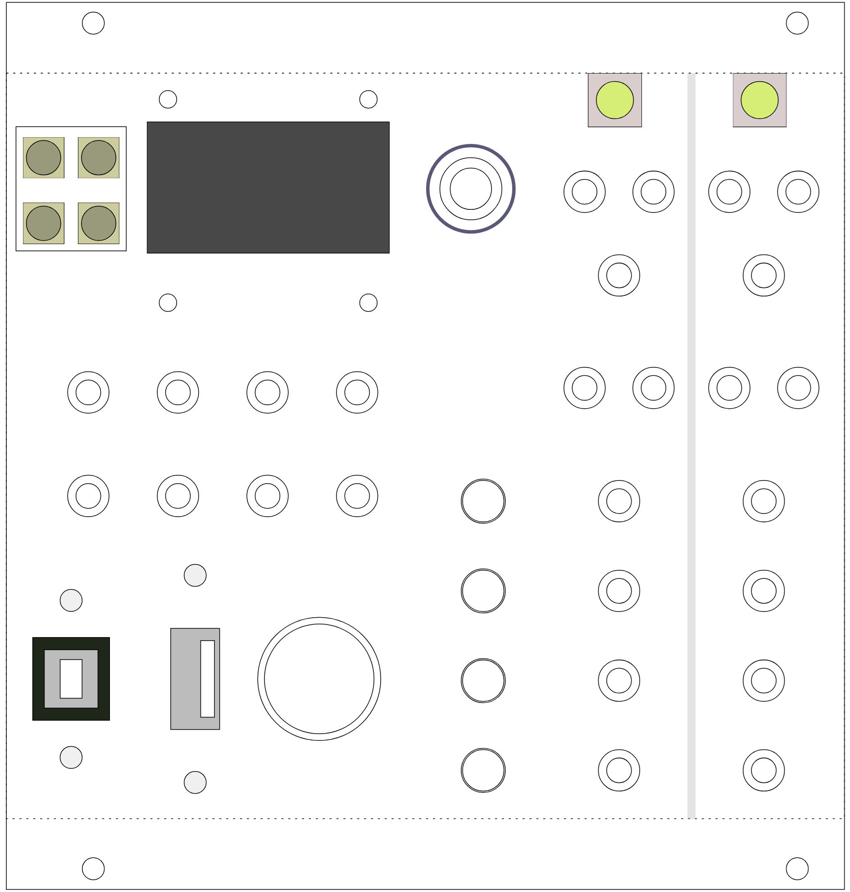
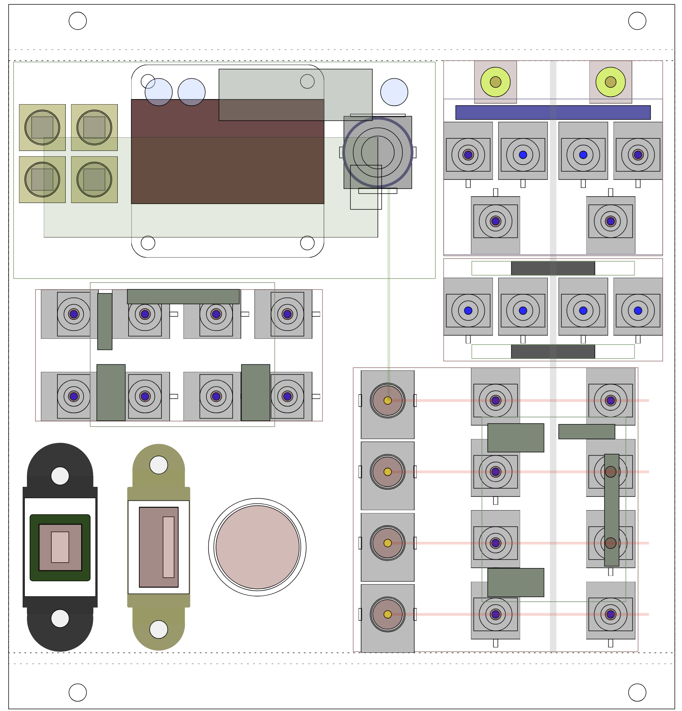

# Eurorack Duophonic MIDI

Inspired by the use of duophony on the ARP 2600 and Odyssey,
this is a MIDI to CV Eurorack module
with twin outputs:
low-note priority and high-note priority.

Re-utilising designs from the polyphonic Euro-MPE project,
this aims to be a high-precison, flexible, and performance oriented
duophonic MIDI to Eurorack CV module.
It's MPE compatible, so there is independent expression on each of the two notes.

## MIDI connection

There are three MIDI inputs

1. DIN MIDI in
2. USB device in, for DAW
3. USB Host in, for USB keyboards

## Analog voice CV

There are two voice channels, each with:

- color LED for gate and to indicate note played (12 color scale)
- Gate and Trigger, see [Gate/LED](./Gate-LED.md).
- Tuning **input** (from oscillator), see [calibration](./calibration.md)
- Oscillator pitch CV, highly linear [18bit, low tempco DAC](./pitch-dac.md)
  - includes pitchbend (Glide) and any microtuning
  - See [Pitch DAC](./pitch-dac.md)
- Second (identical, but separately buffered) pitch CV output (for dual oscillator voices, or for filter cutoff)
- Four MPE-compatible expression outputs (14bit) per voice, see [Performance DAC](./performance-dac.md)
    1. Strike (attack velocity)
    2. Lift (release velocity)
    3. Slide (forward-back, CC 74)
    4. Press (aftertouch)

Any per-channel calibration curves are still applied, so in monophonic mode two different oscillators which have each been calibrated will play in unison.

## Analog general CC CV

There are also eight general CV outputs (14bit), re-using the same board design that produces the two channels of performance outputs. See [Performance DAC](performance-dac.md). Perhaps (considering mainly the Roli Seaboard):

Top row

- Slider1 (CC107)
- Slider2 (CC109)
- Slider3 (CC111)
- XY Pad X (CC114)

Bottom row

- Modulation Wheel (CC01+CC33)
- Expression Controller (CC11+CC43)
- Breath (CC02+CC34)
- XY Pad Y (CC113)

## MIDI Modes

Probably, only Duophonic MPE mode is needed. See [MIDI](./MIDI.md)

### Monophonic (unison MPE)

Last received note is output on channel one. Any new note overides the previous note.  Channel two duplicates channel one.
Monophonic is MPE-enabled, just outputting to a single voice.

### Monophonic (unison)

Configurable for MIDI channel, or all channels.

### Duophonic (duo MPE)

Lowest received note is output on channel one; highest received on channel two. Duo MPE is MPE-enabled,allocating MPE channels to voices based on lowest and highest note priority.

### Duophonic (duo)

Configurable for MIDI channel, or all channels.

### Harmonic

Like unison MPE, but channel two osc CV is offset (for exampe, by a fifth)

Not clear that the two non-MPE modes are needed. Better if the module accepts either MPE or non-MPE.

## Tuning

Like the original polyphonic EuroMPE, there is a [tuning input](./calibration.md) per channel, which displays the current note; an auto-tuning mode can use this to calculate a linearising calibration curve. Because this is setup not playing, it's okay to go to a menu for this.

?? Because the tuner is in the same module as the MIDI interface, it knows when the gates are low and can do auto-tuning for drift control after x minutes of inactivity ??

## Voltage reference

For the pitch DAC, a Max 6226 hermetic ceramic was originally planned, see [Vref MAX6226](./voltage-ref-MAX6226.md). As that prototype had problems, thee replacement is the [Vref LT1236](./voltage-ref-LT1236.md).

For the performance DACs, the internal reference on the octal DAC is easily sufficient.

## Main MPU board

See [MPU board](./MPU-board.md).

## Power

See [Power](./Power.md)

## Panel

Not settled, but this is the [current panel concept](./mock-channel-front-v2-bigscreen-wider.svg) (SVG)

and also [current panel with boards and components](./panel-layout.svg) (SVG)

## Notes

- [Slide: Absolute vs. Relative](https://support.roli.com/support/solutions/articles/36000025050-slide-absolute-vs-relative)
