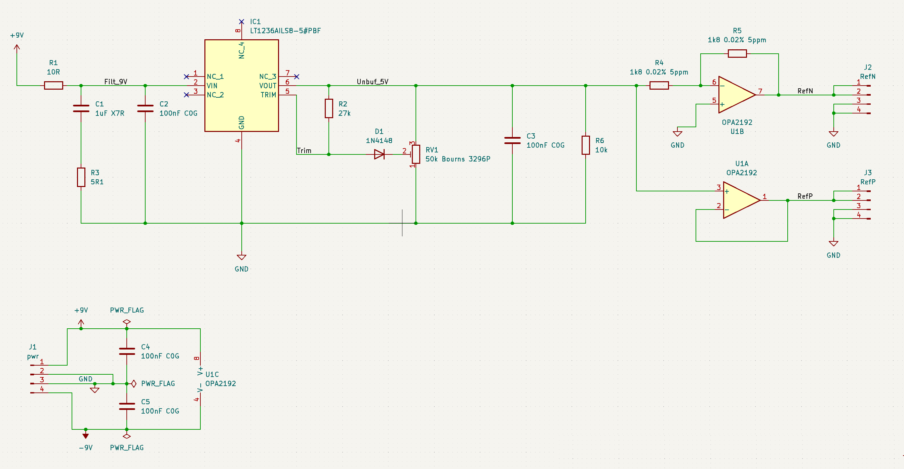
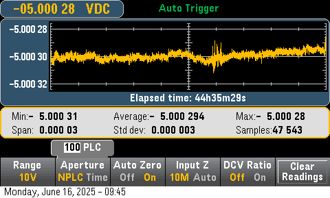

# Voltage ref

Linear LT1236LS8 has become the alternative to [MAX6226](./voltage-ref-MAX6226.md) which could not be made to work reliably.

[EEVBlog thread on LT1236LS8 internals](https://www.eevblog.com/forum/metrology/decapping-the-lt1236ls8/msg2933682/#msg2933682) and [detailed photos and description (in German)](https://www.richis-lab.de/REF05.htm)

Both use ceramic LS8 package with copper pads underneath the device. This gives improved stability, particularly to moisture and PCB flex, but makes soldering difficult without a reflow oven. Hot air tends to blow the lightweight ceramic chip off the board, so holding in place with tweezers is required.

Vref board needs to provide both +5V and -5V to drive the pitch DACs.

## Absolute initial accuracy

Good initial accuracy ±0.05% (±2.5mV) for A grade; although less good than MAX6226_50 ±0.02% (±1mV). But it **is** trimmable, using a resistor, diode and multiturn cermet trimmer.

Pin 5 is trim, unconnected if not used; different from MAX6226_50 where pin 5 is output sense.

## Temperature

Fairly good at 2ppm/°C typ, 5ppm/°C max, not as good as MAX6226_50 1ppm/°C typ, 3ppm/°C max.

So a 20C rise gives (5 × 20 / 1E6) × 5V × 1200 = 0.6 cents error, for the positive reference. Negative reference also has the tempco mismatch from the resistors; Susumu RG2012V-182-P-T1 0.02% is 5ppm, adding another 0.6 cents max error.

Bourns wirewound trimmers with 50ppm/°C are fearsomely expensive (3057Y-1-503 is $32.91/1) compared to the 100ppm/°C cermet types (3296P-1-503LF $2.42/1). As this application is ratiometric, the tempco effect should be diminished.

See [Bourns® Precision Trimming Potentiometers with Improved Linearity and Lower CRV](https://www.bourns.com/docs/technical-documents/technical-library/trimmers/technical-articles/bourns_custom_trimmer_white_paper.pdf?sfvrsn=69fd77f6_9)

## Thermal Hysteresis

Very good at 3ppm.

## Long term drift

> The data sheets of many references specify long-term drift—typically about 25 ppm/1000 hr. This error is proportional to the square root of elapsed time, so 25 ppm/1000 hr ≈ 75 ppm/year. The actual rate is likely (but not certain) to be somewhat better than this as the ageing rate often diminishes after the first few thousand hours. So, again, we have a figure around 14 bits.
[Choosing Voltage References](http://www.analog.com/en/analog-dialogue/raqs/raq-issue-114.html)

20ppm/1k hr (100μV), less good than MAX6226_50 11ppm/1k hr (55μV). But trimmable after pre-ageing.

## Current / Load

Load regulation very good: ±25μV/mA max, and the load impedance is high and constant.

This design drives two DACs, so the lack of a kelvin connections is less of an issue.

The [DAC boards](./pitch-dac.md) provide their own force/sense buffers to drive the voltage reference inputs on each DAC.

## Line regulation

Good at 4 (typ) to 12 max μV/V for supply voltage between 7.2V and 10V.

So a [well-regulated supply](./Power.md) is helpful.

### Secondary regulation

Use same regulated +9.5V supply as pitch DACs. Off-board, to protect from thermal effects.

## Noise

**Spectral noise** is 3 μV p-p 0.1-10Hz
**Flicker noise** is 3.5 μV RMS (typ) at 10Hz-1kHz.

These specs are not directly comparable to MAX6226_50 due to different units and bandwidths.

## Buffering

A non-auto-zero, e-trim op-amp such as **OPA2192** is suitable, and input bias current is even lower.

> For the reference buffers, the AD8676 dual amplifier is recommended, based on its low noise, low offset error, low offset error drift, and low input bias currents.
>
> Egan, M. _The 20-Bit DAC Is the Easiest Part of a 1-ppm-Accurate Precision Voltage Source_

 <table>
 <tr><td></td><th>noise</th><th>offset error</th><th>offset error drift</th><th>input bias current</th></tr>
 <tr><th>AD8676B</th><td>125nV RMS</td><td>±12/50 µV</td><td>±0.2/±0.6 μV/°C</td><td>±4.5nA</td></tr>
 <tr><th>OPA2186</th><td>0.1μV (100nV) p-p</td><td>±1/±10 µV</td><td>±0.01/±0.04 μV/°C</td><td>±4.8nA</td></tr>
 <tr><th>OPA2192</th><td>4 μV p-p</td><td>±8/±50 μV</td><td>±0.1/±0.5 μV/°C</td><td><b>±5/±20 pA</b></td></tr>
 </table>

So the OPA2186 is comparable on some criteria and much superior on offset and offset drift. OPA2192 worse on offsets (still very good though) and better on input bias current.

> The input bias current specification of the reference buffers is important, as excessive bias currents will degrade the dc linearity. The degradation of integral nonlinearity, in ppm, as a function of input bias current, is typically:
>
> Extra INL error = (0.2 * Ibias) / (Vrefp - Vrefn)^2
>
> where IBIAS is in nA; VREFP and VREFN are in volts. For example, with a ±10-V reference input span, an input bias current of 100 nA will increase the INL by 0.05 ppm.
>
> Egan, M. _The 20-Bit DAC Is the Easiest Part of a 1-ppm-Accurate Precision Voltage Source_

OPA2192: 0.2 × 0.005 ÷ (10²) = 0.000,01 ppm

AD8676B: 0.2 × 4.5 ÷ (10²) = 0.009 ppm

Maybe try a non-autozero non-chopper op-amp. **OPA2192** looks suitable: Vos ±8μV typ, ±50μV max, drift ±0.1 typ, ±0.5 max μV/°C.

See figs 32 and 33 in the datasheet:

 

See Figure 69. Precision Reference Buffer in the datasheet (driving a 10μF capacitive load with great stability).

Pair of close-tolerance low thermal drift resistors for the VrefN op-amp.
Use of Vishay matched-pair resistors [suggested on EEVBlog](https://www.eevblog.com/forum/metrology/max6226-vref-and-ground-planes/msg4725761/#msg4725761) such as [these](https://www.mouser.com/ProductDetail/Vishay-Thin-Film/MPM2002QT3?qs=KOdD7VNvzR83jUiiLOdaaQ%3D%3D) 10k/10k 0.01% ratio, 25ppm/°C.
Is it feasible to make a board that accepts either?

Decoupling caps.

Use small serial resistors for the larger decoupling caps because too-low ESR of the ceramic caps might affect stability. Can test with either 5R resistors or solder bridge to see the effect.

## Schematic

[schematic (PDF)](./vref-lt-schematic.pdf)

## Board design

Power input: 4 wires +9.5, 0V, 0V, -9.5.

1μF and 100nF input caps, 1μF (or less; that is a maximum) and 100nF output caps, all C0G ceramic. Later went for X7R on the 1μF for cost and footprint reasons.

> Because of internal current drain on the output, actual
worst-case occurs at ILOAD = 0. Significantly better load
transient response is obtained by moving slightly away
from these points. See Load Transient Response curves
for details
(Datasheet, "Capacitive Loading and Transient Response")

Thus, 10k load resistor draws constant 0.5mA from reference
(assuming drain from the op-amp input currents is negligible in comparison).

Voltage output: pair of 4-pin headers

- +5 +5 0V 0V
- -5 -5 0V 0V

Full bottom ground plane; top ground connections with vias by caps and GND connection, runs under device

Pin 1 of LT1236 is indicated by a circular mark and is aligned to the top-left corner on this board (indicated by small dot on silkscreen).

Pin 1 of OPA2186 is on the side with the bevel, and is aligned closest to J3 on this board.

Input cap has [5R serial resistance](https://www.eevblog.com/forum/metrology/yet-another-basic-10v-reference-tear-my-design-apart!/msg1666097/#msg1666097) to avoid ringing. Electrolytics were better here than ceramics.

> In critical applications,
a 10μF solid tantalum capacitor with several ohms
in series provides optimum output bypass.
(Datasheet, "Capacitive Loading and Transient Response")

2 layer board of 1.57 x 1.03 inches (40.0 x 26.2 mm) ordered 2024-02-10

 top and  bottom

## BOM

### Voltage reference

(1) [LT1236AILS8-5#PBF ](https://www.mouser.com/ProductDetail/Analog-Devices/LT1236AILS8-5PBF?qs=ytflclh7QUXCvMb52%2F4eDQ%3D%3D) Ceramic LCC $11.77/1 = **$11.77** **GOT 4 24 Feb 2024**
IC1

### Low Vos low Ibias precision op-amp (dual)

(1) TI [OPA2192IDR](https://www.mouser.com/ProductDetail/Texas-Instruments/OPA2192IDR?) SOIC-8 $4.63/10 = **$46.30** **GOT 10 Dec 2023**
U1

### Decoupling caps

(4) Kemet C1206C104K3GEC7210 25V 100nF C0G 1206 ceramics $0.051/100 = **$5.10 GOT**

### Bulk ceramic caps

(1) C2,C3,C4,C5 Kemet C1206X105K3RACTU  25V 1μF X7R 10% 1206 ceramic $0.839/10 = **$8.39 GOT**

or

(1) C1 muRata GRM31C5C1E474JE01L 25V 0.47μF G0G 5% 1206 ceramic $0.474/10 = **$4.74** **GOT 10 24 Feb 2024**

### Low-ppm close tolerance resistors

(2) R4, R5 Susumu RG2012V-182-P-T1 1.8k 0.02% 5ppm 0805 $2.30/10 = **$23.00 GOT** 6 ordered 8 Dec 2023 **GOT 6 more 24 Feb 2024**

OR

(2) R4, R5 Vishay Precision Group Y16292K50000T9R  2.5k 0.01% ± 0.2 ppm/°C 0805 foil $12.74/1 = **$25.48** at minimum (need more for multiple boards, for testing). **GOT 4 26 June 2025**

### Generic ESR-increasing, trimming, and load resistors

- (1) R3 Yaego RC0805JR-075R1L 5.1R 5% 0805 thick film $0.026/10 = **$0.26** **GOT 10 24 Feb 2024**
- (1) R1 Yaego RC0805FR-0710RL  10R 0805 $0.027/10 = **$0.27** **GOT 10 24 Feb 2024**
- (1) R2 Yaego RC0805FR-0727KL 27k 0805 $0.016/10 = **$0.16** **GOT 10 24 Feb 2024**
- (1) R6 Yaego RC0805FR-0710KL  10k 0805 $0.016/10 = **$0.16** **GOT 10 24 Feb 2024**

### Diode

(1) 1N4148 Diodes Incorporated 1N4148W-7-F SOD-123 $0.095/10 = **$0.95** **GOT 10 24 Feb 2024**

### Trimmer

(1) Bourns 3296P-1-503LF $2.13/10  or $2.42/1 get 5 = **$12.10** **GOT 5 24 Feb 2024**
(Currently out of stock at Mouser, oddly, until Nov 2025)

### PCB

Ordered OSH Park 10 Feb 2024.

### Pin connectors

Right-angle 0.1" connectors
(1) Adafruit Break-away 0.1" 36-pin strip right-angle male header (10 pack) **$5.95**
https://www.adafruit.com/product/1540 out of stock

TE 9-103329-0 40-position **$2.31/1** **GOT 3**

Double ended connectors
Adafruit Extra-long break-away 0.1" 16-pin strip male header (5 pieces) **$3.00 GOT**
https://www.adafruit.com/product/400

pins are (measured with micrometer) 45.06 ÷ 2 = 22.53mm apart

## Work plan

- [x] Design v0.1 Vref board with dual op-amp
- [x] Fab v0.1 board
- [x] Check existing component inventory
- [x] order Vref, op-amp (same as pitch DAC uses)
- [x] Build, test
- [x] Burn-in
- [ ] Do stability analysis for innie OPA2192 with 2 R and 1 C
- [x] Design and fab temporary [power board](./Power.md) to test for ripple, noise, need for isolation resistors
- [x] Build second board, with Vishay metal film resistors
- [ ] Burn-in and test second board

## Test results - positive reference

### Power

Measured with Joranalogue Test3, combination of [power board](./Power.md) plus Vref is drawing (peak) 5mA on +12V, 4mA on -12V.

### Initial power-up

Board #1 measured using Keysight 34465A, 10V range, 100PLC. Reference chip 1 **5.01721V**  (range 5.01715 to 5.01722). Climbed fractionally over first minute (chip warmup?) then stable.

Stable at **5.017 24V** over 1 hour (range 5.01721 to 5.01725)

### Trimmed

Board #1 trimmed to **5.000 025V** an error of 25μV or 0.03 cents.

### Burn-in

Board #1 overnight, fairly stable at **5.000 024V** sd 4μV.

Four days later, still stable at **5.000 021V** sd  2μV.

Long-term monitoring (100 hours) slight downward trend as it matures and settles,
and small spikes due to air conditioning switching on and off during the day.
Mean is now **5.000 015V**. Reference has been on for over 400 hours now.

The short term stability (air conditioning off) also looks good.
sd  2μV
Accuracy also looks great, 3ppm (15μV) high.

Restarting the board #1 reference after a couple of weeks off, and discarding the first 10 minutes to allow for warmup, the value started 12ppm low and climbed over 12 hours to a steady-state value of **5.000 031V**

A further 72 hours after restart, **5.000 041** sd 4μV

## Test results - negative reference

Board #1 stable at **-5.017 47V** over 2 hours with some cyclic drift (range -5.01749 to -5.01747).

Board #2 inital startup **-4.976 49V** over 2 hours

### Burn-in

Board #1 positive ref trimmed as noted above. Negative ref is **-5.000 292V** implying the inverting op-amp has an actual gain of -5.000281 ÷ 5.000024 = **-1.00005359974**, a mismatch of -0.0000535 × 100 = -0.00535%. Good result considering the pair of 0.02% resistors used.

Later, mean value drifted only fractionally, to **-5.000 293V**

and a week later essentially identical, **-5.000 294V**

Used without correction (i.e. assuming the reference is -5V) 
board #1  gives an error of 0.000294 × 1,200 = **0.3528 cents**.

Drifting is likely caused by tempco of the matched resistor pair (Susumu RG2012V-182-P-T1 1.8k 0.02% 5ppm/°C) as it is not observed on the positive voltage output, only the negative. This rules out Vref tempto (2ppm/°C typ, 5ppm/°C max). Lacking simultaneous measurement of the positive and negative outputs (only one 6.5 digit DMM) this cannot be completely ruled out, however.

Board #1 160 hour monitoring still shows some overall drift and some temperature-relted cycling with the AC.

Plan to build a second board with the Vishay metal film resistors.

After shutting down board #1 for 4 days then restarting soak, a shift was observed then a gradual drift over two hours to the previous value.

Board #1 98 hour soak, second half with AC off and window open so larger temperature swing (18 to 26C) still variation is fairly small. Lowest **-5.000 29V** highest **-5.000 25V**

### Board #2 (Vishay metal film)

Board #2 still settling in for 20 hours, general trend is lower voltage over time. Total on-time around 24 hours for this board, not yet trimmed.

Board #2 after 100 hours total burn-in and one month powered off, measured for 62 hours, **-4.977 413V** sd 7μV. Again a gradual shift over the first 12 hours after power-off.

Board #2 short-term stability, **-4.977 419V** sd 2μV.
