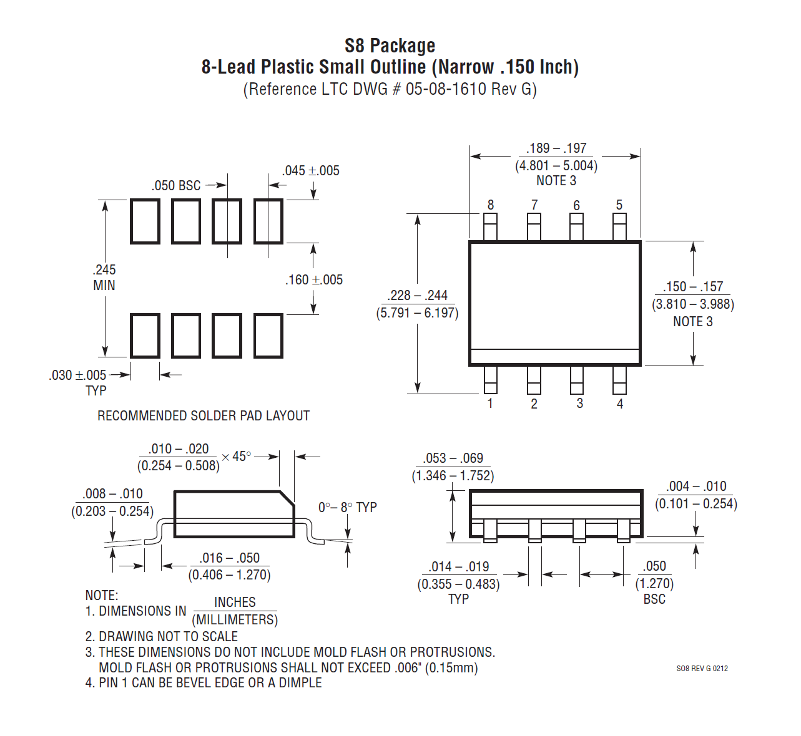

# Voltage ref 

Post-COVID supply chain has much less availability for good voltage references.

MAX6226_50 (Ceramic LCC) is available at MOQ 1, 
has great stability due to the hermetic ceramic package,
excellent temperature stability

- [EEV metrology thread on MAX6226](https://www.eevblog.com/forum/metrology/max6226-voltage-reference/msg3569644/#msg3569644)

Vref board needs to provide both +5V and -5V to drive the pitch DACs.

## Absolute initial accuracy

Good initial accuracy ±0.02% (±1mV). But not trimmable, would need digital-domain trim.

## Temperature

Very good at 1ppm/C typ, 3ppm/C max (15μV max over 0 to 70C)

## Thermal Hysteresis

Very good at 5ppm.

## Long term drift

> The data sheets of many references specify long-term drift—typically about 25 ppm/1000 hr. This error is proportional to the square root of elapsed time, so 25 ppm/1000 hr ≈ 75 ppm/year. The actual rate is likely (but not certain) to be somewhat better than this as the ageing rate often diminishes after the first few thousand hours. So, again, we have a figure around 14 bits.
[Choosing Voltage References](http://www.analog.com/en/analog-dialogue/raqs/raq-issue-114.html)

11ppm/1k hr (55μV), worst on new device and settling over time.

## Current / Load

Load regulation good: ±50μV/mA and the load is high and constant.

As this design drives two DACs, the kelvin connections only take us to the Vrefp and Vrefn buffers.
The [DAC boards](./pitch-dac.md) provide their own force/sense buffers to drive the voltage reference inputs on each DAC.

## Line regulation

Okay at 9 (typ) to 80 max μV/V. [EEVBlog](https://www.eevblog.com/forum/metrology/max6226-voltage-reference/msg3569644/#msg3569644) found 100μV/V in practice (datasheet uses pulse rather than continuous changes, to avoid self-heating effects as supply voltage changes).

So a [well-regulated supply](./Power.md) is essential.

### Secondary regulation

Use same regulated +9.5V supply as pitch DACs. Off-board, to protect from thermal effects.

## Noise

**Spectral noise** at 5V output is 145 nV/√Hz at 1kHz, reducing to 95 nV/√Hz with 100nF noise reducing cap. **Flicker noise** 2.85 μVP-P at 0.1-10Hz.

## Buffering

Dual low-drift **OPA2186D** op-amp to provide the +5V Vref and -5V VrefN outputs needed by the pitch DACs.

> For the reference buffers, the AD8676 dual amplifier is recommended, based on its low noise, low offset error, low offset error drift, and low input bias currents.
>
> Egan, M. _The 20-Bit DAC Is the Easiest Part of a 1-ppm-Accurate Precision Voltage Source_

 <table>
 <tr><td></td><th>noise</th><th>offset error</th><th>offset error drift</th><th>input bias current</th></tr>
 <tr><th>AD8676B</th><td>125nV RMS</td><td>±12/50 µV</td><td>±0.2/±0.6 μV/°C</td><td>±4.5nA</td></tr>
 <tr><th>OPA2186</th><td>0.1μV (100nV) p-p</td><td>±1/±10 µV</td><td>±0.01/±0.04 μV/°C</td><td>±4.8nA</td></tr>
 </table>

So the OPA2186 is comparable on some criteria and much superior on offset and offset drift.

> The input bias current specification of the reference buffers is important, as excessive bias currents will degrade the dc linearity. The degradation of integral nonlinearity, in ppm, as a function of input bias current, is typically:
>
> Extra INL error = (0.2 * Ibias) / (Vrefp - Vrefn)^2
>
> where IBIAS is in nA; VREFP and VREFN are in volts. For example, with a ±10-V reference input span, an input bias current of 100 nA will increase the INL by 0.05 ppm.
>
> Egan, M. _The 20-Bit DAC Is the Easiest Part of a 1-ppm-Accurate Precision Voltage Source_

Pair of close-tolerance low thermal drift resistors for the VrefN op-amp.
Use of Vishay matched-pair resistors [suggested on EEVBlog](https://www.eevblog.com/forum/metrology/max6226-vref-and-ground-planes/msg4725761/#msg4725761) such as [these](https://www.mouser.com/ProductDetail/Vishay-Thin-Film/MPM2002QT3?qs=KOdD7VNvzR83jUiiLOdaaQ%3D%3D) 10k/10k 0.01% ratio, 25ppm/C.
Is it feasible to make a board that accepts either?

Decoupling caps.

## Schematic

- [Schematic](./vref-schematic.pdf)

## Board design

Power input: 4 wires +9.5, 0V, 0V, -9.5.

1μF and 100nF input caps, 100nF noise cap, 1μF and 100nF output caps, all C0G ceramic. Later went for X7R on the 1μF for cost and footprint reasons.

OutF and OutS join at inverting op-amp input.

Voltage output: pair of 4-pin headers

- +5 +5 0V 0V
- -5 -5 0V 0V

Pin 8 is (per spec sheet) clear of copper, mask (no mechanical connection).

Full bottom ground plane; top ground connections with vias by caps and GND connection, runs under device (like eval kit, contrary to data sheet?). Thick input and OutF traces; narrow NR, OutS.
see [EEVBlog posting](https://www.eevblog.com/forum/metrology/max6226-vref-and-ground-planes/)

?? Try a U cutout around the MAX-6226 for rigidity and freedom form humidity effects.
NO. No evidence this helps, especially on a board this small.

> Note that although the MAX6226’s ceramic package
prevents the output voltage from being affected by
mechanical stresses due to humid environments, the
PC board may be affected by humidity, and may in turn
cause mechanical stress to the MAX6226 mounted on it.
Take extra care with PC board layout. Power and ground
planes should be avoided under the voltage reference IC
for best stability. Closely follow the layout guidelines in the
Output Bypassing and Output Force and Sense.

> Pin 8 must be clear of any mechanical and electrical
contact. Neither copper nor solder/paste mask must
be placed underneath its land pattern. The absence of
the mechanical contact will eliminate the possibility of
paddle induced stress to the die. The absence of electrical
contact will eliminate the possibility of any ground current
redistribution.

> We detected a 2 layer board of 1.99 x 1.15 inches (50.5 x 29.2mm)
> 3 boards will cost $11.40 

Board [ordered at OSH Park 31 Mar 2023](https://oshpark.com/shared_projects/fTokzv8n) Got.

Pin 1 of MAX6226 is indicated by a cross and is aligned to the top-left corner on this board (indicated by small dot on silkscreen).

Pin 1 of OPA2186 is on the side with the bevel, and is aligned closest to JP2 on this board.

## BOM

### Voltage reference

(1) AD MAX6226ALA50+ Ceramic LCC $11.79/1 = **$11.79** get 3 **GOT**
IC1

### Low Vos low Ibias precision op-amp (dual)

(1) TI OPA2186DR SOIC-8 $2.22/10 = **$22.20 GOT**
U1

### Decoupling and NR caps

(4) Kemet C1206C104K3GEC7210 25V 100nF C0G 1206 ceramics $0.051/100 = **$5.10 GOT**
C2, C3, C4, C6, C7

### Bulk ceramic caps

(2) Kemet C1206X105K3RACTU  25V 1μF X7R 10% 1206 ceramic $0.839/10 = **$8.39 GOT**
C1, C5

### Low-ppm close tolerance resistors

(2) Susumu RG2012V-103-P-T1 10k 0.02% 5ppm 0805 $2.57/25 = **$64.25 GOT**
Same as is used for the offsets module.
R1, R2

### PCB

### Pin connectors

Right-angle 0.1" connectors
(1) Adafruit Break-away 0.1" 36-pin strip right-angle male header (10 pack) **$5.95**
https://www.adafruit.com/product/1540 out of stock

TE 9-103329-0 40-position **$2.31/1** **GOT 3**

Double ended connectors
Adafruit Extra-long break-away 0.1" 16-pin strip male header (5 pieces) **$3.00 GOT**
https://www.adafruit.com/product/400

## Work plan

- [x] Design vref board with dual op-amp
- [x] Fab board
- [x] Check existing component inventory
- [x] order Vref, op-amp (same as pitch DAC uses)
- [x] Build, test
- [ ] Burn-in

**Disaster**, unable to locate the Susumu RG2012V-103-P-T1 10k 0.02% 5ppm/C !!

For testing, temporarily substituted a pair of Susumu RG2012N-104-W-T1 100k 0.05% 10ppm/C.

### Initial power-up

Measured using Keysight 34465A, 10V range, 100PLC. **4.99946V**  (range 4.99937 to 4.99953). Climbed fractionally over first 30 minutes (chip warmup?) then stable over 3 hours at **4.999528V**.
This -0.472mV error is -4.72E-4 / 5 × 100 = -0.00944% initial accuracy, within spec sheet ±0.02% (±1mV)

Used without correction (i.e. assuming the reference is 5.000000V) would give 4.72E-4 × 1,200 = 0.5664 cents error at 5V, which is outside the error budget. So the code needs to store measured calibration readings for the positive and negative reference voltages.

Drift = 280 ÷ 4.999528 = 56.0052868991 (56ppm) in 3 hours

Negative voltage however is very drifty (mean **4.989221V** with a **6mV** span!):

Drift = 6,100 ÷ 4.98221 = 1,224.35625957 (1224ppm) in 6 hours

After running overnight, negative voltage drift had continued, mean was now **-4.994695V** sd 28µV

However the positive voltage output now seemed stable at **4.999573V** sd 14µV.

