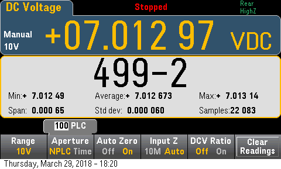
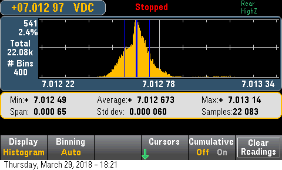
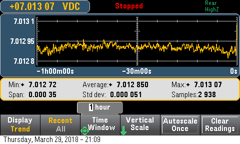
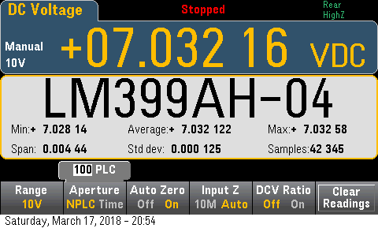
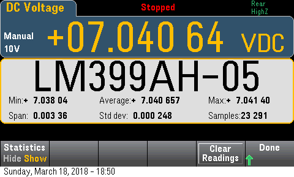
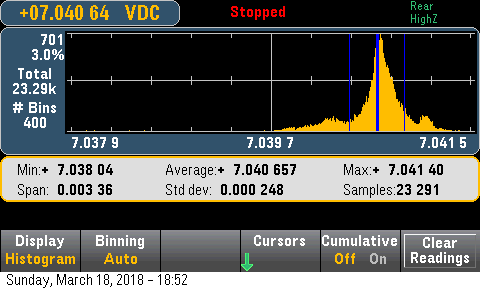
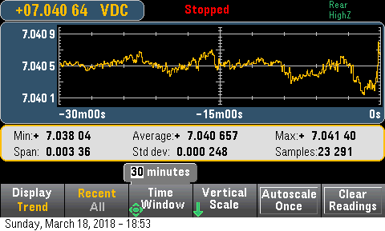
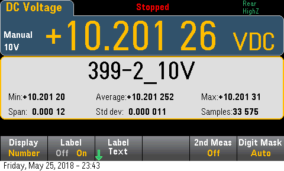
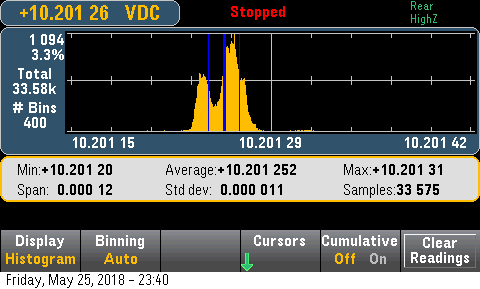

# Voltage ref with divided-down LM399

## Intro

LM399AH has ultra-high long term stability and drift over temperature, as it has an on-chip thermal stabilisation. It uses a hermetically sealed metal can, so is unaffected by relative humidity, and the long leads protect against board stress. It is used in mid-range 6.5 digit multimeters as a voltage reference, for this reason (the higher-end 7.5 digit and above meters use the more stable, less noisy and more expensive LTZ1000A).

On the downside, the initial accuracy is _really terrible_; each device needs to be burned in for hundreds of hours and then measured to see what voltage it produces.

## Absolute initial accuracy

6.95V (typ) with a huge variation - 6.75 to 7.3V !! -200 to +350mV !! Absolutely requires measurement of initial value, monitoring of value over time for burning until stable to desired precision, then trimming in the output conditioning stage to desired output voltage.

Accuracy is improved by running the heater from bipolar supplies, keeping the return current off the 0V plane.

Output voltage varies with zener current, 1mA is the optimum value for stability. There is about 1μV of voltage change for 1μA of current change.

"The LM399 is much more sensitive to board stress than the LTZ [because the LTZ has a special mechanical arrangement in the die mount]-- so the LM399 should be mounted off of the PCB a little bit to allow for this."

### Test results

Five samples of LM399AH from Linear.com were tested. All have datecode  week 50, 2017. Initial results (before ageing, temp 19 to 23C over the longer runs, 100PLC):

- 1   7.000
- 2   7.012
- 3   ?
- 4   7.032
- 5   7.040

Samples 1, 4 & 5 on breadboard. Samples 2,3 on Ian Johnston burn-in board with two different op-amp choices. Circuit for sample 3 did not work; needs to be desoldered and tested in a new circuit.

  

  

  

  

After ageing (2 months), Ian Johnston burn-in board with 0.01% 2ppm resistors, LTC2050 op-amp, 10.9V power supply, bubble-wrap insulation on both sides of LM399: **10.201,25V sd 11μV**. Long run, temperature varied 19 to 24C as histogram shows.

  

## Temperature

Specified as 0.3 (typ) 1.0 (max) ppm/C over 0 to 70C ambient (A grade). Major effect on the tempco of the eventual 5V reference is the tempco of the resistive divider.

- [LM399 tempco is not linear](https://www.eevblog.com/forum/metrology/lm399-based-10-v-reference/msg467770/#msg467770)

Has its own heater and thermal regulation circuit, so there is a stable temperature inside the can.
It works well with a large voltage difference, and the use of negative as well as positive supplies also helps. Limit is 40V. Agilent 34401 uses +15 and -15 for the heater circuit.

Use +12 and -12 direct from Eurorack power. Also avoids dumping current into the 0V common reference.

Temperature is not adjustable, chip runs at a die temperature of 95C and junction temperature 90C. Besides the supplied plastic insulator cap, additional foam insulation above and below the LM399 means the heater circuit does less work, improving stability.

Heater supply current stated to be 8.5mA (typ) 15mA (max) on 30V heater. For the same power, 10.6 mA (typ) 18.8 mA (max) on 24V. Note huge inrush current of 140mA (typ) 200mA (max) (on 30V, so higher on 24V). Can use inrush currrent limiting resistor (max 200R, see datasheet Fig G09) to damp this, with slower time to thermal stabilisation. However the normal time is 3s so plenty of leeway there. 180R limits inrush current to 130mA at 24V.

"If properly insulated, an LM399 can have a ppm/K figure of between 0.1ppm/K to 0.2ppm/K-- the data sheet is *very* conservative.  [Note that the DMM manufacturers are not insulating these other than the plastic insulator that they come in-- they would benefit by better insulating the top and bottom of the LM399 to keep the heat in, and the heater power down" (Bob Dobkin)

## Current / Load

Load regulation not directly specified, as this is a shunt regulator. In this project the load will be a resistive divider trimmed to give exactly 5.000V after the output buffer op-amp. This constant load (influence of the input impedance of the kelvin amps used to sent the voltage reference to the DACs is minimal) means load regulation term can be ignored.

## Long term drift

Higher at first, reduces with square root of 1000 hours in use. Needs 100 hours burn-in before initial measurement.

Specified as 8ppm/√kHr at ambient 22 to 28C, 1kHr, 1mA zener current ±0.1%. So 8ppm in first 1kHr, 8+4=12ppm at 4kHr, 12+2=14ppm at 16kHr (almost 2 years). Note influence of zener current stability, hence the popularity of bootstrapped references.

- [LM399 10 channel ageing/monitoring](http://www.ianjohnston.com/index.php/onlineshop/10-ch-lm399-testing-detail)

"Vz changes by 1uV for every deviation of 1uA of zener current from the nominal 1mA"

"The LM399 is getting rather hot in normal operation. So unless really brute force is used the thermal conditions on un-soldering and soldering are not that severe compared to a normal power cycle." [Kleinstein, EEVBlog](http://www.eevblog.com/forum/metrology/lt$30-ebay-lm399lt1001-2-55-07-510v-vref-module-hack-step-1-poc/msg1537199/#msg1537199)

## Line regulation

Not directly specified. heater circuit seems to tolerate a large voltage range.
 [Andreas, EEVBlog](http://www.eevblog.com/forum/metrology/lm399-based-10-v-reference/msg1708226/#msg1708226)

"the LM399 dampens the supply noise at least by 3K / 1 Ohm"

"any resistor on the heater seems to worse the PSRR slightly."

and

"Since PSRR decreases on higher voltages the heater voltage should be choosen as high as possible."

Zener circuit is current driven, so high stability current is needed.

"In contrast, the LM199 is measured in still air of 25°C to 28°C at a reverse current of 1 mA ±0.5%" (AN-161) 0.5% is 5μΑ.

A precision current source gives the best stability (not a resistor from the power rail, as with most circuits in the datasheet). This can be bootstrapped from output voltage rather than using a separate (and less stable) reference. For circuit starting, a high value resistor to power _may_ be needed. This should be less than 10% of the total zener current (investigate).

" Since the dynamic impedance is constant with current changes regulation is better than discrete zeners. For optimum regulation, lower operating currents are preferred since the ratio of source resistance to zener impedance is higher, and the attenuation of input changes is greater. Further, at low currents, the voltage drop in the wiring is minimized." (ΑΝ-161)

"PSRR comes from 2 or 3 contributions:
1) The temperature regulator part
2) the OP buffering the outout if used
3) the current source to drive the zener part of the LM399 - often this a resisitor from the scaled up voltage.

With modern voltage regulators, the PSRR is not that important any more. Even a 7812 can keep the supply resonable stable - with only a few mV in change 55 ppm/V are not a probem at all." [Kleinstein, EEVBlog](https://www.eevblog.com/forum/metrology/lm399-based-10-v-reference/msg849709/#msg849709)

XDevs KX-lowcost uses 25ppm/C resistors for the op-amp divider, but 5ppm/C resistor for the bootstrapped current source. (And no pullup resistor for startup) [KX low-cost](https://xdevs.com/article/kx-ref/#lm399opt)

- [LM399  PSRR, part 1](https://www.eevblog.com/forum/metrology/lm399-based-10-v-reference/msg441913/#msg441913)
- [LM399 PSRR, part 2](https://www.eevblog.com/forum/metrology/lm399-based-10-v-reference/msg443181/#msg443181)

## Layout and mechanical considerations

"Mounting is an important consideration for optimum performance. Although the thermal shield minimizes the heat loss, the LM199 should not be exposed to a direct air flow such as from a cooling fan. This can cause as much as a 100% increase in power dissipation degrading the thermal regulation and increasing the drift. Normal convection currents do not degrade performance." (AN-161)

"The printed circuit board (PCB) layout is also important. Firstly, 4-wire sensing should be used to eliminate ohmic drops in pc traces. Although the voltage drops are small the temperature coefficient of the voltage developed along a copper trace can add significantly to the drift. For example, a trace with 1 Ω resistance and 2 mA current flow will develop 2 mV drop. The TC of copper is 0.004%/°C so the 2 mV drop will change at 8 μV/°C, an additional 1 ppm drift error. Of course, the effects of voltage drops in the printed circuit traces are eliminated with 4-wire operation. The heater current also should not be allowed to flow through the voltage reference traces. Over a −55°C to +125°C temperature range the heater current will change from about 1 mA to over 40 mA. These magnitudes of current flowing reference leads or reference ground can cause huge errors compared to the drift of the LM199." (AN-161)

"Thermocouple effects can also cause errors. The kovar leads from the LM199 package form a thermocouple with copper printed circuit board traces. Since the package of the 199 is heated, there is a heat flow along the leads of the LM199 package. If the leads terminate into unequal sizes of copper on the p.c. board greater heat will be absorbed by the larger copper trace and a temperature difference will develop. A temperature difference of 1°C between the two leads of the reference will generate about 30 μA. Therefore, the copper traces to the zener should be equal in size. This will generally keep the errors due to thermocouple effects under about 15 μV.
The LM199 should be mounted flush on the p.c. board with a minimum of space between the thermal shield and the boards. This minimizes air flow across the kovar leads on the board surface, which also can cause thermocouple voltages. Air currents across the leads usually appear as ultra-low frequency noise of about 10 μV to 20 μV amplitude." (AN-161)

- [Slot or Not thermo measurements on LM399](https://www.eevblog.com/forum/metrology/ultra-precision-reference-ltz1000/msg278247/?topicseen#msg278247)

However, opinions vary on lead length:

- Long leads without slot:   around 5 degres stray within pad  + 1,7 degrees from pad to pad
- Long leads with slots:      around 5-6 degres stray within pad + 2,3 degrees from pad to pad
- Short leads without slot: around 9-11 degres stray within pad + 3,1 degrees from pad to pad
- short leads with slots:     around 12-15 degres stray within pad + 6,6 degrees from pad to pad

[Andreas, Re: Slot or Not, EEVBlog](https://www.eevblog.com/forum/metrology/ultra-precision-reference-ltz1000/msg288588/#msg288588)

"Sockets are generally no good idea.
On a LM399 I had around 4-6 ppm difference depending on how the reference was placed into the socket." [Andreas, EEVBlog](https://www.eevblog.com/forum/projects/project-kx-diy-calibrator-reference-sourcemeter/msg826499/#msg826499)

"Having the reference in a case is absolutely recommended, mostly due to air drafts. I can´t say that having a metal or plastic case seems to make a difference for me. Neither from an EMC or stability point. One reason the metal case is of little use for EMC is that the noise entering through the binding posts are the same for metal and plastic. Good design of the PCB probably is the best. " [Lars, Experiments on 10V references, EEVBlog](https://www.eevblog.com/forum/metrology/best-out-of-the-box-10v-reference/msg1197529/#msg1197529)

"It is winter. Perhaps you have zapped it by ESD.

This is one reason why I place a 100nF capacitor (SMD) directly on the
pads over the zener output and over the heater input.
Besides ESD it also rejects some mains line noise for the case" [Andreas, EEVBlog](https://www.eevblog.com/forum/metrology/lm399-based-10-v-reference/msg620762/#msg620762)

Kelvin connection to 399

"I'd go for additional tap (thin wires is ok) for voltage sense. So you have 6 wires going out of the LM399 ;)." [TiN, EEVBlog](http://www.eevblog.com/forum/metrology/lm399-based-10-v-reference/msg1455785/#msg1455785)

## Output conditioning

### Noise filtering

"It does not make a significant difference between filtering before or after amplification. Between the LM399 and the OP it is very easy to implement a simple RC filter: e.g. a resistor in the 100 Ohms to 1 K range and a 100nF-1µF capacitor. So this is the obvious place for some filtering.

The noise level of the LM399 is around 10 times the noise level of typical precision OPs. There is no practical way to filter out the really low frequency noise.  So the useful amount of filtering is limited to what is simple. As an alternative to complicated filtering there is the option to use a second LM399.

Usually one would avoid using a second OP in the path to reduce extra errors. So things like a more capacitive tolerant output would normally be done with the same OP as the 7 to 10 V step." [Kleinstein, EEVBlog](http://www.eevblog.com/forum/metrology/lm399-based-10-v-reference/msg1455583/#msg1455583)

"Most designs are rather old. So mobile phones, WIFI etc. did not play a role.
On LM399 a 100nF cap improves massively EMI behaviour.
Leakage is negligible compared to 1 Ohms output impedance." [Andreas, EEVBlog](http://www.eevblog.com/forum/metrology/ultra-precision-reference-ltz1000/msg1917350/#msg1917350)

### Buffer op-amp

Chopper-stabilised zero-drift op-amps seem to be favoured for stability.

LTC2050HV (used on the Ian Johnston adjustable reference) has almost zero Vos and drift, while also having low switching noise.

Max PSU voltage is 11V for 2050HV though, so  would need a separate derived PSU. Supply current is 0.8mA.

LTC2057 is up to 36V. LTC2057IS8#PBF in SO-8 Mouser $3.36/1, $3.08/10, $2.23/25
Compare carefully.

"The chopper amplifier LTC2057, with TCVOS of 0.015uV/°C, contributes only 0.0025ppm/°C of output error, thus effectively eliminating TCVOS as an error consideration." [LM399 low cost version](https://xdevs.com/article/kx-ref/#lm399opt)

"I learned yesterday that the choppers need a low impedance at their *input* pins. The OPA189 with 100k to the non inverting input had a 650uV offset. With a 20pf or 2000pF COG cap to ground the offset was less than 0.2uV. Other op amps like the LTC2058 and he ADA4522 need the full 2000pF to get below 1uV. I don't know yet if higher capacitance helps them more." [ChuckB, EEVBlog](http://www.eevblog.com/forum/metrology/output-protection-for-diy-references/msg2122366/#msg2122366)

"Be careful of a '2057 used by itself as an output buffer...keep the current very low (<<2mA), say driving a meter input circuit only.  Otherwise its demodulater won't work well and you'll get errors.  For instance: If someone were to drive an ADC Ref input that would need another amp in between.  Or they should be careful trying to do a direct comparison with another Vref, etc.  AZ Choppers usually need another companion amp in their feedback loop if you're using it as a buffer - and that should be low noise." [MisterDiodes, EEVBlog](http://www.eevblog.com/forum/metrology/usa-cal-club-round-2/msg1502974/#msg1502974)

For a pair of 10k resistors used as 10V to 5V divider, current is 0.5mA. Maybe use higher value resistors, but is at least a small and constant current.

Watch out for [50kHz oscillation](https://www.eevblog.com/forum/projects/project-kx-diy-calibrator-reference-sourcemeter/msg580093/#msg580093) on LTC2057 (chopper frequency).

"Placing a capacitor across the feedback resistor reduces either form of clock feedthrough by limiting the bandwidth of the closed loop gain. " 10nF film or NP0/CoG.

100nF film cap for noise filtering.

Keep the 100nF decoupling cap very close to the positive power input.

The output voltage is bootstrapped round via a resistor to set the zener current to 1mA (range is 0.5 to 10mA, above 1mA has no benefit). A 200k pull-up resistor allows the circuit to start (there seems to be debate on whether this is needed; less so if the output buffer uses a single rail rather than split rails).

"The BEST way to filter out 1/f noise is to not generate it in the first place.  So, you select a reference source and device under test that has the smallest amount of 1/f noise that you can find (and/or afford), and go with that.  You have to be realistic and understand that unless you have quantum based intrinsic standards, you are going to have to accept some level of noise in your measurements, and the final uncertainty will not be zero.

That said, as an example, you can put a 100mHz filter on the output of a voltage reference like an LM399, and this will reduce the apparent noise by about 6X (1uVpp)-- but you will NOT be able to filter out changes in the LM399 that happen over minutes (about 1ppm jumps in the reference voltage).  So, because of this, the LM399 cannot be relied upon for anything better than about 1ppm.  If left on continuously, the LM399 will exhibit a temporal drift (of typically 4ppm/a, but some are better than that).  If you only turn it on for a very short period to take a measurement, then turn it off for a very long period, the long term temporal drift can be negligible, but you are still limited to the 1ppm uncertainty due to the 1ppm "jumps" in the output (due to low Zener current, which you can do nothing about).  If you are looking for better than 1ppm uncertainty, then an LTZ1000 is the only commercially available reference that has a long track record of providing sub-ppm uncertainties and annual drift rates.  (Obviously, some LM399s and LTZ1000s are better than others, and typically 1 out of 100 will be exceptionally good).

The same goes for resistors-- there are many known drift mechanisms and ways of dealing with those drifts.  A hermetic package eliminate a whole set of problems.  After that, artificial aging can significantly reduce temporal aging effects.  After that, placing the resistor in a thermally lagged enclosure can improve temporal drift, and short term temperature drift.  Keeping the resistor in a thermally stable environment (oil or oil bath) can further reduce temporal drift.  Different resistance wire materials can have very good temporal stability-- some better than others.  Zeranin-30 and Evanohm alloys are probably the most stable." [Magnificent Bastard on EEVBlog](http://www.eevblog.com/forum/metrology/noise-analysis-and-reduction-for-ppm-level-measurements/msg1468869/#msg1468869)

"the 100nF on the output is not in the cirquit diagram.
And I think this is one essential component to imrove EMI.
(But should be mounted kelvin sensed between output and LM399)." [Andreas, EEVBlog](http://www.eevblog.com/forum/metrology/lm399-based-10-v-reference/msg1460647/#msg1460647)

"I always put 100nF additionally over the zener pins of the LM399 to improve the EMI behaviour.
additionally 100nF + 47uF for the heater.
If you want to trim you should use the trimming scheme
(Figure Standard Cell Replacement) of the data sheet to reduce the influence of the T.C. of the trimmer."
"on the heater side yes. (ceramic is ok since the 47uF is in parallel).

on the zener side: it depends.
If you have large vibrations you could see it theoretically
on the output signal. (microphonic effect).
So if you are not shure a film capacitor on the zener side is the safe way."
[Andreas, EEVBlog](http://www.eevblog.com/forum/metrology/first-lm399-10v-reference/msg1532795/#msg1532795)

[NO] For 5V output, use a unity-gain non-inverting follower then a resistive divider load to get the exact 5V on the distribution board. No, because then a separate constant current source is needed. Amping up gives enough potential difference above the zener voltage that the Vref can bootstrap itself as a constant current source.

"Probably of greater importance, is that the supporting circuitry (most people use the LT1013, because they don't really understand the circuit or proper analog circuit design, so they just copy what others are doing)-- it is very difficult to get amplifiers in TO metal cans any more.  It is a well known effect that board stress from mechanical movement-- caused either by temperature or humidity, can and will have an effect on *epoxy* packaged devices.  For G10 or FR4 epoxy glass PC material, the effects of humidity can be severe.  The epoxy IC packages also can vary stress on the die if the temperature or humidity changes.  This can cause voltage fluctuations of 10's (and worst-case 100's) of micro-Volts.  This is not the case though with most chopper-style amps-- the offset change due to die stress is "inside the compensation loop", and so these offsets are automatically removed-- (and I know this because I asked the Linear-Tech applications engineers about this very thing-- concerning the LTC2057)." [DiligentMinds.com, EEVBlog](https://www.eevblog.com/forum/metrology/ultra-precision-reference-ltz1000/msg278688/#msg278688)

### Adjusting to 5.000V

Most circuits amp up the output to 10V; in this case needs low tempco resistor divider to 5V.

- [LM399 influence of resistors](http://www.eevblog.com/forum/metrology/influence-of-resistors-in-lm399-reference-circuit/msg1214075/#msg1214075)
- [xdevs LM399 ref](https://xdevs.com/article/kx-ref/#lm399opt)
- [xdevs LM399 calculator](https://xdevs.com/lmx99/)
- [cellularmitosis resistor/gain calculator](https://gist.github.com/cellularmitosis/eef3564c692acc4b590869112042e0f6)

LM399-1

    7.0000 	Iz=1.0 	If=0.077 	Rz=3K 	Rf=39K 	Rg=91K 	*Vop=10.0000*

LM399-2

    7.0125 	Iz=1.0 	If=0.138 	Rz=3K3 	Rf=24K 	Rg=51K 	Vop=10.3125

    7.0200 	Iz=1.0 	If=0.390 	Rz=3K9 	Rf=10K 	Rg=18K 	Vop=10.9200

LM399-4

    7.0364 	Iz=1.0 	If=0.164 	Rz=1K8 	Rf=11K 	Rg=43K 	Vop=8.8364

LM399-5

    7.0500 	Iz=1.0 	If=0.150 	Rz=3K 	Rf=20K 	Rg=47K 	*Vop10.0500*

For lowest tempco, resistive divider should be two identical, low tempco 10k resistors R1, R2 placed closely together and in good thermal contact (ground plane under, copper sheet with thermal epoxy over). One has a small resistance R3 in series (to increase the value by more than the error in the resistor matching and deviation from precisely 10V), plus (series resistor R4 and series rheostat trimmer VR5)  in parallel (to, at minimum resistance value, decrease total resistance beow the max error.

