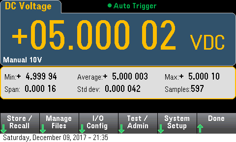
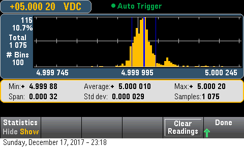
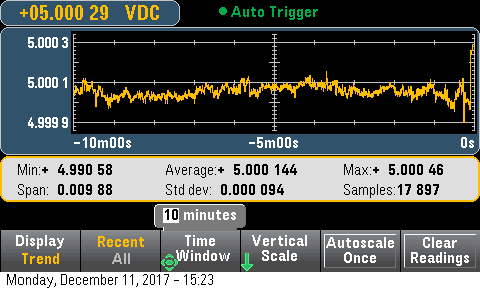
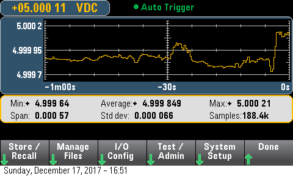
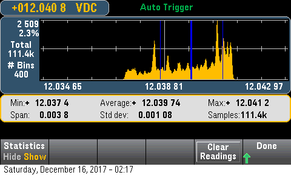
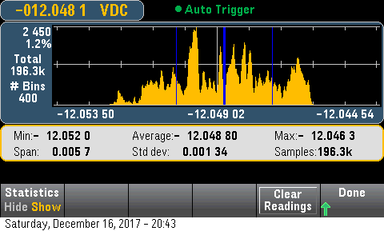

# Voltage ref

Assume trimmed AD588BQ (CERDIP-16) rather than previous mono MIDI2CV designs with untrimmed AD586M (PDIP-8) or AD780 (PDIP-8).

- [Useful EEBlog article on AD588](https://www.eevblog.com/forum/testgear/ad588-reference-10-volt-0-01-1-5-ppmdeg-simple-rugged-and-affordable/)
- [ad588 ref with 15V derived from 12VAC (Russian)](http://radio-hobby.org/modules/news/article.php?storyid=1226)
- [heated AD588 10V ref](http://www.eevblog.com/forum/metrology/temperature-stabilised-enclosures-heating-and-or-cooling/msg1414486/#msg1414486)

## Absolute initial accuracy

Initial accuracy guaranteed (individually tested) is 200ppm: 5V ±1mV. Or is that 200ppm of 10V, so ±2mV?

Trimming uses special pins on this Vref, not an op-amp buffer after. Trim range is ±4mV. Separate trims for the +10V and +5V outputs.
Final trim offset depends on uncertainty of meter measurement.

Quick breadboard (untrimmed) shows +10V = 9.99962 sd 50μV and +5V = 4.99862 sd 42μV on Keysight 34465A @ 20C = 1.38mV error. Circuit has 22μF and 100nF caps to power rails, kelvin connections not used (bridged), powered from switching Eurorack PSU.

After powering for 4 days (100 hours), socketed on soldered protoboard, with trim, +5V = mean 5.000 003 sd 42μV with a range of 4.999 94 to 5.000 10 (a range of 160μV). Keysight 34465A @ 20C, 10PLC, 597 samples.

Still some random wandering, possibly noise spikes on the power rails from switching PSU.

## Temperature

1.5ppm/C (525μV max over 0 to 70C)

Once trimmed, temperature term dominates.

"So what accuracy and stability can we hope for? The AD588 specifies 0.01% max initial error (one part in 10,000 or about 13 bits), with a 1.5-ppm/°C max temperature coefficient. Over the industrial temperature range of –40°C to +100°C, this could cause a 210 ppm variation, or 1 LSB at 12 bits. So, without temperature compensation, the best uncalibrated absolute accuracy we can guarantee is about 12 bits over temperature5. If we calibrate using expensive high-precision voltage standards (racks of equipment, not ICs), and limit the temperature range that the IC sees to ±20°C around room temperature, we might just achieve a temperature-compensated absolute accuracy of about 16 bits."
[Choosing Voltage References](http://www.analog.com/en/analog-dialogue/raqs/raq-issue-114.html)

Need an oven, 50 or 60C ±0.1C instead of 20 to 50C range. If running at 60 or over, maybe better going for the Industrial range (-25 to 85C) rather than Commercial (0 to 70C) for longer reference life. Oven control circuitry drives panel LED with red - orange - green for temp stability.

Temp measurement by DS18B20 thermally epoxied to the Vref chip. Use direct power, not parasitic. Accuracy is 0.5C.

"But anyhow, HP engineers originally designed this circuit to run on 95°C, also due to the required ambient temperature of 55°C.
That causes a higher drift than intended originally by LT: running on 65°C instead gives typically -1.. -2ppm/year, and other designs of 8 1/2 digit DMM, standards and calibrators use 45..55°C oven temperature for around 1..2 ppm/year guaranteed stability."
[EEVBlog 34465A discussion]http://www.eevblog.com/forum/testgear/keysight's-new-34465a-(6-5-digit)-and-34470a-(7-5-digit)-bench-multimeters/msg626805/#msg626805

- [Maxim DS18B20 product page](https://www.maximintegrated.com/en/products/analog/sensors-and-sensor-interface/DS18B20.html)
- [DS18B20 (9 bit) vs. DS18S20 (12 bit)](https://www.maximintegrated.com/en/app-notes/index.mvp/id/4377)
- [Maxim DS18B20](http://vwlowen.co.uk/arduino/ds18b20/ds18b20.htm)
- [Calibration of DS18B20 in ice bath](http://www.kandrsmith.org/RJS/Misc/Hygrometers/absolutetemperature.html)
- [PJRC OneWire library docs](https://www.pjrc.com/teensy/td_libs_OneWire.html)
- [Onewire tutorial](https://playground.arduino.cc/Learning/OneWire)
- [original Dallas Library](https://www.milesburton.com/Dallas_Temperature_Control_Library)
- [Arduino Library for Maxim Temperature ICs](https://github.com/milesburton/Arduino-Temperature-Control-Library)
- [Example, Arduino DS18B20](https://create.arduino.cc/projecthub/everth-villamil-ruiz/temperature-sensor-ds18b20-3decfc)
- [Example2, same](https://create.arduino.cc/projecthub/TheGadgetBoy/ds18b20-digital-temperature-sensor-and-arduino-9cc806)

- [Geller labs vref oven/cooler](https://web.archive.org/web/20140524004806/http://www.gellerlabs.com:80/SVR_TempcoTest.htm)

Alternatively, analog temperature sensor like LM35CA (T0-92 case) read by an ADC input. 1.100V at 110C, 250mV at 25C (absolute Centigrade voltage output). 0.2C (typ) 0.5C (max) absolute accuracy at 25C. 9.9 to 10.1 max mV/C slope variation (compensatable in ADC readings if needed). Long term stability ±0.08C/1k hours.

Analog avoids any digital interference on the analog reference voltage.

Heater by variable current (or PWM??) through a resistor?

- [Arduino PID playground](http://playground.arduino.cc/Code/PIDLibrary)
- [Arduino PID library on GitHub](https://github.com/br3ttb/Arduino-PID-Library/)
- [PID Tutorial](http://brettbeauregard.com/blog/2011/04/improving-the-beginners-pid-introduction/)
- [Google group](https://groups.google.com/forum/#!forum/diy-pid-control)
- [Autotune](https://playground.arduino.cc/Code/PIDAutotuneLibrary)
- [Example: PID control for instrument "oven"](https://groups.google.com/forum/#!topic/diy-pid-control/4EY679OWbQw)
- [simple resistive heater with transistor for current](https://www.alanzucconi.com/2016/08/02/arduino-heater-2/)

Transistor heater across 12V

- [Use a transistor as a heater](https://www.edn.com/design/components-and-packaging/4371386/Use-a-transistor-as-a-heater)

Alternatively, use an existing (analog loop) 40C crystal heater

- [Precision Crystal Heater](http://janielectronics.com/index.php?route=product/product&product_id=117)
- [Precision crystal heater 40° QH40A](https://shop.kuhne-electronic.de/kuhne/en/shop/accessoires/crystal-heater/Precision+crystal+heater+40%C2%B0+QH40A/?card=724#_tab_content2)
- [Miniature Crystal Oven Temperature Controller Module](http://www.masterscommunications.com/products/ch/ch25_docs.html)

## Current / Load

Load regulation good: ±50μV/mA

As this design drives multiple DACs, the kelvin connections only take us from the oven to the Vref distribution board, which will have a fixed, low load (op-amp input resistances, in parallel, plus a small resistive load for stability).

1mA is 5k load resistor. 10-20k static load could help assure a constant load depending on peak DAC current draws. AD5542CRZ current is code-dependent, varies from 100 to 200μA per DAC (so worst case, 9 DAC all switching together, 900μA to 1800μA).

If reference buffered by diff amp next to each DAC, load is constant. But then need precision matched resistors for the differential amp!

If reference output buffered on a central, Vref distribution board by sets of unity gain differential amp (one per DAC), load is constant. Kelvin connections on each DAC over 4-way jumper wire set to each DAC board. Use the Hinton scheme for balanced output, and DAC provides the kelvin connections.

Assume a second, unipolar buffer drives the less critical DACs. Assume 2V reference derived locally (as part of offset trim) on each Pitch DAC board.

Need to measure the actual deviations with kelvin coupling vs directly hooking them up. Compare with offsets from other sources. Makes re-use of the Vref more complicated (eg for offset trimming). Perhaps the op-amps are good enough that this is not needed.

Ribbon cable typically 26awg which has 40mΩ/foot. 3 inch cabling 10mΩ. Contact resistance 2x IDC at 20 mΩ max each. Say 50mΩ. Assume current 2mA. Voltage drop 100μV.

For the +2V offset, perhaps use the +10V output, passively sent to each DAC board and then divided down 1:4 with two .1% resistors and a trimmer.

## Long term drift

"The data sheets of many references specify long-term drift—typically about 25 ppm/1000 hr. This error is proportional to the square root of elapsed time, so 25 ppm/1000 hr ≈ 75 ppm/year. The actual rate is likely (but not certain) to be somewhat better than this as the ageing rate often diminishes after the first few thousand hours. So, again, we have a figure around 14 bits."
[Choosing Voltage References](http://www.analog.com/en/analog-dialogue/raqs/raq-issue-114.html)

15ppm/1k hr (75μV), worst on new device and settling over time.

Burn in at ±12V/1week. Check burn-in drift over some weeks, determine optimum balance between waiting and stability.

## Line regulation

Much worse than comparable (and cheaper!) references: 200 max μV/V (10.8 to 18V).

My case has switching power supplies which give stable but noisy power lines.

Regulated bipolar 11.2V supply for Vref, with ample PSU buffer caps. Check with variable PSU that 11.2V suply still gives a stable 10V out. If so, use this low-power regulator pair:

LT1964-BYP LDO negative variable regulator, 340mV dropout, 200mA SOT-23

LT1761 LDO positive reg, 300mV dropout, 100ma SOT-23

11.2 = 1.22 (1 + R2/R1) where R1 <200k. (same eqn, opposite sign for both regs)
8.18 = R2/R1 let R1 = 22k then R2 = 180k

Current in R1 is 1.22V/R1 = 56μA
Current in R2 = current in R1 + 30nA = 56μA again.

Full equation is
Vout = 1.22(1 + R2/R1) + (Iadj * R2) where Iadj is 30nA
Vout = 11.21V

Load Reg for LT1761 at 1ma to 100mA is Vout/1.22 × -1mV = -9.1mV. Proportionally, at 10mA should be -0.9mV. For LT1964 at 1mA to 200mA  Vout/1.22 × 2mV = -18.2mV. So at 10mA again 0.9mV.

These should hold supply voltage to ±11.2V ±2mV and cope with PSU droop down to ±11.6V, and provide some noise rejection.

Tested with  well-regulated, low ripple linear variable PSU.

At 12V, stable but no improvement in wandering and spikiness despite the clean PSU.

Progressively worse below 12V. Poor results at 11.2V
Thus, not enough room to produce a secondary regulated power from 12V.

